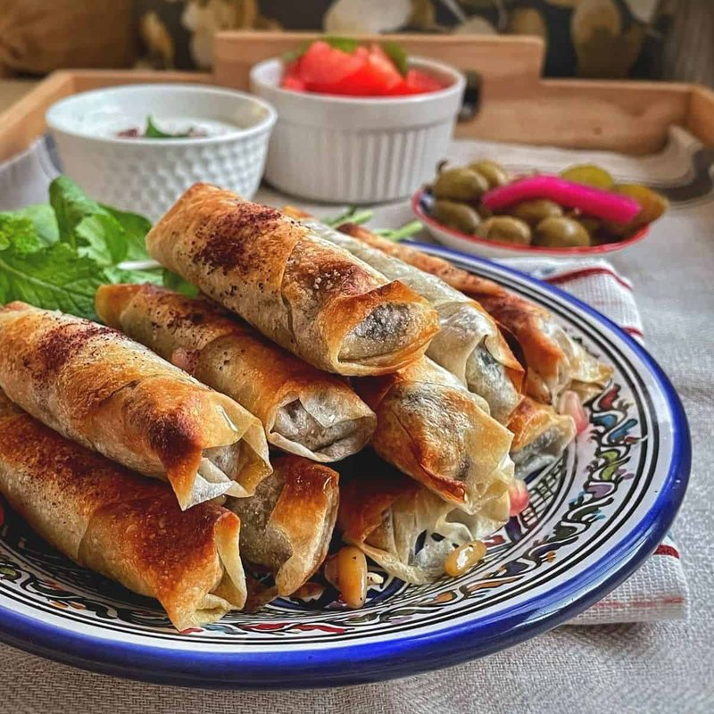

# Musakhan Rolls

*The roll-up version of Palestine's national dish: caramelised sumac onions and shredded chicken wrapped in flatbread, baked golden.*

**Serves:** 4 (makes 12 rolls)

**Prep Time:** 30 minutes

**Cook Time:** 25 minutes

## Overview
The musakhan filling: red onions (LOTS - for the dish to work, you need 4-5 large onions) slowly caramelise in olive oil for 25-30 minutes until deep gold and sweet; sumac is stirred in generously (a tablespoon at minimum); shredded cooked chicken is folded through with toasted pine nuts. Markook bread (thin Palestinian flatbread, sold at Middle Eastern shops; substitute thin lavash or large flour tortillas) is cut into rectangles. A spoon of filling is spread on each; rolled tightly; sealed seam-side-down. Brushed with olive oil; either baked at 200°C for 12 minutes OR pan-toasted in a dry hot pan for 2 minutes per side. Served warm with lemon and yogurt.

## Ingredients

### Filling
- 500 g cooked chicken (poached or rotisserie; pulled into shreds - leftover roast chicken works ideally)
- 6 tablespoons extra-virgin olive oil
- 5 large red onions (sliced thin - about 1 kg)
- 1 teaspoon salt
- 3 tablespoons sumac (the tart purple Levantine spice)
- 1 teaspoon Aleppo pepper
- 1 teaspoon ground allspice
- ½ teaspoon black pepper
- 60 g pine nuts (toasted in a dry pan 3 minutes)
- Juice of ½ lemon
- 3 tablespoons fresh parsley (chopped)

### Wrappers
- 6 large markook breads (Palestinian thin flatbread; sold at Middle Eastern shops)
- OR substitute 12 lavash sheets, OR 6 large flour tortillas cut in half

### To finish
- 4 tablespoons olive oil (for brushing)
- 1 tablespoon sumac (extra, for garnish)
- A few extra pine nuts

### To serve
- 200 g Greek yogurt (with a pinch of salt and a squeeze of lemon)
- 2 lemons (wedges)
- A handful of fresh parsley sprigs

## Method

### Stage 1 - Caramelise the onions
1. Heat 6 tablespoons olive oil in a wide deep pan over medium heat.
1. Add sliced red onions; sprinkle with the salt.
1. Cook 25-30 minutes, stirring often, until very soft and deep golden-mahogany. Don't rush this - pale-onion musakhan is bland; deep-caramelised onion is what makes it.

### Stage 2 - Spice the onions
1. Reduce heat to low.
1. Stir in sumac, Aleppo pepper, allspice and black pepper.
1. Cook 2 minutes, stirring.

### Stage 3 - Add chicken
1. Stir in the shredded chicken and ⅔ of the pine nuts.
1. Add lemon juice.
1. Cook 3 minutes to warm through.
1. Off heat; stir in chopped parsley.
1. Taste; adjust salt and sumac.

### Stage 4 - Cut the bread
1. Cut each markook bread into 2-3 rectangles (about 12 cm × 20 cm).
1. You should have 12 rectangles total.

### Stage 5 - Fill and roll
1. Working with one bread rectangle at a time on a board:
   - Spoon a heaped tablespoon of filling along the long edge nearest you.
   - Roll up tightly into a cigar shape, seam-side down.
1. Repeat for all 12.

### Stage 6 - Cook (choose one)
**Baked**:
1. Heat oven to 200°C (180°C fan).
1. Place rolls seam-side-down on a lined baking tray.
1. Brush with olive oil.
1. Bake 12-15 minutes until golden.

**Pan-toasted (fast)**:
1. Heat a wide non-stick pan over medium-high heat with a thin film of olive oil.
1. Place 3-4 rolls seam-side-down; press lightly.
1. Cook 2 minutes; flip; cook 2 more minutes.
1. Lift onto a plate.

### Stage 7 - Serve
1. Plate 3 rolls per person.
1. Drizzle with extra olive oil.
1. Sprinkle with extra sumac and the remaining pine nuts.
1. Yogurt and lemon wedges on the side.

## Notes
- **Caramelise the onions properly:** This is 80% of the dish. Pale onions = bland musakhan. The deep-mahogany 25-30 minute cook is non-negotiable.
- **Generous sumac:** Musakhan is defined by sumac. A tablespoon at minimum; some Palestinian recipes use 3-4 tablespoons. Adjust to taste; the dish should be distinctly tart.
- **Markook is the right bread:** Very thin, slightly chewy Palestinian flatbread. Lavash or tortillas substitute but the flavour shifts slightly.

## Storage
- Best within 30 minutes.
- Cooked rolls: refrigerate 3 days; reheat at 180°C 5 minutes.
- Filling alone refrigerates 4 days, freezes 2 months.
- Assemble fresh; pre-rolled-but-unbaked rolls go soggy from the wet filling within 2 hours.
