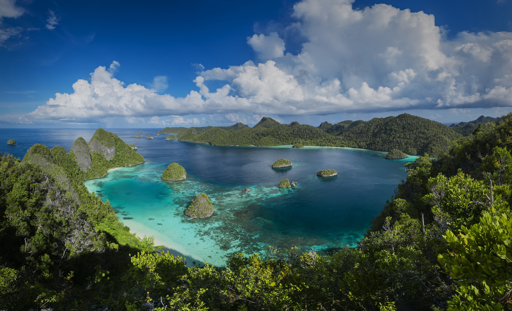

# Papua New Guinean Cuisine

A Melanesian cuisine built on the mumu earth-oven, where pork, kaukau (sweet potato), banana and greens are buried with hot stones and slow-baked under banana leaves for the village feast. Sago is the lowland starch, kaukau the highland one, and the coconut, fish and pig of the islands round out the table. The cooking sits inside a strong Christian-and-clan tradition, ceremonial and communal, with the mumu pit at the centre of every wedding, funeral and welcome.
