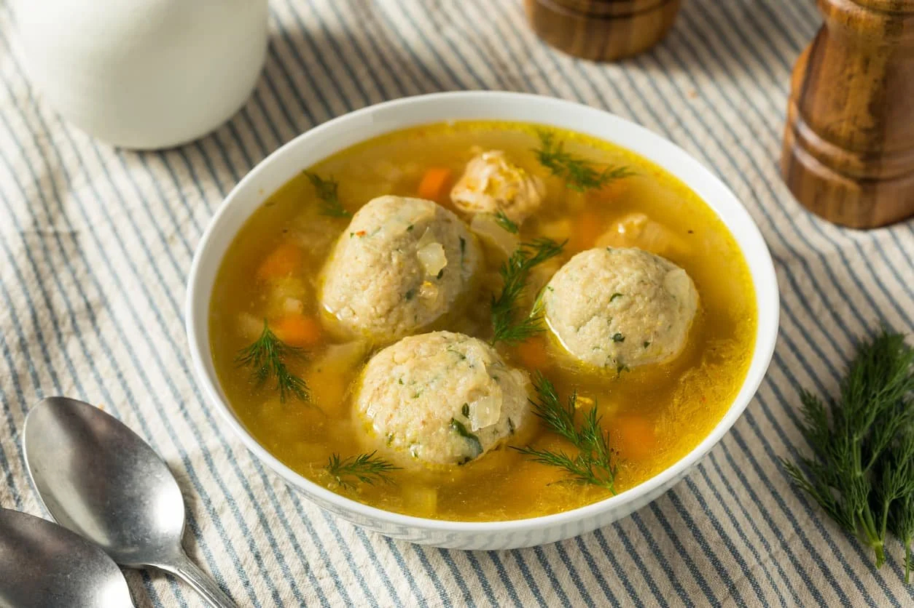

# Bori Bori

*Paraguayan chicken soup studded with small cornmeal-and-cheese dumplings, perfumed with onion, tomato, parsley and a quiet hit of cumin. The classic winter pot of the interior.*

**Serves:** 6

**Prep Time:** 25 minutes

**Cook Time:** 1 hour 15 minutes

## Overview
Bori bori (the name is a doubling of the Guaraní "vori", meaning ball) is one of the great country soups of Paraguay, served on cold winter days throughout the central departments. A whole chicken is poached down to a deep golden broth with onion, tomato, bell pepper and parsley; small dumplings made from cornmeal and grated cheese are rolled in the palms and dropped into the simmering pot to cook through and lightly thicken the soup. The cornmeal balls puff slightly, soaking up the broth, and the chicken is shredded back in. The result is a bowl of clear amber broth, golden dumplings and tender shredded chicken, finished with a fistful of fresh chopped parsley. It is the kind of soup that asks for a plate of fresh chipa beside it and a long afternoon.

## Ingredients

### Broth
- 1 whole chicken (1.5 kg), jointed
- 2 onions, finely chopped
- 1 red bell pepper, finely chopped
- 3 ripe tomatoes, peeled and chopped
- 3 cloves garlic, minced
- 1 tsp ground cumin
- 1 bay leaf
- 1 tbsp lard or oil
- 2.5 litres water
- 2 tsp salt
- Black pepper

### Dumplings
- 200 g fine yellow cornmeal
- 100 g queso paraguay or young feta, finely crumbled
- 1 egg
- 50 ml warm water (as needed)
- 1/2 tsp salt

### Finish
- 1 large handful flat-leaf parsley, chopped
- 2 spring onions, thinly sliced

## Method

### Stage 1 - Build the broth
1. Heat the lard in a heavy pot over medium-high heat.
2. Brown the chicken pieces on both sides, 6-8 minutes total. Lift out and set aside.
3. Add the onion to the same pot; cook 5 minutes until soft.
4. Add the bell pepper, tomato, garlic, cumin and bay leaf; cook another 5 minutes.
5. Return the chicken; pour in the water; add the salt.
6. Bring to a gentle boil, lower to a simmer, partly cover, and cook 45 minutes until the chicken is falling off the bone.

### Stage 2 - Mix the dumplings
1. While the broth simmers, combine the cornmeal, crumbled cheese, egg and salt in a bowl.
2. Add warm water, a tablespoon at a time, until a soft moldable dough forms (it should hold together when rolled but not be wet).
3. Roll into small balls about the size of a hazelnut (2 cm across); place on a tray.

### Stage 3 - Cook the dumplings in the soup
1. Lift the chicken pieces out of the broth; cool slightly, then shred the meat and discard the bones and skin.
2. Bring the broth back to a gentle simmer.
3. Drop the dumplings into the simmering broth, one by one. Cook 12-15 minutes until they puff slightly and rise to the surface.
4. Return the shredded chicken to the pot for the last 3 minutes to rewarm.
5. Stir in the chopped parsley and spring onion. Taste and adjust salt and pepper.
6. Ladle into bowls.

## Notes
- **Don't crowd the dumplings:** drop them in one at a time so they do not stick together as they hit the broth.
- **The texture of the dough:** if too dry, the dumplings break; if too wet, they dissolve. Aim for a soft Play-Doh consistency.
- **The cheese:** queso paraguay is traditional; young feta is the best substitute outside Paraguay.
- **Cumin restraint:** Paraguayan cooks use cumin lightly; one level teaspoon is plenty.

## Variations
- **Bori bori de gallina:** made with an older laying hen for a richer broth; cook 2 hours.
- **Vori vori (the sister recipe):** the same dumplings dropped into a clear beef broth instead.
- **With pumpkin:** add 200 g diced kuri or butternut squash to the broth in the last 15 minutes.
- **With cassava:** add 300 g peeled cubed mandioca to the broth in the last 20 minutes.

## Serving
- Hot bowls with a wedge of lime · with chipa or fresh bread on the side · with a tomato-and-onion salad · as the centrepiece of a Paraguayan winter Sunday lunch · with a glass of mate cocido after.

## Storage
- Keeps 3 days refrigerated; the dumplings soften slightly on day two
- Reheat gently on the stove; do not boil hard or the dumplings break
- Freezes 1 month; thaw overnight and rewarm slowly

