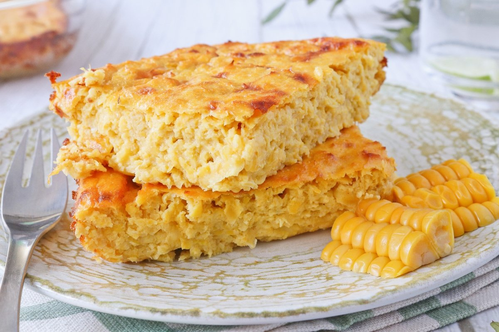

# Chipa Guazú

*The summer sister of sopa paraguaya: a baked casserole of fresh corn kernels, fried onion and crumbled cheese, golden on top and creamy inside, served alongside grilled beef.*

**Serves:** 8

**Prep Time:** 25 minutes

**Cook Time:** 55 minutes

## Overview
Chipa guazú (Guaraní for "big chipa") is what Paraguayans cook when the new corn comes in. Where sopa paraguaya uses dry cornmeal year-round, chipa guazú uses fresh white corn kernels stripped straight from the cob, roughly blitzed and folded into a batter of fried onion, eggs, milk and queso paraguay, then baked into a deep golden slab. The texture is the opposite of sopa paraguaya: where the sopa is crumbly and bread-like, chipa guazú is custardy and creamy, with whole corn kernels suspended throughout. It belongs to the asado paraguayo table from December to March, when corn is in season and the family gathers around the grill. Outside corn season, frozen kernels work passably; tinned sweetcorn is a poor substitute because the sugar is wrong.

## Ingredients

- 1 kg fresh white corn kernels (from about 8 cobs; or frozen white sweetcorn, defrosted)
- 3 medium onions, finely chopped
- 4 tbsp lard or vegetable oil
- 6 eggs
- 250 ml whole milk
- 300 g queso paraguay or young feta, crumbled (or feta plus mild mozzarella)
- 1 tsp salt
- Black pepper
- 50 g unsalted butter, melted (for the dish)

## Method

### Stage 1 - Soften the onion
1. Heat the lard in a wide pan over medium heat.
2. Add the chopped onion; cook 12-15 minutes, stirring often, until very soft and pale gold (not brown).
3. Tip the cooked onion into a large mixing bowl and let cool 5 minutes.

### Stage 2 - Process the corn
1. Strip the kernels from the cobs with a sharp knife if using fresh corn.
2. Tip the kernels into a food processor and pulse 6-8 times: you want a coarse texture, not a smooth puree. About half the kernels should remain whole.

### Stage 3 - Combine and bake
1. Heat the oven to 180 C. Brush a 25 x 30 cm baking dish with the melted butter.
2. To the bowl with the onion, add the pulsed corn, milk, eggs, crumbled cheese, salt and a good grind of pepper.
3. Stir well until evenly combined. The batter should be thick and pourable.
4. Tip into the buttered dish and smooth the top.
5. Bake 45-55 minutes until the top is golden brown and the centre is set but still soft to the touch (a skewer should come out with moist crumbs, not wet batter).
6. Rest 10 minutes before cutting into thick squares.

## Notes
- **Fresh corn matters:** the dish is built around the sweetness and starch of just-picked corn. White corn is traditional; yellow sweetcorn works but is sweeter.
- **Don't over-process:** keeping half the kernels whole gives the right texture.
- **Cheese choice:** young feta has the closest profile to queso paraguay. Avoid sharp aged cheeses.
- **Tell it's done:** the top is deep golden and the edges have pulled away slightly from the dish.

## Variations
- **Chipa guazú con choclo amarillo:** made with yellow corn for a richer colour and sweeter result.
- **With anise:** a teaspoon of toasted anise seeds folded through the batter; an older country touch.
- **Mini chipa guazú:** baked in muffin tins for 25 minutes; serve at parties.
- **Chipa guazú con jamón:** 200 g diced cooked ham folded through the batter for a more substantial main.

## Serving
Cut into thick squares alongside grilled beef · with asado paraguayo and a tomato-and-onion salad · with sopa paraguaya as a contrast of textures · with a green salad as a vegetarian summer lunch · with a glass of tereré in the shade.

## Storage
- Keeps 3 days refrigerated, well covered
- Reheat in a low oven (150 C) for 10 minutes
- Does not freeze well: the texture turns watery on thawing
