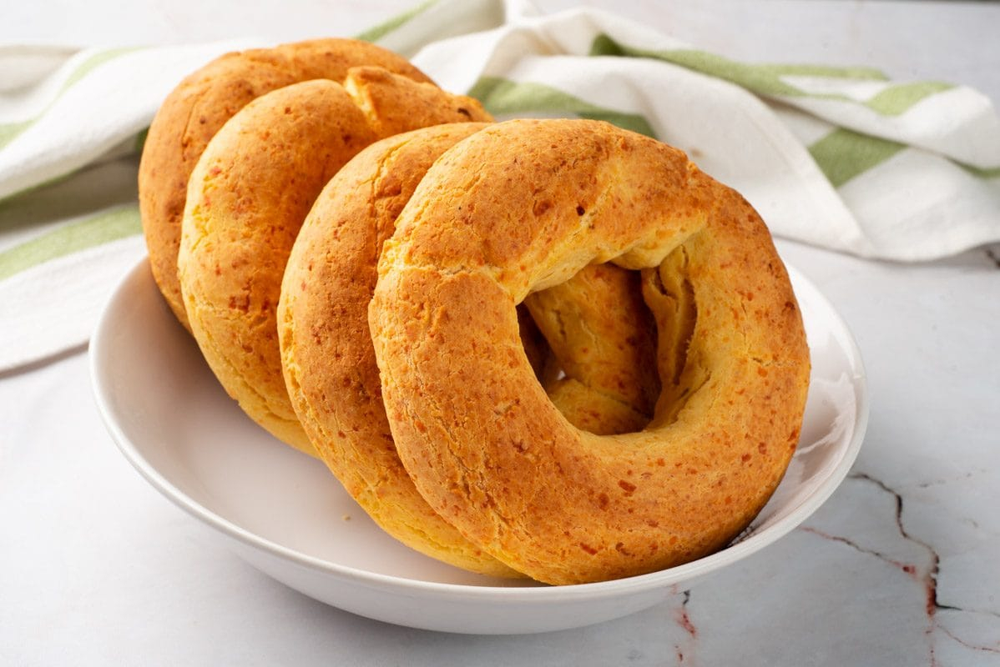

# Chipa

*Paraguay's everyday bread: a ring-shaped cassava-and-cheese bun, baked until golden outside and pillow-soft inside. Sold from baskets at every bus station and long-distance lay-by from Asunción to the Brazilian border.*

**Serves:** Makes 16 rings

**Prep Time:** 25 minutes

**Cook Time:** 25 minutes

## Overview
Chipa is the bread of Paraguay, eaten at breakfast with mate cocido, sold from cane baskets at every roadside stop, and served beside almost every soup. The dough is unusual: no wheat flour, only cassava starch (almidón de mandioca), bound with eggs, lard, milk and a heavy quantity of grated queso paraguay. The result is a slightly stretchy, slightly springy bread (closer in texture to Brazilian pão de queijo) with a deep cheese flavour and a crisp golden exterior. Traditionally chipa is shaped into small rings the size of a doughnut and baked in clay tatakua ovens fired by hardwood; the home oven version is just as good. Chipa is best within hours of baking, when the inside is still pillow-soft and the crust has just enough bite.

## Ingredients

- 500 g sour cassava starch (almidón agrio; "polvilho azedo" in Brazilian stores). Sweet cassava starch works but the rise is gentler
- 300 g queso paraguay or young feta, finely crumbled
- 100 g hard cheese, finely grated (parmesan or aged manchego; not traditional but adds depth)
- 150 g lard, soft (or 150 g butter if lard is hard to find)
- 4 eggs
- 150 ml whole milk, warm
- 2 tsp salt
- 1/2 tsp anise seeds, lightly toasted and crushed (optional but traditional)

## Method

### Stage 1 - Make the dough
1. In a large mixing bowl, beat the soft lard with the salt and crushed anise seeds until creamy.
2. Beat in the eggs one at a time.
3. Mix in the crumbled feta and grated hard cheese.
4. Add the cassava starch in three additions, alternating with the warm milk, stirring between each.
5. Bring the dough together with your hands. It should be moist, slightly tacky, and hold together when squeezed; if dry, add another splash of milk.

### Stage 2 - Shape the rings
1. Heat the oven to 220 C. Line two baking sheets with baking paper.
2. Pinch off pieces of dough the size of a walnut (about 50 g).
3. Roll each piece into a rope about 15 cm long, then join the ends to make a small ring.
4. Place the rings on the baking sheets, leaving 3 cm between them.

### Stage 3 - Bake
1. Bake 18-22 minutes until the rings are deep golden on top with a few darker spots and the cracks across the surface show a paler interior.
2. Eat warm from the oven.

## Notes
- **Sour starch is best:** "almidón agrio" or "polvilho azedo" is fermented cassava starch and gives the proper chewy stretch. Sweet starch (regular tapioca flour) works but the texture is denser.
- **The cheese:** queso paraguay is the right cheese; young feta gives the closest profile abroad. Use a mix of soft fresh cheese and a small amount of harder cheese for depth.
- **Don't overwork the dough:** chipa is mixed, not kneaded. Stop as soon as the dough comes together.
- **Eat warm:** chipa goes hard within a few hours; the texture is at its best in the first 60 minutes.

## Variations
- **Chipa de almidón (the classic):** the version above, the everyday standard.
- **Chipa mestiza:** half cassava starch and half cornmeal; slightly heavier and gritter.
- **Chipa so'o:** small chipa rings stuffed with a tablespoon of seasoned minced beef before baking; a substantial snack.
- **Chipa argolla (large ring):** shape into one large 25 cm ring rather than 16 small ones; bake 35 minutes. The traditional Easter shape.
- **Chipa with extra cheese:** scatter a tablespoon of grated hard cheese over each ring before baking.

## Serving
Eat warm from the oven · with mate cocido at breakfast · with tereré in the afternoon · alongside vori vori, bori bori or so'o yosopy as the bread of the meal · at long-distance bus stops, the standard road snack.

## Storage
- Best within 4 hours of baking; freshness is everything
- Day-old chipa rewarms well in a hot oven (200 C) for 5 minutes
- Freezes 1 month after baking; rewarm from frozen in a hot oven
- Raw dough freezes 1 month shaped on a tray; bake from frozen with an extra 5 minutes
