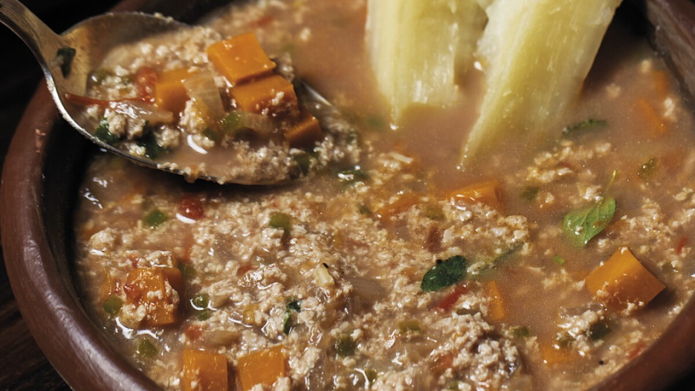

# So'o Yosopy

*Paraguayan beef-and-rice soup: minced beef browned with onion and bell pepper, simmered with rice and tomato into a thick, comforting broth. The everyday weeknight bowl of the interior.*

**Serves:** 6

**Prep Time:** 15 minutes

**Cook Time:** 50 minutes

## Overview
So'o yosopy (Guaraní for "meat soup", from "so'o" meaning meat and "yosopy" meaning broth) is the daily soup of Paraguayan country kitchens. Where vori vori takes hours and bori bori takes a whole chicken, so'o yosopy goes from cupboard to bowl in under an hour. Minced beef is browned with onion, red bell pepper, tomato and a careful pinch of cumin; long-grain rice goes in to swell and thicken the broth, and parsley is stirred through at the end. The result is somewhere between a soup and a loose risotto: a heavy ladle of red-brown broth carrying rice and tender beef, eaten with a slab of chipa on the side. It is what families cook on a weekday when the asado is for Sunday. The name is sometimes spelled so'o josopy or so'o jukysy depending on the region.

## Ingredients

- 500 g minced beef (not too lean; about 15 percent fat)
- 2 medium onions, finely chopped
- 1 red bell pepper, finely chopped
- 3 ripe tomatoes, peeled and chopped (or 1 tin chopped tomatoes)
- 4 cloves garlic, minced
- 1 tsp ground cumin
- 1 bay leaf
- 2 tbsp lard or vegetable oil
- 200 g long-grain white rice, rinsed
- 2 litres beef stock or water
- 2 tsp salt
- Black pepper
- 1 large handful flat-leaf parsley, chopped
- 2 spring onions, sliced (to finish)
- Optional: 1/2 tsp dried oregano

## Method

### Stage 1 - Build the base
1. Heat the lard in a heavy pot over medium-high heat.
2. Add the onion; cook 5 minutes until softening.
3. Add the bell pepper and garlic; cook another 4 minutes.
4. Push the vegetables to the side and add the minced beef. Break it up with a wooden spoon and brown well, 8-10 minutes, until any liquid evaporates and the meat takes a little colour.

### Stage 2 - Season and reduce
1. Stir in the cumin, bay leaf, salt and a good grind of black pepper.
2. Add the chopped tomato; cook 5 minutes until it breaks down and goes deep red.

### Stage 3 - Simmer with rice
1. Pour in the beef stock; bring to a boil.
2. Tip in the rinsed rice; lower to a gentle simmer.
3. Cook 20-25 minutes, stirring occasionally to keep the rice from sticking, until the rice is tender and the broth has thickened. It should be loose, more soup than risotto.
4. Taste and adjust salt and pepper.

### Stage 4 - Finish
1. Stir in the chopped parsley.
2. Ladle into bowls and scatter spring onion over the top.

## Notes
- **The fat matters:** lean mince makes a watery soup. 15 percent fat gives the right body.
- **Brown the meat properly:** the colour and flavour of the soup depend on this step. Cook until the liquid evaporates and the bottom of the pot browns slightly.
- **Stir while the rice cooks:** rice settles to the bottom and scorches; a stir every few minutes keeps it suspended.
- **Adjust the broth at the end:** the rice absorbs water as it sits; add a splash of stock when serving leftovers.

## Variations
- **So'o yosopy with potato:** add 2 diced potatoes alongside the rice for extra body.
- **With pumpkin:** 200 g diced kuri or butternut squash added in the last 15 minutes; a winter version.
- **Spicy version:** add a sliced ají amarillo or a teaspoon of paprika; an Argentine-influenced touch.
- **With pasta (so'o pira):** swap rice for 200 g small soup pasta; cook for the time on the packet.
- **Lighter version:** swap minced beef for shredded leftover roast beef stirred in at the end.

## Serving
Deep bowls with chipa on the side · with a wedge of lime · alongside a tomato-and-onion salad · as a weekday family supper · with mate cocido afterwards.

## Storage
- Keeps 3 days refrigerated; the rice thickens the broth on standing
- Reheat with an extra splash of stock or water
- Freezes 1 month; thaw and rewarm slowly with more liquid

