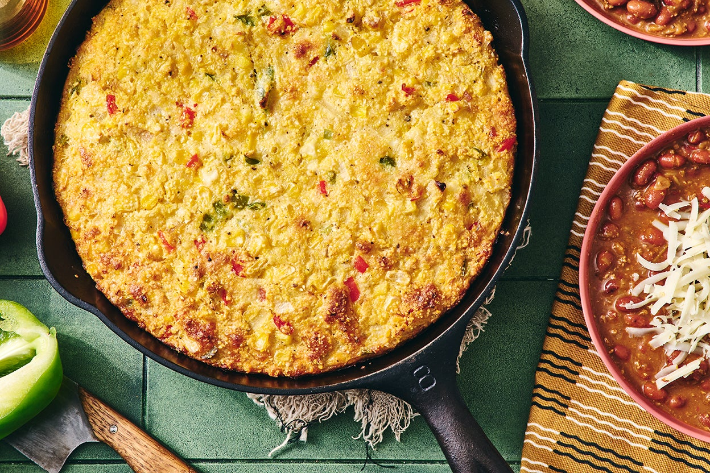

# Sopa Paraguaya

*Paraguay's national dish: a moist baked cornbread loaded with fried onion, fresh cheese and milk, cut into squares and served alongside beef. Despite the name "soup", it is a solid slab of golden corn cake.*

**Serves:** 8

**Prep Time:** 20 minutes

**Cook Time:** 50 minutes

## Overview
Sopa paraguaya is the most celebrated dish of Paraguay and one of the most famous misnamings in Latin American cooking. Legend places its invention in the 1850s when a cook for President Carlos Antonio López left too much cornmeal in a milk-and-cheese soup, baked the over-thickened result in a clay oven, and presented it to the president, who declared it sopa paraguaya. The truth is that baked corn breads predate the López era by centuries in Guaraní cooking; the story just stuck. What ends up on the table is a yellow, slightly crumbly cornbread perfumed with fried onion, enriched with whole milk and a generous amount of fresh queso paraguay (a soft cow's-milk cheese close to a young feta), with a tender crumb and a deep golden crust. It is always served as a side to grilled or roasted meat, never alone.

## Ingredients

- 4 medium onions, finely chopped
- 4 tbsp lard or vegetable oil
- 1 tsp salt
- 300 g fine yellow cornmeal (harina de maíz, not polenta)
- 400 ml whole milk
- 300 g queso paraguay or young feta, crumbled (or 200 g feta plus 100 g mild mozzarella)
- 6 eggs, separated
- 100 ml vegetable oil
- 1 tsp baking powder

## Method

### Stage 1 - Cook the onion base
1. Heat the lard in a wide pan over medium heat.
2. Add the chopped onion and salt; cook 12-15 minutes, stirring often, until very soft and pale gold.
3. Pour in the milk and bring just to a simmer, then turn off the heat.
4. Let the milk-onion mixture stand 10 minutes to infuse.

### Stage 2 - Build the batter
1. Heat the oven to 180 C. Grease a 25 x 30 cm baking dish with lard or oil.
2. Tip the cornmeal into a large mixing bowl. Pour the warm milk-onion mixture over it and stir well.
3. Beat in the 6 egg yolks, the 100 ml oil, the baking powder, and the crumbled cheese. The batter should be thick but spoonable; if very stiff, add a splash more milk.

### Stage 3 - Fold and bake
1. In a clean bowl, whisk the 6 egg whites to soft peaks.
2. Fold the whites into the cornmeal batter in two additions; do not overmix.
3. Pour the batter into the greased dish and smooth the top.
4. Bake 40-50 minutes until deep golden, pulling away from the sides, and a skewer comes out clean.
5. Rest 10 minutes before cutting into squares.

## Notes
- **The cheese:** Queso paraguay is the right cheese but is almost impossible to find outside Paraguay. Young feta has the closest salty fresh-curd character; a mix of feta and mild mozzarella gives both flavour and melt.
- **The cornmeal:** Use a fine yellow cornmeal labelled "harina de maíz" or "polenta fine grind". Coarse polenta is too gritty.
- **The onion:** Cook the onion long enough that it loses all sharpness; this is what gives sopa paraguaya its sweet savoury depth.

## Variations
- **Sopa so'o:** the same batter with shredded cooked beef stirred through the centre layer; a substantial main course.
- **Sopa paraguaya with anise:** a handful of toasted anise seeds in the batter; older country version.
- **Mini sopa cups:** baked in greased muffin tins for 25 minutes; useful for parties.
- **Extra-cheese version:** an additional 100 g of mozzarella scattered on the surface for the last 10 minutes of baking.

## Serving
Eat hot from the oven · cut into thick squares alongside grilled beef · with asado paraguayo and a tomato-and-onion salad · with so'o yosopy or vori vori as a side · with a glass of tereré on a hot afternoon.

## Storage
- Keeps 3 days refrigerated, well covered
- Reheat in a low oven (150 C) for 10 minutes; the microwave makes it gummy
- Freezes 1 month wrapped tightly; thaw and rewarm in the oven

