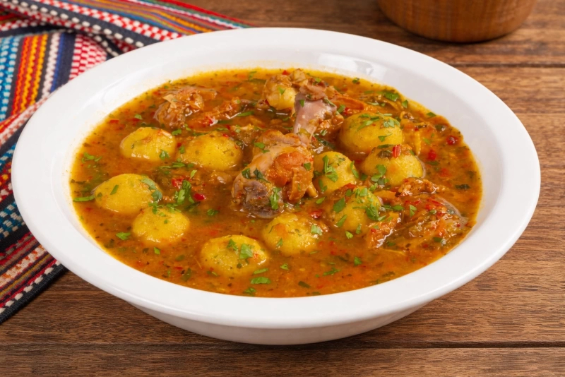

# Vori Vori

*Small cornmeal-and-cheese balls poached in a clear beef broth flavoured with onion, bell pepper, parsley and bay. Paraguay's country soup, made on rural stoves through the winter.*

**Serves:** 6

**Prep Time:** 25 minutes

**Cook Time:** 1 hour 30 minutes

## Overview
Vori vori (from the Guaraní "vori", a small ball, doubled for emphasis) is the rural Paraguayan answer to the question of how to stretch a piece of beef across a long table. A modest cut of beef shin or brisket is simmered into a deep beef broth with onion, tomato, red bell pepper, bay and parsley; little balls of cornmeal mixed with grated queso paraguay are rolled in the palms and dropped into the broth to poach. The dumplings puff and lightly thicken the soup as they cook. The beef is shredded back in for the final minutes. It is closer to home cooking than restaurant cooking, the kind of dish that simmers on the back of the stove from late morning until the family sits down at one. The dumplings should be small (no bigger than a hazelnut) and the broth should stay clear, never thickening to gravy.

## Ingredients

### Broth
- 800 g beef shin or brisket, cut into 4 cm chunks
- 2 onions, finely chopped
- 1 red bell pepper, finely chopped
- 2 ripe tomatoes, peeled and chopped
- 3 cloves garlic, minced
- 1 tsp ground cumin
- 1 bay leaf
- 2 tbsp lard or oil
- 2.5 litres water
- 2 tsp salt
- Black pepper

### Dumplings
- 200 g fine yellow cornmeal
- 100 g queso paraguay or young feta, finely crumbled
- 1 egg
- 50 ml warm water (as needed)
- 1/2 tsp salt

### Finish
- 1 large handful flat-leaf parsley, chopped
- 2 spring onions, sliced

## Method

### Stage 1 - Brown the beef
1. Heat the lard in a heavy pot over medium-high heat.
2. Pat the beef chunks dry and brown them in batches on all sides, 8-10 minutes total. Lift out.
3. Add the onion to the same pot; cook 5 minutes until soft.
4. Stir in the bell pepper, tomato, garlic, cumin and bay leaf; cook 5 minutes more.

### Stage 2 - Simmer the broth
1. Return the beef to the pot; pour in the water; add the salt.
2. Bring to a gentle boil; lower to a bare simmer.
3. Skim any grey foam that rises in the first 10 minutes.
4. Partly cover and simmer 1 hour 15 minutes until the beef is tender enough to shred with a fork.

### Stage 3 - Mix and shape the dumplings
1. While the broth simmers, combine the cornmeal, crumbled cheese, egg and salt in a bowl.
2. Add warm water a spoonful at a time until a soft moldable dough comes together.
3. Roll into small balls 2 cm across (the size of a hazelnut). Place on a tray.

### Stage 4 - Finish the soup
1. Lift the beef out of the broth; cool briefly, then shred coarsely and discard any bone.
2. Bring the broth back to a gentle simmer.
3. Drop the dumplings in one by one. Cook 12-15 minutes until they puff and rise.
4. Return the shredded beef for the last 3 minutes.
5. Stir in the parsley and spring onion. Taste and adjust salt and pepper.
6. Ladle into bowls.

## Notes
- **Keep the simmer gentle:** a hard boil breaks the dumplings.
- **Small dumplings, many of them:** the proportions are 30-40 small balls across six bowls, not six big ones.
- **Skim the broth early:** clear amber broth is the goal; not a cloudy gravy.
- **Beef cut:** shin gives the best flavour; brisket works; tougher chuck takes longer.

## Variations
- **Vori vori de pollo (bori bori):** swap beef for a whole jointed chicken; the official sister dish.
- **With pumpkin:** add 200 g diced kuri or butternut squash in the last 20 minutes.
- **With mandioca:** add 300 g peeled cubed cassava in the last 25 minutes.
- **With aniseed:** a pinch of toasted anise seed in the dumpling dough; an older rural touch.

## Serving
Hot bowls with chipa on the side · with a wedge of lime · alongside a tomato-and-onion salad · as a Paraguayan winter Sunday lunch · with mate cocido after.

## Storage
- Keeps 3 days refrigerated; the dumplings soften slightly on day two
- Reheat gently; never boil hard or the dumplings break apart
- Freezes 1 month; thaw overnight and rewarm slowly

