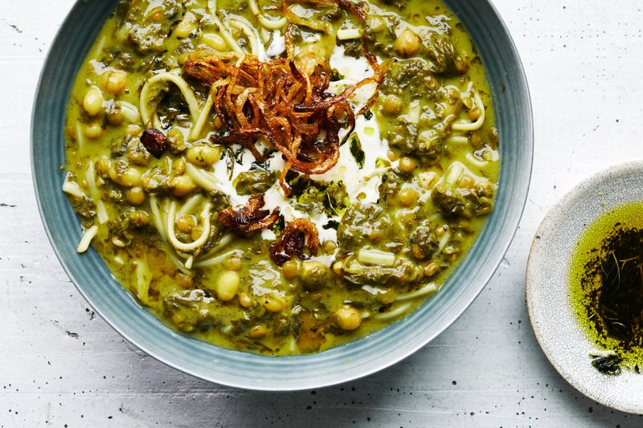

# Ash Reshteh

*Persia's Nowruz noodle soup: chickpeas, beans, lentils and reshteh noodles simmered with a heap of fresh herbs, finished with kashk.*

**Serves:** 6

**Prep Time:** 25 minutes (plus overnight bean soak)

**Cook Time:** 1 hour 45 minutes

## Overview
Ash reshteh is the great pot of Nowruz, the Persian new-year soup that fills the kitchen with the smell of dried mint and frying onions while houses are being cleaned and tables set for spring. Chickpeas, kidney beans, green lentils and barley simmer with golden softened onions and turmeric until the pot turns thick like a herb porridge. Then three enormous bunches of fresh herbs (parsley, coriander, dill and chives, plus a heap of chopped spinach) and the soup darkens to deep forest green; reshteh noodles go in for the last ten minutes to thicken the broth around them. The four-way finish is non-negotiable: a spoon of kashk (Persian fermented whey, salty and tangy), a drizzle of mint-and-garlic oil sizzled deep green off the heat, a scatter of deep-brown crispy onions fried slowly till the edges crackled, and a swirl of plain yogurt. Without all four toppings you have a herb-bean soup; with them you have ash reshteh. Eat with hot sangak or flatbread.

## Ingredients

### Beans (one cup of each, dried)
- 80 g dried chickpeas
- 80 g dried red kidney beans
- 80 g dried green lentils
- 50 g pearl barley (optional, traditional in some versions)

### Base
- 4 tablespoons sunflower oil
- 2 onions (large, one finely diced, one sliced thin and reserved for the topping)
- 1 ½ teaspoons ground turmeric
- 2 teaspoons salt
- 2 ½ litres water (or vegetable stock)

### Herbs
- 1 large bunch fresh parsley (about 60 g, chopped fine)
- 1 large bunch fresh coriander (about 60 g, chopped fine)
- 1 large bunch fresh dill (about 50 g, chopped fine)
- 1 small bunch chives (or spring onions, about 30 g, chopped)
- 400 g fresh spinach (washed, roughly chopped)

### Noodles
- 200 g Persian reshteh noodles (sold at Iranian shops, substitute linguine broken into 5 cm pieces if unavailable)

### Toppings (essential!)
- 4 tablespoons sunflower oil (for fried onions)
- 1 onion (large, sliced thin, fried deep brown - about 12 minutes)
- 3 tablespoons sunflower oil (for mint oil)
- 6 garlic cloves (sliced thin)
- 2 tablespoons dried mint
- 150 g kashk (Persian fermented whey, sold at Iranian shops, substitute thick Greek yogurt + lemon juice if unavailable)
- 4 tablespoons plain Greek yogurt (extra, for the swirl)

## Method

### Stage 1 - Soak beans
1. Place chickpeas, kidney beans and barley (if using) in a bowl with 2 litres of water.
1. Soak overnight (lentils need NO soaking - add fresh to the pot at Stage 3).
1. Drain.

### Stage 2 - Onion base
1. Heat 4 tablespoons oil in a large stockpot over medium heat.
1. Add the finely diced onion (NOT the one for topping); cook 10 minutes until soft and gold.
1. Add turmeric and salt; cook 30 seconds.

### Stage 3 - Beans
1. Add the soaked chickpeas, kidney beans, barley AND the unsoaked green lentils to the pot.
1. Pour in 2 ½ litres of water (or stock).
1. Bring to a boil; reduce to a simmer; partially cover.
1. Cook 1 hour to 1 hour 15 minutes until all the beans are tender. (Lentils may break down; that's fine - they thicken the soup.)
1. The soup should be like a thick porridge consistency; if too thick, add more hot water.

### Stage 4 - Herbs
1. Add the chopped parsley, coriander, dill, chives and chopped spinach.
1. Stir to combine - the soup darkens to a deep green.
1. Simmer 15 minutes - the herbs cook into the soup and integrate.

### Stage 5 - Noodles
1. Add the reshteh noodles (break them in half before adding if they're long).
1. Stir; cook 8-10 minutes until tender (the noodles will swell and the soup will thicken substantially).
1. Taste; adjust salt - ash reshteh needs generous salt.

### Stage 6 - Crispy fried onions
1. While the soup simmers, heat 4 tablespoons oil in a wide pan over medium-high.
1. Add the thinly sliced onion; fry 12-15 minutes, stirring often, until deep brown and crisp.
1. Lift onto kitchen paper. Reserve the onion oil.

### Stage 7 - Mint-and-garlic oil
1. In a small pan, heat 3 tablespoons sunflower oil over medium-low.
1. Add sliced garlic; cook 1 minute until just gold.
1. Off heat (or barely simmering); stir in the dried mint. It should sizzle and turn deep green.
1. Don't let the mint burn - that's why it goes off heat.

### Stage 8 - Serve
1. Ladle ash reshteh into deep bowls.
1. Top each bowl with:
   - 1 spoon of kashk (or yogurt-lemon if using as substitute)
   - 1 spoon of mint-and-garlic oil drizzled across
   - A scatter of crispy fried onions
   - A swirl of plain Greek yogurt
1. The toppings are part of the dish, not optional. The kashk + mint oil + fried onion + yogurt is the FOUR-WAY finish that makes ash reshteh.
1. Eat with hot flatbread or sangak.

## Notes
- **Don't skip the toppings:** Ash reshteh without kashk, mint oil and fried onions is a herb-bean soup. With them it's the dish. All four toppings together is the proper presentation.
- **Kashk:** Persian fermented dried whey. Sold as a thick beige paste at Iranian shops. Salty, tangy, deeply savoury. If you can't find it, use thick Greek yogurt thinned with lemon juice (1 tablespoon lemon per 4 tablespoons yogurt) and a pinch of salt.
- **Generous herbs:** This is a soup BUILT on herbs. The herb-to-bean ratio is high. Don't be timid with the parsley, coriander and dill.

## Storage
- Refrigerate 4 days; the soup thickens overnight - loosen with hot water on reheat.
- Freezes 3 months (without toppings).
- Toppings keep separately: fried onions 1 week, mint oil 2 weeks in fridge, kashk 6 weeks.
