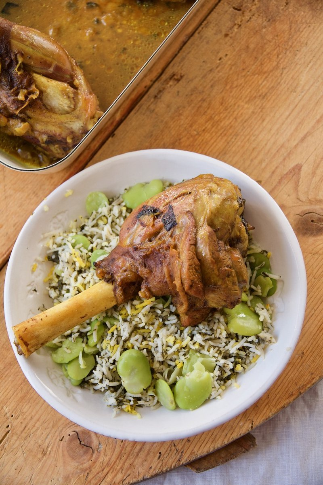

# Baghali Polo Ba Mahiche

*A Persian feast plate: dill-and-broad-bean rice with a saffron tahdig, served alongside slow-braised lamb shanks. A Nowruz dish.*

**Serves:** 4

**Prep Time:** 30 minutes (plus 1 hour rice soak)

**Cook Time:** 3 hours

## Overview
Lamb shanks brown hard; cook for 2 hours 30 minutes with onion, garlic, turmeric, cinnamon and saffron in a covered pot with a small amount of stock until fork-tender. Meanwhile, basmati rinses and soaks for 1 hour. Frozen (or fresh, podded) broad beans simmer briefly until tender; the rice parboils for 6 minutes in heavily salted water; drains. The rice layers in the cooking pot with the broad beans, dill and saffron: bottom oil-and-rice for tahdig; then a mixed layer of rice + beans + dill; another rice-and-bean-and-dill layer; topped with rice and saffron-water; lid-wrapped-in-towel; steam for 40 minutes. Plated with the lamb shanks alongside.

## Ingredients

### Lamb shanks
- 4 lamb shanks (about 350 g each)
- 3 tablespoons sunflower oil
- 2 onions (large, sliced)
- 6 garlic cloves (crushed)
- 2 teaspoons ground turmeric
- 1 teaspoon ground cinnamon
- 2 teaspoons salt
- ½ teaspoon black pepper
- 1 large pinch saffron threads (soaked in 4 tablespoons hot water)
- 500 ml light lamb (or chicken stock)
- 2 tablespoons tomato paste (optional)

### Rice
- 500 g basmati rice
- 3 tablespoons salt (for the parboil)
- 3 tablespoons sunflower oil
- 60 g unsalted butter
- 1 large pinch saffron threads (soaked in 4 tablespoons hot water)
- 250 g podded broad beans (fresh or frozen, defrosted)
- 1 large bunch fresh dill (chopped fine - about 80 g)

## Method

### Stage 1 - Sear and braise the lamb
1. Heat oven to 160°C (140°C fan).
1. Heat 3 tablespoons oil in a wide ovenproof lidded pot over medium-high.
1. Pat shanks dry; season with salt and pepper.
1. Brown shanks 4 minutes per side, deep colour. Lift to a plate.
1. Reduce heat to medium; add onion to the same pot.
1. Cook 10 minutes until soft and gold.
1. Add garlic, turmeric, cinnamon and salt; cook 30 seconds.
1. Add tomato paste (if using); stir 1 minute.
1. Return shanks; pour in stock; add saffron-water.
1. Bring to a simmer; cover; transfer to the oven.
1. Braise 2 hours 15 minutes. Turn the shanks once at the 1-hour mark.
1. Lift off the lid; cook 15 minutes more uncovered to reduce the sauce.

### Stage 2 - Rinse and soak rice
1. Rinse basmati until the water runs clear.
1. Cover with cold water and 1 tablespoon salt; soak 1 hour.

### Stage 3 - Broad beans
1. If using fresh: bring a pot of water to a boil; cook beans 3 minutes; drain.
1. If frozen: defrost.
1. Pop beans out of their thin skins (the inner bright-green bean is what you want) - fiddly but worth it.

### Stage 4 - Parboil rice
1. Bring 3 litres water + 3 tablespoons salt to a boil.
1. Drain soaked rice; add to the boiling water.
1. Cook 5-6 minutes - outside cooked, centre still firm.
1. Drain into a sieve; rinse briefly with lukewarm water.

### Stage 5 - Layer for steaming
1. Wash and dry the rice-cooking pot (or use a new one).
1. Add 3 tablespoons oil and 30 g butter to the bottom; heat over medium until bubbling.
1. Add 2 large spoons of plain rice to the bottom as an even layer (this will be the tahdig).
1. Drizzle 1 tablespoon of saffron-water over.
1. In a wide bowl, gently mix the remaining rice with the broad beans and chopped dill.
1. Spoon the rice-bean-dill mixture over the tahdig layer in a heap (cone shape).
1. Poke 5 holes through the rice cone with the handle of a wooden spoon (steam vents).
1. Dot the remaining 30 g butter around the top.
1. Drizzle the remaining saffron-water across.

### Stage 6 - Steam
1. Wrap the lid in a tea towel; clamp on the pot.
1. Cook over low heat 35-40 minutes - bottom forms tahdig, rice steams fluffy.

### Stage 7 - Plate
1. Spoon rice onto a wide platter, fluffing it gently.
1. Lift the tahdig out as a disc with a flat spoon (or break into pieces); place to one side.
1. Set the lamb shanks alongside; spoon some of the reduced sauce over them.

### Stage 8 - Serve
1. Eat with a wedge of lemon; some Persian families serve with maast (plain yogurt) on the side.

## Notes
- **Pop the bean skins:** Inner green bean only. The tough outer skin makes the dish chewy. Yes, it's tedious; yes, it matters.
- **Dill in abundance:** Fresh, chopped fine, generous quantity. Dried dill is a poor substitute. The dish is named for the rice's herb, not the meat - get it right.
- **Cloth-wrapped lid:** Standard Persian rice technique; absorbs condensation and keeps the rice fluffy.

## Storage
- Lamb shanks refrigerate 4 days; reheat covered in sauce at 160°C 25 minutes.
- Rice best fresh; reheats in a covered pan with a splash of water.
- Both freeze separately for 2 months.
