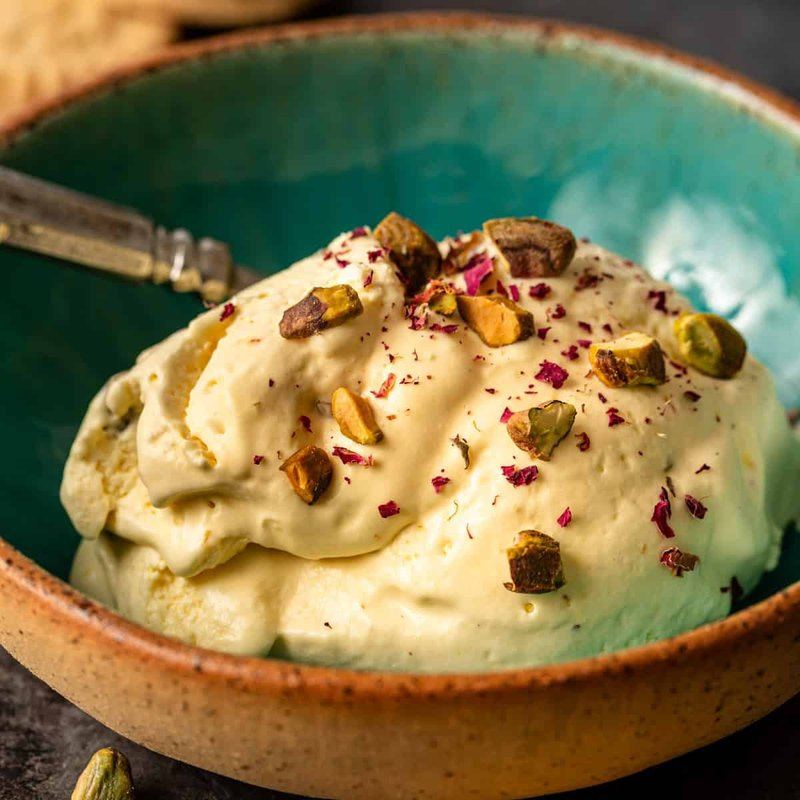

# Bastani Sonnati

*Persia's saffron-pistachio-rosewater ice cream: studded with shards of frozen cream and a touch of mastic gum for a faint chew.*

**Makes:** about 1 ½ litres

**Prep Time:** 25 minutes (plus 6 hours freezing)

**Cook Time:** 20 minutes

## Overview
Bastani sonnati is the Persian ice cream you eat from a paper cup on a summer street in Tehran or sandwiched between two thin vanilla wafers, the flavour an arresting combination of saffron, rosewater and pistachio with a faint chew from mastic gum and shards of frozen cream cracking through every scoop. Spread 200 ml of cream into a thin sheet and freeze it solid (you'll break it later into the cold shards that crunch through the soft ice cream and make this dish what it is). Meanwhile build a proper custard base: warm whole milk and cream with half the sugar till just simmering, whisk the yolks with the rest of the sugar till pale and ribbony, then temper the hot milk into the yolks and cook the custard gently back over low heat for four or five minutes till it coats the back of a wooden spoon. Off the heat, stir in saffron-milk, rosewater, ground mastic and a pinch of salt, strain to catch any cooked egg, then chill the base thoroughly overnight so the flavours marry. Churn till soft-set, fold through chopped pistachios and the cracked frozen cream shards working fast so they don't melt, then firm in the freezer for four hours. Let the tub soften five minutes before scooping; serve in a glass dish with extra pistachios and a few dried rose petals scattered across the top.

## Ingredients

### Custard
- 600 ml whole milk
- 400 ml double cream
- 200 g caster sugar
- 6 egg yolks (large)
- A generous pinch of saffron threads (steeped in 4 tablespoons hot milk 15 min)
- 2 tablespoons rosewater
- ½ teaspoon ground mastic gum (optional but classic - sold at Middle Eastern grocers)
- ½ teaspoon vanilla extract
- A pinch of salt

### Mix-ins
- 200 ml double cream (frozen separately into a thin sheet, then broken into shards)
- 80 g shelled pistachios (chopped)

## Method

### Stage 1 - Cream shards
1. Pour 200 ml of the cream into a wide shallow tray (around 20 x 30 cm).
1. Freeze 4 hours until solid.
1. Break into rough 1 cm shards with a knife or by tapping; return to the freezer until needed.

### Stage 2 - Custard base
1. Combine the milk, cream and 100 g of the sugar in a heavy saucepan.
1. Heat over medium until just simmering; stir to dissolve the sugar.

### Stage 3 - Egg yolks
1. Whisk the yolks with the remaining 100 g sugar in a bowl until pale and thickened.

### Stage 4 - Temper
1. Pour the hot milk slowly into the yolks, whisking constantly.
1. Return the mixture to the pan.
1. Cook over medium-low heat, stirring constantly with a wooden spoon, 4-5 minutes until the custard coats the back of the spoon and a finger drawn through leaves a clear line.

### Stage 5 - Flavour
1. Off the heat, stir in the saffron-milk, rosewater, mastic, vanilla and salt.
1. Strain through a fine sieve into a clean bowl (catches any cooked egg).

### Stage 6 - Chill
1. Cool to room temperature; press cling film onto the surface.
1. Refrigerate at least 4 hours, ideally overnight.

### Stage 7 - Churn
1. Pour the chilled custard into an ice cream maker; churn per the maker's instructions until soft-set.
1. Without an ice cream maker: pour into a wide tray; freeze 4 hours, whisking vigorously every 45 minutes for the first 3 hours to break up ice crystals.

### Stage 8 - Fold and freeze
1. Tip the soft-churned ice cream into a chilled container.
1. Fold through the pistachios and frozen cream shards (work fast so they don't melt).
1. Smooth the top; cover and freeze at least 4 hours.

### Stage 9 - Serve
1. Let soften 5 minutes at room temperature before scooping.
1. Top with extra pistachios and a few rose petals.

## Notes
- **Mastic gum:** Tiny crystals of pine resin from the Greek island of Chios; gives bastani its faintly chewy texture. Sold at Middle Eastern grocers; grind in a mortar with a pinch of sugar to a powder. Skip if unavailable; the ice cream is still excellent.
- **Frozen cream shards:** A traditional Persian touch - they crunch through the soft ice cream and add fat-richness. Don't omit if you're going for the proper experience.
- **Saffron quality:** Iranian super-negin or sargol gives the deepest flavour and colour. Cheap saffron tastes thin.

## Storage
- Keeps 2 weeks in an airtight container in the freezer; texture is best in the first week.
