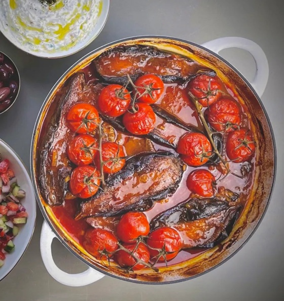

<!-- TODO: hero image undersized, refresh from Pexels or hand-curate -->
# Khoresh Bademjan

*Persia's aubergine stew: golden-fried aubergines laid over lamb shoulder simmered with onion, turmeric, saffron and yellow split peas.*

**Serves:** 4

**Prep Time:** 30 minutes (plus 30 min aubergine salting)

**Cook Time:** 1 hour 45 minutes

## Overview
Khoresh bademjan is the great Persian aubergine stew, layers of golden-fried aubergine laid across slow-cooked lamb the colour of saffron and split peas, eaten over chelo rice with the tahdig cracked into shards alongside. The aubergines do real work here: peeled in stripes (some skin stays for structure), salted heavily on both sides and rested half an hour till the bitter water beads up, then shallow-fried till deep gold. Pale fried aubergine gives a watery khoresh, so push the colour. The lamb braise builds slowly with onions taken deep gold, turmeric and cinnamon bloomed, tomato paste cooked till it darkens, and yellow split peas added for body. Saffron-water and a splash of verjuice (lemon juice substitutes) give the bright Persian acidity at the end. The aubergines layer across the top in the last twenty-five minutes; never stir them in or they collapse into mush. Served in a wide shallow dish over basmati rice.

## Ingredients

### Lamb base
- 600 g lamb shoulder (cut into 3 cm cubes)
- 3 tablespoons sunflower oil
- 2 onions (large, sliced)
- 4 garlic cloves (sliced)
- 1 ½ teaspoons ground turmeric
- 1 teaspoon ground cinnamon
- 1 ½ teaspoons salt
- ½ teaspoon black pepper
- 3 tablespoons tomato paste
- 80 g yellow split peas (rinsed)
- 800 ml water

### Aubergines
- 4 aubergines (medium, about 800 g)
- 2 tablespoons salt (for salting)
- 200 ml sunflower oil (for frying)

### To finish
- 1 large pinch saffron threads (soaked in 3 tablespoons hot water)
- 3 tablespoons verjuice (sour-grape juice, OR juice of 1 lemon)
- 1 teaspoon dried mint (optional)
- 2 tomatoes (sliced thin, optional, for topping)

### To serve
- Persian chelo rice (with tahdig if possible)

## Method

### Stage 1 - Salt the aubergines
1. Peel aubergines in alternating stripes (so some skin remains).
1. Cut into 1 ½ cm-thick rounds (or 2 cm thick long lengthwise slices).
1. Lay on a tray; sprinkle generously with salt on both sides.
1. Rest 30 minutes.
1. Rinse briefly; pat very dry with kitchen paper.

### Stage 2 - Lamb base
1. Heat 3 tablespoons sunflower oil in a wide heavy lidded pot over medium-high.
1. Add lamb cubes; brown 6 minutes on all sides. Lift to a plate.

### Stage 3 - Onions
1. Reduce heat to medium; add sliced onions to the same pot.
1. Cook 12 minutes, stirring, until deep golden.
1. Add garlic; cook 1 minute.

### Stage 4 - Spice
1. Add turmeric, cinnamon, salt and pepper; cook 30 seconds.
1. Add tomato paste; stir 2 minutes - it should darken slightly.

### Stage 5 - Simmer
1. Return lamb to the pot.
1. Add yellow split peas.
1. Pour in 800 ml water.
1. Bring to a simmer; cover; reduce heat.
1. Cook 1 hour - the lamb should be tender; the split peas soft and slightly broken down.

### Stage 6 - Fry the aubergines
1. While the lamb simmers: heat 200 ml sunflower oil in a wide pan to 175°C.
1. Fry the aubergine slices in 2-3 batches, 2 minutes per side, until deep gold.
1. Lift onto kitchen paper.

### Stage 7 - Combine
1. To the lamb pot, add the saffron-water, verjuice (or lemon juice) and dried mint.
1. Lay the fried aubergines on top in a single layer (don't stir in; they break apart).
1. Place sliced tomatoes over the aubergines if using.
1. Cover; simmer gently 25-30 minutes.

### Stage 8 - Rest and serve
1. Off heat; let stand 10 minutes.
1. Taste the sauce; adjust salt and verjuice.
1. Serve in a wide shallow dish, alongside Persian chelo rice and tahdig.

## Notes
- **Salt the aubergines:** Bitterness in aubergines is largely a flavour of the seeds and the juice. Salting and resting draws both out. Modern aubergine varieties are less bitter than older ones, but the salt step still helps texture.
- **Fry them gold:** Pale fried aubergine gives a watery khoresh. Fry to deep gold so the slices hold their shape and have caramelised flavour.
- **Don't stir in the aubergines:** They go on top and stay on top. Stirring breaks them into a mush.

## Storage
- Refrigerate 4 days; reheats well, arguably better on day 2.
- Freezes 3 months.
