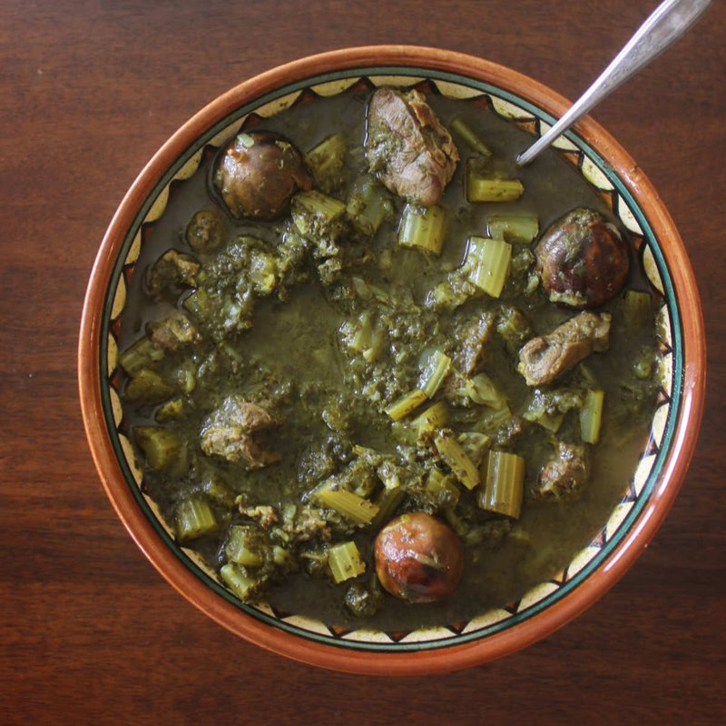

# Khoresh Karafs

*Persia's celery stew: lamb simmered with celery, parsley and mint until the pot is herb-bright, then finished with saffron and lemon.*

**Serves:** 4

**Prep Time:** 25 minutes

**Cook Time:** 1 hour 45 minutes

## Overview
Khoresh karafs is the Persian celery stew, an unlikely-sounding dish that turns out to be one of the brightest, most herb-bright things you can put on a plate of saffron rice. You start by browning lamb shoulder cubes hard, then softening sliced onions in the same pot for ten minutes till deep gold, blooming turmeric and a whisper of cinnamon before returning the lamb to simmer in 700 ml of water for an hour and a quarter till the meat is tender. Meanwhile sauté the karafs: slice a whole head of celery into 2 cm lengths and cook in olive oil for six or seven minutes till just softened with the bright green colour intensifying, then add an enormous bunch of chopped parsley and mint and the celery leaves for two more minutes off the heat (raw celery dropped straight into the pot stays grassy and waters everything down, so this sauté is what builds the flavour). Tip the herbs and celery into the lamb pot to simmer another twenty-five minutes, then finish off the heat with saffron-water and a generous squeeze of lemon (lemon at the end brightens; lemon at the start dulls the herbs). Rest covered ten minutes, taste for salt and acidity, and ladle over chelo rice with the tahdig alongside for cracking into pieces.

## Ingredients

### Lamb base
- 600 g lamb shoulder (cut into 3 cm cubes)
- 3 tablespoons sunflower oil
- 2 onions (large, sliced)
- 4 garlic cloves (sliced)
- 1 ½ teaspoons ground turmeric
- ½ teaspoon ground cinnamon
- 1 teaspoon salt
- ½ teaspoon black pepper
- 700 ml water

### Celery and herbs (the karafs)
- 1 large head celery (8-10 stalks, leaves reserved - about 500 g)
- 3 tablespoons sunflower oil
- 1 large bunch fresh flat-leaf parsley (chopped - about 50 g)
- 1 small bunch fresh mint (chopped - about 25 g, or 2 tablespoons dried mint)
- A handful of celery leaves (chopped - they go in for extra flavour)

### To finish
- 1 large pinch saffron threads (soaked in 3 tablespoons hot water)
- 2 lemons (about 4 tablespoons, or 3 tablespoons verjuice, juice)
- 1 teaspoon salt (to taste)

### To serve
- Persian chelo rice with tahdig

## Method

### Stage 1 - Brown the lamb
1. Heat 3 tablespoons sunflower oil in a wide heavy lidded pot over medium-high.
1. Add lamb; brown 6 minutes on all sides. Lift to a plate.

### Stage 2 - Soften the onion
1. Reduce heat to medium.
1. Add onion; cook 10 minutes until deep gold.
1. Add garlic; cook 1 minute.

### Stage 3 - Spice
1. Add turmeric, cinnamon, salt and pepper; cook 30 seconds.

### Stage 4 - Simmer
1. Return lamb to the pot; toss to coat in the spice.
1. Pour in 700 ml water.
1. Bring to a simmer; cover; reduce heat.
1. Cook 1 hour 15 minutes until tender.

### Stage 5 - Sauté celery and herbs
1. While the lamb simmers, slice celery stalks into 2 cm pieces.
1. Heat 3 tablespoons sunflower oil in a wide pan over medium heat.
1. Add celery; sauté 6-7 minutes until just softened and slightly golden at the edges (the bright green colour intensifies).
1. Add chopped parsley, mint and celery leaves; cook 2 minutes - the herbs darken slightly but should stay vibrant green.
1. Off heat.

### Stage 6 - Combine
1. Tip the sautéed celery-and-herbs into the lamb pot.
1. Stir gently.
1. Cover; simmer 25 minutes - the celery softens further; the herb flavour permeates the lamb.

### Stage 7 - Finish
1. Off heat (or very low).
1. Stir in saffron-water and lemon juice.
1. Taste; adjust salt and acidity.

### Stage 8 - Rest and serve
1. Rest covered 10 minutes.
1. Serve over chelo rice with tahdig alongside.

## Notes
- **Heaps of herbs:** Persian khoresh karafs is not "stew with a sprig of parsley" - it's stew thick with herbs. A whole bunch of parsley per 4 people is correct.
- **Sauté the celery before adding:** Raw celery added directly to the pot would water down the stew and stay grassy. Sautéing draws out water and builds flavour.
- **Lemon at the end:** Lemon juice added at the start dulls the herbs. At the end it brightens everything.

## Storage
- Refrigerate 3 days; reheats well.
- Freezes 3 months; the herbs lose some vibrancy on thaw but the flavour holds.
