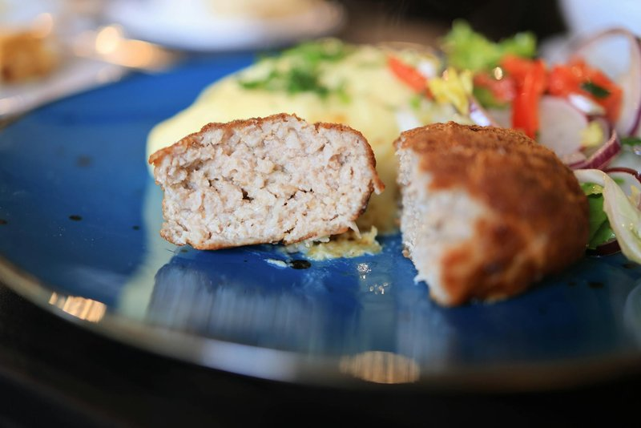

# Kotlet

*Persia's everyday cutlet: oval patties of mince, grated potato and onion lightly spiced with turmeric, shallow-fried gold and crisp.*

**Serves:** 4 (makes 12 kotlet)

**Prep Time:** 25 minutes (plus 30 min chilling)

**Cook Time:** 25 minutes

## Overview
A medium potato grates fine (on a box grater); a small onion grates the same way. The grated potato and onion squeeze in a clean tea towel to extract excess water. They combine with mince, egg, turmeric, salt, pepper and a touch of cinnamon into a paste. The paste rests for 30 minutes (firms up; the salt seasons through). Shaped into 12 oval patties, about 8 cm long, 1 cm thick. Shallow-fried in sunflower oil 3 minutes per side until deep gold.

## Ingredients

- 500 g beef mince (or lamb mince, or 50/50)
- 1 potato (medium, peeled - about 250 g)
- 1 onion (medium, peeled - about 150 g)
- 2 garlic cloves (crushed)
- 2 eggs (large)
- 1 ½ teaspoons ground turmeric
- ¼ teaspoon ground cinnamon
- 2 teaspoons salt
- 1 teaspoon black pepper
- 4 tablespoons sunflower oil (for frying)

### To serve
- Sangak, taftoon (or flatbread)
- 2 tomatoes (medium, sliced)
- 1 small bunch radishes (sliced or whole)
- A handful fresh parsley sprigs
- A handful fresh mint
- Persian pickles (torshi)

## Method

### Stage 1 - Grate
1. Grate the potato on the fine side of a box grater (NOT shredded - finer than that, into a paste-like texture).
1. Do the same for the onion.
1. Combine both in a clean tea towel; twist hard over the sink to squeeze out as much liquid as you can. (Discard the liquid.)

### Stage 2 - Mix
1. In a wide bowl, combine the mince, the squeezed potato-and-onion, crushed garlic, eggs, turmeric, cinnamon, salt and pepper.
1. Mix thoroughly with your hand for 3-4 minutes - the mixture should be uniform, slightly tacky, and hold together when pressed.

### Stage 3 - Rest
1. Cover; refrigerate 30 minutes (firms the mixture; lets the seasoning permeate).

### Stage 4 - Shape
1. Take 2 heaped tablespoons of mixture per kotlet.
1. Wet your hands; shape each into an oval patty about 8 cm long, 5 cm wide, 1 cm thick.
1. Place on a tray.
1. Should make 12 kotlet.

### Stage 5 - Fry
1. Heat oil in a wide non-stick pan over medium heat.
1. Add 4-5 kotlet (don't crowd); fry 3 minutes per side until deep golden brown.
1. Lift onto kitchen paper.
1. Continue with the rest, adding a splash of oil between batches.

### Stage 6 - Serve
1. Eat warm with sangak or flatbread.
1. On the side: sliced tomatoes, radishes, fresh herbs, pickles.
1. Wrap a kotlet inside a piece of bread with some tomato and a sprig of herb - that's the Persian way.

## Notes
- **Grate fine, not shredded:** The texture of a properly grated potato and onion is a paste, not strands. Shredded gives a stringy kotlet. Use the fine side of the grater, not the coarse.
- **Squeeze out the water:** Wet kotlet falls apart in the pan. Squeeze the grated potato-and-onion in a tea towel until dry to the touch.
- **Don't overcrowd the pan:** Crowded patties steam rather than fry. They lose their crisp edge and look pale.

## Storage
- Refrigerate 3 days; eat cold or reheat in a dry pan 1 minute per side.
- Freeze cooked 2 months; reheat from frozen in a pan 4 minutes per side.
- Sandwiches the next day - a Persian classic.
