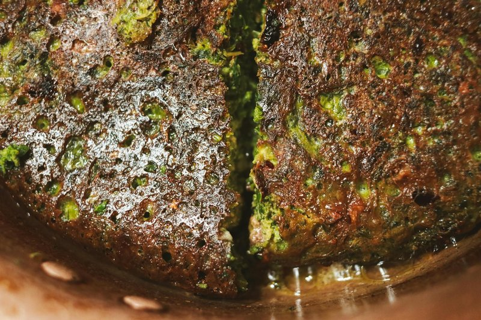

# Kuku Sabzi

*Persia's herb omelette: a deep-green frittata heavy with parsley, coriander, dill and fenugreek. The Nowruz table-centre dish.*

**Serves:** 6

**Prep Time:** 25 minutes

**Cook Time:** 30 minutes

## Overview
Kuku sabzi is the deep-green herb omelette that sits at the centre of the Nowruz table, a frittata that's somehow 80% herb and 20% binding egg, scented with dried fenugreek and faintly stained gold by saffron. Huge bunches of parsley, coriander, dill and chives (about 250 g chopped, a generous heap that looks like too much and isn't) chop very fine by hand or in pulses short of paste. The egg base is light on binding: flour, baking powder, turmeric, salt, pepper and saffron-water, with chopped walnuts and barberries folded through. The mixture should look like herbs barely held together by egg, not the other way round. Cooked covered in a hot oiled pan till the bottom sets deep green-brown, then flipped or finished in the oven at 180 °C for twenty minutes. Eat warm in wedges with Greek yogurt or mast o musir, sliced tomato and warm sangak; picnic-cold the next day on flatbread is arguably even better.

## Ingredients

### Herbs (about 250 g total chopped, by volume the bulk of the dish)
- 1 large bunch flat-leaf parsley (about 80 g)
- 1 large bunch coriander (about 60 g)
- 1 large bunch fresh dill (about 60 g)
- 1 small bunch chives (or spring onion tops, about 30 g)
- A handful fresh fenugreek leaves (shanbalileh): OR 2 teaspoons dried fenugreek leaves (kasoori methi)

### Eggs
- 6 eggs (large)
- 2 tablespoons plain flour (or chickpea flour for a gluten-free version)
- 1 teaspoon baking powder
- 1 teaspoon ground turmeric
- 1 ½ teaspoons salt
- ½ teaspoon black pepper

### Optional add-ins
- 40 g walnuts (chopped, traditional in some households)
- 1 tablespoon zereshk (dried barberries, rinsed, traditional in some)
- 1 large pinch saffron (soaked in 2 tablespoons hot water)

### For cooking
- 4 tablespoons sunflower oil (or 2 tablespoons oil + 2 tablespoons butter)

### To serve
- Greek yogurt (or mast o musir)
- Sliced tomato, cucumber
- Fresh herbs and pickles
- Sangak (or other Persian bread)

## Method

### Stage 1 - Chop herbs
1. Strip leaves from the stems; reserve the soft fine stems (which have great flavour); discard only the thick bottom stems.
1. Chop all herbs very fine, by hand on a board, or pulse in a food processor (don't process to a paste, you want fine chop).
1. The herb pile should be about 250 g total. (If using a kitchen scale, fresh chopped herbs weigh light, go by volume too: you want a generous heap, the bulk of the dish.)

### Stage 2 - Egg mixture
1. In a wide bowl, whisk eggs until well combined.
1. Whisk in flour, baking powder, turmeric, salt and pepper.
1. Stir in the saffron-water (if using).

### Stage 3 - Combine
1. Fold the chopped herbs into the egg mixture.
1. Add walnuts and barberries if using.
1. The mixture should be thick (more like a herb-with-some-egg than an omelette): about 80% herbs, 20% egg.

### Stage 4 - Cook (stovetop method)
1. Heat oil in a 24 cm non-stick pan over medium heat until shimmering.
1. Pour in the mixture; smooth the top.
1. Cover with a lid (to trap heat).
1. Cook 6-8 minutes, the bottom sets and turns deep green-brown.
1. To flip: slide onto a flat plate, then invert the pan over the plate and tip back. Cook 4-6 more minutes covered to set the second side.

### Stage 5 - Or oven method (easier for beginners)
1. Heat oven to 180°C (160°C fan).
1. Heat oil in an ovenproof 24 cm pan over medium heat.
1. Pour in the mixture; cook 3 minutes on the stove to set the bottom.
1. Transfer to the oven; bake 18-20 minutes until a skewer comes out clean and the top is set.

### Stage 6 - Cool slightly and serve
1. Cool 5 minutes; cut into wedges or squares.
1. Serve warm or at room temperature with yogurt, bread and salad.

## Notes
- **The herbs ARE the dish:** Kuku sabzi is herb-heavy by design. The egg is just enough to bind. Don't reduce the herb quantity; it's the point.
- **Fenugreek is the giveaway:** Dried fenugreek (kasoori methi) added in small amount gives the unmistakable Persian aroma. Without it, you have a green omelette, not kuku sabzi. Even ½ teaspoon makes the difference.
- **Don't overcook:** A drier kuku is less pleasant than a slightly moist one. Pull off heat when the centre is just set; carry-over does the rest.

## Storage
- Refrigerate 4 days. Many Persians prefer kuku cold the next day with bread for breakfast.
- Freezes 2 months; defrost in the fridge overnight.
- Excellent picnic food.
