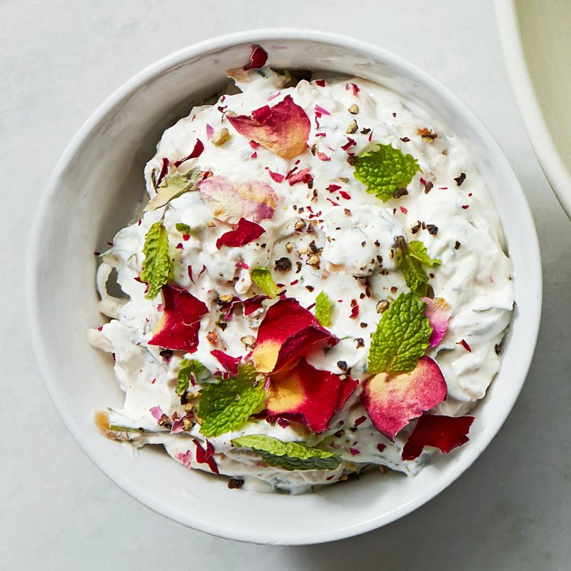

# Mast O Musir

*Persia's wild-shallot yogurt: thick strained yogurt mixed with dried Zagros-mountain shallots. Served with rice or for dipping bread.*

**Serves:** 4

**Prep Time:** 10 minutes active

**Total Time:** 8 hours (overnight rehydration)

## Overview
Dried sliced Persian shallots (sold at Iranian shops, looks like small papery brown discs) cover with cold water and rehydrate overnight (8-12 hours). Drained and patted dry; chopped fine. Strained thick yogurt whisks in a bowl; the chopped rehydrated shallots fold in; a pinch of salt and a small splash of cold water adjust the consistency. Rests for 1 hour for flavours to integrate. Served with a drizzle of olive oil.

## Ingredients

- 30 g dried Persian shallots (musir, sold sliced at Iranian shops)
- 500 g full-fat thick plain yogurt (strained, or use thick Greek yogurt)
- 1 teaspoon salt (to taste)
- 1 tablespoon cold water (only if the yogurt is very thick)
- ½ teaspoon dried mint (optional)
- 1 tablespoon extra-virgin olive oil (to drizzle)

## Method

### Stage 1 - Rehydrate the shallots
1. Place the dried shallots in a bowl; cover with cold water (about 200 ml).
1. Soak overnight (8-12 hours). The shallots will swell and soften from papery dry to fully reconstituted.
1. Drain through a sieve; rinse briefly to wash off any released bitterness.
1. Pat dry on kitchen paper.
1. Chop fine.

### Stage 2 - Combine
1. In a wide bowl, whisk the yogurt smooth.
1. Fold in the chopped rehydrated shallots.
1. Season with salt; add 1 tablespoon of cold water only if the texture is dense (mast o musir should be thick-spoonable, not pourable).
1. Stir in dried mint if using.
1. Taste; adjust salt.

### Stage 3 - Rest
1. Cover; refrigerate 1 hour (or up to 24 hours - the flavour develops).

### Stage 4 - Serve
1. Tip into a wide shallow bowl.
1. Make a shallow well in the centre with the back of a spoon.
1. Drizzle with extra-virgin olive oil.
1. Serve alongside grilled meats, kebabs, chelo rice or as a starter with sangak / pita / pieces of warm bread.

## Notes
- **Overnight rehydration is non-negotiable:** Short soaks (1-2 hours) leave the shallots chewy and the funky-sour flavour underdeveloped. The 8-hour rest is what makes mast o musir work.
- **Strained / thick yogurt only:** Watery yogurt makes a thin sad dip. Use Persian-style strained yogurt (or thick Greek yogurt); if your yogurt is loose, hang it in muslin over a sieve overnight to drain off the whey.
- **Substitute for musir:** If you cannot find dried Persian shallots, finely chop 2 tablespoons of fresh shallot and let it soak in 2 tablespoons cold water + 1 teaspoon vinegar for 30 minutes; drain. The result is similar though milder.

## Storage
- Refrigerate 4 days. The flavour deepens over the first 24 hours, then slowly fades.
- Don't freeze.
