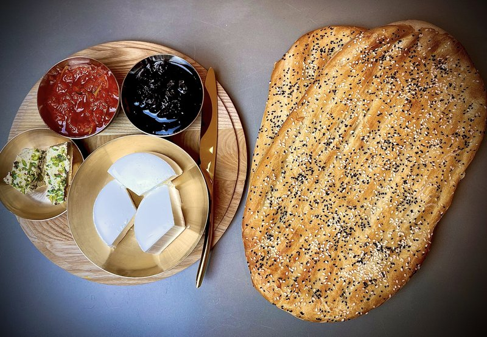

# Nan e Barbari

*Iran's morning flatbread: a long ridged loaf with a glossy crackle, scattered with sesame and nigella, baked on a hot stone.*

**Serves:** 4 (makes 2 long loaves)

**Prep Time:** 30 minutes (plus 1 hour 30 min rises)

**Cook Time:** 15 minutes per loaf

## Overview
A medium-hydration yeasted dough (about 65% hydration) of bread flour, yeast, salt, water and a small amount of oil rises for 1 hour. Divides into 2; each piece shapes into a long oval (about 35 cm x 15 cm) and proofs for 30 minutes. The roomal glaze cooks separately: flour-and-water-and-baking-soda whisks and brings to a boil, it sets into a glossy paste. Each loaf gets brushed all over with the warm glaze; deep parallel ridges press in with fingertips (4-5 ridges per loaf running lengthwise); sprinkled with sesame and nigella seeds. Slides onto a hot stone (or upside-down baking tray) preheated to maximum; bakes for 12-15 minutes until deep gold.

## Ingredients

### Dough
- 600 g strong white bread flour
- 1 sachet (7 g) fast-action yeast
- 1 ½ teaspoons salt
- 1 teaspoon caster sugar
- 400 ml warm water
- 2 tablespoons sunflower oil

### Roomal glaze
- 250 ml water
- 1 tablespoon plain flour
- ½ teaspoon bicarbonate of soda
- ½ teaspoon caster sugar

### Topping
- 2 tablespoons white sesame seeds
- 1 tablespoon black sesame seeds or nigella seeds

## Method

### Stage 1 - Dough
1. Whisk flour, yeast, salt and sugar in a wide bowl.
1. Add warm water and oil; mix to a soft slightly sticky dough.
1. Knead 10 minutes by hand (or 7 minutes in a stand mixer) until smooth and elastic.
1. Cover; rise 1 hour until doubled.

### Stage 2 - Roomal glaze
1. While the dough rises, in a small saucepan whisk flour with 250 ml cold water until smooth.
1. Add baking soda and sugar.
1. Bring to a simmer over medium heat, whisking constantly - the mixture thickens to a thin runny paste over about 3 minutes.
1. Off heat; cool to lukewarm.
1. (If it gets too thick on standing, whisk in a tablespoon of water.)

### Stage 3 - Shape
1. Knock back the dough; divide into 2 equal pieces.
1. Roll each piece into a ball.
1. Cover; rest 10 minutes.
1. On a lightly floured surface, shape each ball into a long oval, about 35 cm x 15 cm, by stretching and patting (NOT rolling - barbari should have some air retained).

### Stage 4 - Proof
1. Place each shaped loaf on a piece of baking paper.
1. Cover loosely with a tea towel; proof 25-30 minutes (puffy but not doubled).

### Stage 5 - Heat oven
1. Heat oven to maximum (260°C / 240°C fan or higher).
1. Place a baking stone (or heavy upside-down baking tray) on the upper-middle rack to preheat 30 minutes.

### Stage 6 - Glaze and ridge
1. Working with one loaf at a time on the paper:
   - Brush the entire top surface generously with the lukewarm roomal glaze.
   - With fingertips (oiled if sticky), press 4-5 deep parallel ridges running lengthwise along the loaf - really push down to leave clear grooves about 1 cm deep.
   - Sprinkle generously with sesame seeds and nigella seeds.

### Stage 7 - Bake
1. Slide the loaf (with paper) onto the hot stone.
1. Bake 12-15 minutes until deep golden brown, the ridges deeply set, the crust glossy and crackled.
1. Slide off the stone onto a wire rack.

### Stage 8 - Serve
1. Eat warm, ideally within 30 minutes of baking.
1. Traditional Persian breakfast: tear off pieces, eat with feta cheese, walnuts, fresh herbs and black tea.

## Notes
- **The roomal glaze:** This is what gives barbari its distinctive glossy crackled crust. Plain water-brush gives a dull-looking bread. The cooked flour-and-soda paste is essential.
- **Maximum oven heat:** Barbari needs FIERCE heat to develop the crust and ridges. Maximum oven temperature; preheated stone or tray; no compromise.
- **Deep ridges:** Shallow ridges flatten out during baking. Press hard, all the way to 1 cm depth. The hot oven sets the shape immediately.

## Storage
- Best within 4 hours of baking.
- Refrigerate 2 days in a paper bag; refresh in a hot oven 4 minutes.
- Freeze cooked 2 months; reheat from frozen at 200°C 6 minutes.
