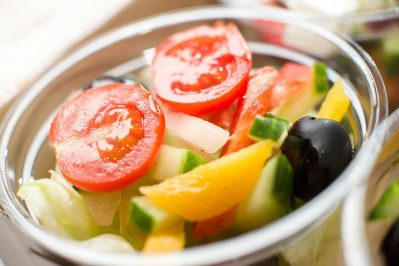

# Salad Shirazi

*Persia's everyday cucumber-and-tomato salad, named for the city of Shiraz: tomato, cucumber and onion finely diced, dressed with lime juice, olive oil and dried mint. Eats next to kabab, fesenjan, ghormeh sabzi - anything from the Persian table. The dice is small, almost like a relish; the dried mint is the signature.*

**Serves:** 4

**Prep Time:** 15 minutes

**Cook Time:** 0 minutes

## Overview
Salad shirazi is named for Shiraz and turns up next to almost everything on a Persian table: chelo kabab, fesenjan, ghormeh sabzi, or just a kuku and bread for lunch. The shape is small, sharp and herb-bright, almost a relish rather than a salad, and the dried mint is the signature note that separates it from every other Mediterranean chopped vegetable. The cut is the Persian distinction; tomato, cucumber and red onion all diced into matching 5 mm cubes, small enough that every cube gets dressed properly. Deseeding the tomatoes and cucumbers is non-negotiable; the watery core dilutes the dressing within twenty minutes and the whole bowl becomes soup. Dried mint is the Persian signature (generous, with a smaller hand of fresh mint alongside); all-fresh-mint loses the dusty-savoury flavour. Lime juice rather than lemon is the Persian acid; lime gives a sharper edge that pairs with saffron rice in a way lemon doesn't. A pinch of sumac across the top, served at room temperature alongside whatever's just come out of the saffron rice pot.

## Ingredients

- 4 tomatoes (medium, around 400 g)
- 2 cucumbers (medium, around 300 g)
- 1 red onion (small)
- 4 tablespoons extra-virgin olive oil
- 2 limes (juice)
- 1 tablespoon dried mint
- A small bunch fresh mint (chopped)
- 1 teaspoon salt
- ½ teaspoon black pepper
- ¼ teaspoon ground sumac (optional)

## Method

### Stage 1 - Dice
1. Halve the tomatoes; squeeze out and discard the seeds and watery cores.
1. Dice the flesh into 5 mm cubes.
1. Peel the cucumbers; halve lengthwise; scoop out the seeds; dice to match.
1. Dice the onion to match.

### Stage 2 - Combine
1. Tip everything into a wide bowl.
1. Add the olive oil, lime juice, dried mint, fresh mint, salt and pepper.
1. Toss gently.

### Stage 3 - Rest
1. Cover and rest 10 minutes at room temperature.
1. Stir; taste; adjust salt and lime.

### Stage 4 - Serve
1. Sprinkle with sumac if using.
1. Serve at room temperature alongside any Persian main: chelo kabab, fesenjan, ghormeh sabzi.

## Notes
- **Dried mint, not fresh alone:** Dried mint is what gives the salad its signature flavour. Fresh mint adds, but isn't a substitute.
- **Small dice:** Salad Shirazi is finer than Western chopped salads - small cubes coat in the dressing properly. Knife work matters.
- **Eat fresh:** Won't keep beyond 2 hours; the cucumbers and tomatoes weep and the salad goes watery.

## Storage
- Best within 2 hours of mixing.
