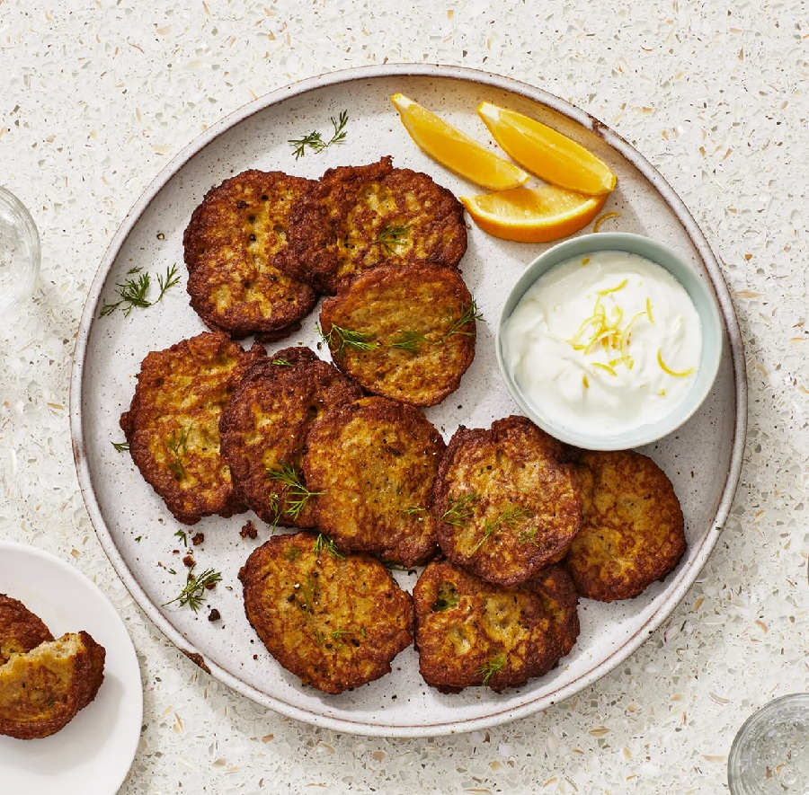

# Kuku Sib Zamini

*Persia's potato omelette: grated boiled potato folded with eggs, onion, turmeric and saffron, baked till just-set and gold.*

**Serves:** 6 (one 24 cm tray, cut into 12 squares)

**Prep Time:** 20 minutes

**Cook Time:** 35 minutes

## Overview
Potatoes are boiled in their skins until tender (about 25 minutes); cooled slightly, peeled, grated on the coarse side. Onion is sautéed in oil with a pinch of turmeric until soft. Eggs are beaten with salt, pepper, saffron-water, baking powder and a tablespoon of flour. The grated potato and softened onion are folded through. The mixture is tipped into a buttered 24 cm round or square tin; baked at 180°C for 25-30 minutes until the top is gold and the centre is just set. Cooled slightly; cut into squares. Excellent with Greek yogurt or as part of a sabzi-khordan (Persian herb-and-cheese plate).

## Ingredients

- 700 g waxy potatoes (about 4 medium - Charlotte, Yukon Gold or other waxy)
- 1 large onion (finely diced)
- 3 tablespoons sunflower oil OR ghee
- 1 teaspoon ground turmeric
- 5 large eggs (room temperature)
- 1 teaspoon baking powder
- 1 tablespoon plain flour
- 1 large pinch saffron threads (soaked in 2 tablespoons hot water)
- 1 teaspoon salt
- ½ teaspoon black pepper
- 1 teaspoon dried mint (optional)
- 2 tablespoons fresh chives or spring onion (chopped, optional)

### To finish
- 30 g unsalted butter (for the tin)
- 1 tablespoon olive oil (drizzle on top)
- Greek yogurt to serve
- Persian flatbread (sangak / barbari) or pita

## Method

### Stage 1 - Cook potatoes
1. Place potatoes (skins on) in a pot of cold water; bring to a boil; cook 25 minutes until a knife slips in.
1. Drain; cool 5 minutes; peel; grate on the coarse side of a box grater.
1. The potatoes should still be slightly warm but not hot.

### Stage 2 - Onion
1. Heat oil or ghee in a wide pan over medium heat.
1. Sauté onion 8 minutes until soft and just gold.
1. Stir in turmeric; cook 30 seconds.
1. Off heat; cool slightly.

### Stage 3 - Egg mixture
1. Beat eggs with baking powder, flour, saffron-water, salt, pepper and dried mint (if using) in a wide bowl.

### Stage 4 - Combine
1. Fold the grated potato and softened onion into the egg mixture.
1. Add chopped chives if using.

### Stage 5 - Bake
1. Heat oven to 180°C (160°C fan).
1. Butter a 24 cm round or 22 cm square tin generously.
1. Pour in the mixture; smooth the top.
1. Drizzle 1 tablespoon olive oil over.
1. Bake 25-30 minutes until the top is deep gold and a skewer inserted comes out clean.

### Stage 6 - Cool and cut
1. Rest 10 minutes in the tin.
1. Cut into 12 squares (or 6 wedges if round).

### Stage 7 - Serve
1. Plate warm with yogurt and bread.
1. Or cool fully, refrigerate, and pack into bento boxes for a picnic. Excellent cold the next day on Persian flatbread with tomato slices.

## Notes
- **Coarse grate, slightly warm potato:** Cold potato is too firm to grate into a fine texture; hot potato falls apart. Warm-but-not-hot is right.
- **Saffron is the Persian signature:** Even a small amount of saffron-water in the egg mix gives the dish its distinctive gold colour and faint floral aroma. Without it, you have a potato omelette, not a Persian kuku.
- **Cool to room temp for sandwich use:** The classic Tehran kuku sandwich is cold kuku slices on flatbread with sliced tomato, pickled cucumber and a smear of butter.

## Storage
- Refrigerate 4 days; serves cold or warmed.
- Freezes 2 months in slices; defrost in fridge then warm or eat cold.
