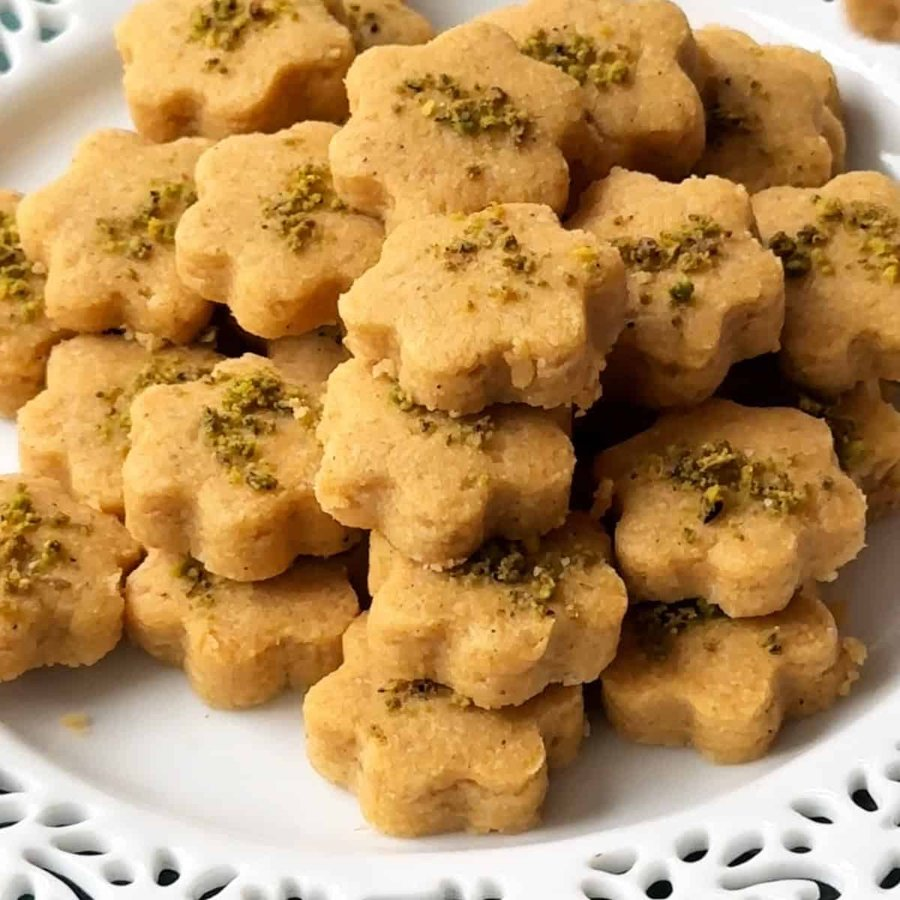

# Nan-E Nokhodchi

*Persia's chickpea-flour cookies: tiny clover-shaped shortbreads scented with rosewater and cardamom, dusted with crushed pistachios.*

**Serves:** 8 (makes 40 small cookies)

**Prep Time:** 30 minutes (plus 2 hour dough rest)

**Cook Time:** 18 minutes

## Overview
Chickpea flour roasts briefly in a dry pan or oven to remove the raw flavour and develop nuttiness; cooled fully. Butter (softened, not melted) creams with icing sugar and ground cardamom until pale and fluffy. Rosewater works in. The cooled chickpea flour folds through (no other flour added; gluten-free). The dough rests for 2 hours at room temperature. Rolled to 1 cm thick on a board dusted with extra chickpea flour. Cut with a small four-leaf-clover stencil OR rolled into walnut-sized balls flattened slightly. Topped with a pinch of crushed pistachio. Baked at 150°C 15-18 minutes, gently, no browning. Cool fully before lifting (very fragile when warm).

## Ingredients

- 250 g chickpea flour (besan / gram flour - sold at Indian / Middle Eastern shops)
- 200 g unsalted butter (softened to room temperature; NOT melted)
- 120 g icing sugar (sifted)
- 1 ½ teaspoons ground cardamom
- 1 tablespoon rosewater (Persian or Lebanese)
- A pinch of salt

### Topping
- 50 g shelled unsalted pistachios (chopped fine, almost powdered)

### Equipment
- A small flower / 4-leaf-clover cookie cutter (3-4 cm across) OR a small flute / round cutter
- Baking trays lined with paper

## Method

### Stage 1 - Roast chickpea flour
1. Spread chickpea flour on a dry baking tray.
1. Roast at 130°C 10 minutes, stirring once - the flour should smell nutty but NOT brown.
1. (Or toast in a dry pan over medium-low heat 5-6 minutes, stirring continuously.)
1. Cool completely.

### Stage 2 - Cream butter and sugar
1. In a wide bowl, cream softened butter with icing sugar and ground cardamom - beat with electric beaters or a wooden spoon for 4-5 minutes until very pale, fluffy and almost white.

### Stage 3 - Add rosewater
1. Mix in rosewater and a pinch of salt.

### Stage 4 - Add flour
1. Fold in the cooled roasted chickpea flour in 3 additions.
1. The dough should come together as a soft, slightly crumbly Play-Doh consistency.
1. If it's too dry, add another teaspoon of rosewater; too wet, a tablespoon more chickpea flour.

### Stage 5 - Rest
1. Cover with cling film; rest at COOL room temperature 2 hours (don't refrigerate - refrigerated, the butter firms too much and the dough cracks when rolled).

### Stage 6 - Roll and cut
1. Heat oven to 150°C (130°C fan).
1. Dust a board with chickpea flour.
1. Roll the dough to 1 cm thick (THICK - the cookies are short and dense).
1. Cut with a small clover / flower cutter into 40 small shapes.
1. Re-roll scraps once.
1. Transfer to lined baking trays with a spatula (cookies are fragile).

### Stage 7 - Top
1. Press a tiny pinch of chopped pistachio into the centre of each cookie.

### Stage 8 - Bake
1. Bake 15-18 minutes at 150°C - the cookies should look pale-and-just-set, NO browning. They should still feel slightly soft on top; they firm as they cool.

### Stage 9 - Cool
1. Lift the baking paper with the cookies onto a wire rack.
1. Cool 20 minutes WITHOUT moving the cookies - they're extremely fragile while warm.
1. Once fully cool, lift gently onto a plate.

### Stage 10 - Serve
1. Eat with strong black tea (Persian-style, sweetened with sugar cubes held between the teeth).
1. Store in an airtight tin.

## Notes
- **Roast the chickpea flour:** Without roasting, the cookies have a slightly raw-bean flavour. The brief toast removes this and adds nuttiness.
- **Don't bake to brown:** These cookies are pale by design. Any browning gives a bitter edge and changes the texture. 150°C is right; 180°C is too hot.
- **Very fragile when warm:** Don't try to move warm cookies - they'll crumble. Let them cool fully on the tray.
- **Snack or dessert?**: In Persian custom, nan-e nokhodchi is eaten as both a tea-time snack and an after-dinner sweet. Listed here as a snack because it pairs with tea; equally at home in desserts/.

## Storage
- Keep airtight at cool room temperature 2 weeks.
- Don't refrigerate - they go stale faster.
- Doesn't freeze well (texture suffers).
