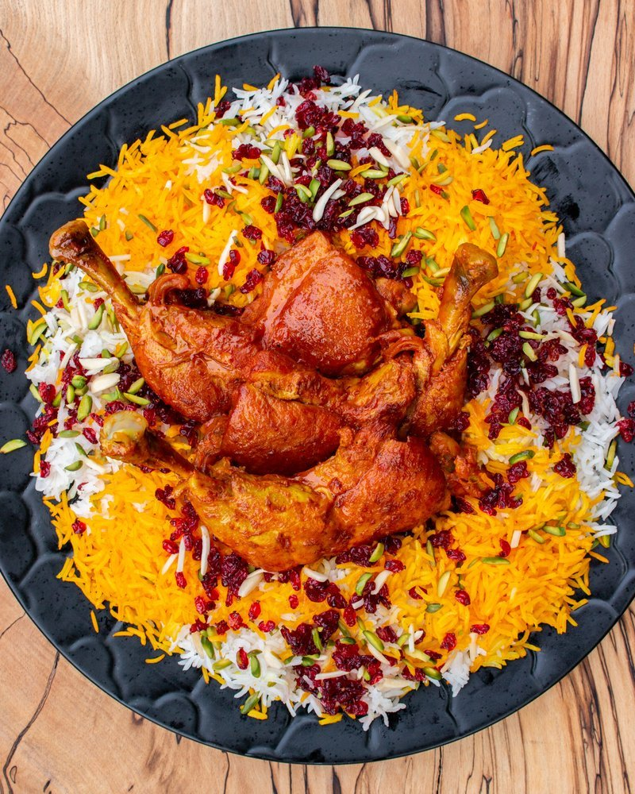

# Zereshk Polo Ba Morgh

*The Persian wedding rice: basmati with a saffron tahdig, golden chicken on top, scattered with barberries, almonds and pistachios.*

**Serves:** 4

**Prep Time:** 30 minutes (plus 1 hour rice soaking)

**Cook Time:** 1 hour 15 minutes

## Overview
Zereshk polo ba morgh is the great Persian wedding rice, saffron-stained basmati under a tower of slow-cooked chicken, scattered with ruby-red barberries, slivered almonds and pistachios, the tahdig disc broken into golden shards alongside. Rinse basmati under cold water for a full five minutes till the water runs clear, soak in salted water for an hour while you build the chicken: brown bone-in thighs and drumsticks hard, soften sliced onions in the same pot, bloom turmeric and tomato paste and cinnamon, then return the chicken with water and lemon juice to simmer covered for forty minutes till tender, finished with saffron-water for the last five. Parboil the soaked rice in three litres of heavily salted water for five or six minutes till the outside is cooked and the centre still firm, drain and rinse briefly with lukewarm water to stop the cooking. Now the Persian technique: oil and butter to a clean pot till bubbling, two large spoons of plain rice as the tahdig layer, drizzled with saffron-water; the rest of the rice piled gently into a cone above; five steam-vent holes poked through with a wooden spoon handle; more butter dotted, more saffron-water drizzled. Wrap the lid in a tea towel (this absorbs condensation and keeps the rice fluffy rather than wet), clamp on, and steam over low heat for forty minutes till the bottom forms a deep gold tahdig and the grains above are loose and separate. Rinse the salty barberries, sauté them quickly in butter with a spoon of sugar (they go from gleaming to charred in sixty seconds, watch them), and finish with saffron. Plate the rice on a wide platter, lift the tahdig out in a single disc, set the chicken pieces on top with sauce spooned over, and shower with zereshk, almonds and pistachios.

## Ingredients

### Chicken
- 4 bone-in skin-on chicken thighs and 4 drumsticks (or 6 thighs)
- 2 tablespoons sunflower oil
- 1 onion (large, sliced)
- 4 garlic cloves (crushed)
- 1 ½ teaspoons ground turmeric
- 2 tablespoons tomato paste
- 1 teaspoon ground cinnamon
- 1 ½ teaspoons salt
- ½ teaspoon black pepper
- 1 large pinch saffron threads (soaked in 3 tablespoons hot water)
- 250 ml water
- ½ lemon (juice)

### Rice
- 500 g long-grain basmati rice
- 3 litres water (for parboiling)
- 3 tablespoons salt (for the boil - Persian rice cooking is heavily salted)
- 3 tablespoons sunflower oil
- 50 g unsalted butter
- 1 large pinch saffron threads (soaked in 4 tablespoons hot water)

### Zereshk topping
- 80 g zereshk (dried barberries)
- 2 tablespoons unsalted butter
- 1 tablespoon caster sugar
- 1 small pinch saffron (extra)
- 2 tablespoons slivered almonds (toasted)
- 2 tablespoons slivered pistachios (unsalted, toasted)

## Method

### Stage 1 - Rinse and soak rice
1. Rinse basmati under cold water until the water runs clear (about 5 minute of rinsing).
1. Cover with cold water + 1 tablespoon salt; soak 1 hour minimum.

### Stage 2 - Chicken
1. Heat oil in a wide pot over medium-high.
1. Add chicken pieces; brown 4 minutes per side. Lift to a plate.
1. Reduce to medium; add sliced onion; cook 8 minutes until soft and gold.
1. Add garlic, turmeric, tomato paste, cinnamon, salt and pepper; cook 1 minute.
1. Pour in 250 ml water; add lemon juice; stir.
1. Return chicken to the pot; spoon sauce over.
1. Cover; simmer 35-40 minutes until tender.
1. Stir in saffron-water; cook 5 more minutes uncovered to thicken the sauce slightly.
1. Keep warm.

### Stage 3 - Parboil rice
1. Bring 3 litres of water with 3 tablespoons salt to a hard boil in a wide pot.
1. Drain the soaked rice; tip in.
1. Cook 5-6 minutes - taste a grain; the outside should be cooked but the centre still firm (70% done).
1. Drain into a sieve; rinse briefly with lukewarm water to stop cooking.

### Stage 4 - Tahdig and steam
1. Wash and dry the pot.
1. Add 3 tablespoons oil and 30 g butter to the bottom; heat over medium until just bubbling.
1. Add about 2 large spoons of the parboiled rice to the bottom in an even layer (this becomes the tahdig).
1. Sprinkle 1 tablespoon of the saffron-water over this layer.
1. Add the remaining rice in a heap, spooning gently so you build a cone shape rather than pressing it down.
1. With the handle of a wooden spoon, poke 4-5 holes in the rice cone all the way to the bottom (this allows steam to circulate).
1. Dot the remaining 20 g butter around the top.
1. Drizzle 1 more tablespoon of saffron-water across.
1. Wrap the pot lid in a tea towel (the towel absorbs condensation, keeping the rice fluffy).
1. Place lid on; reduce heat to low.
1. Cook 35-40 minutes - the bottom forms a crispy golden tahdig; the rice steams to fluffy perfection.

### Stage 5 - Zereshk
1. Rinse zereshk under cold water (they're often salty/dusty); drain.
1. Heat 2 tablespoons butter in a small pan over medium-low.
1. Add zereshk and sugar; sauté 1-2 minutes (they plump and gleam - DO NOT brown; they burn fast).
1. Stir in a small pinch of saffron.

### Stage 6 - Plate
1. Lift the lid; spoon most of the rice onto a wide platter.
1. Spoon some saffron-rice (from the top of the rice cone, the most yellow part) into a small bowl, then sprinkle it over the white rice for the golden contrast.
1. Lift the tahdig out as a single golden disc with a wide flat spoon; place to one side of the platter (or break into shards).
1. Top the rice with the saffron chicken pieces and their sauce.
1. Sprinkle the zereshk over.
1. Scatter slivered almonds and pistachios.

### Stage 7 - Serve
1. Eat with the chicken sauce drizzled, the tahdig broken into pieces for each plate.

## Notes
- **Rinse the zereshk:** Iranian dried barberries are often sandy / dusty / salty. Rinse before sautéing or you get gritty grainy berries.
- **Don't burn the zereshk:** They go from gleaming to charred in 60 seconds. Watch closely; pull off the heat at the first sign of darkening.
- **Cloth-wrapped lid:** The towel between the lid and the pot is what makes Persian rice fluffy rather than wet. Condensation absorbs into the cloth rather than dripping back onto the rice.

## Storage
- Best fresh. Refrigerate components separately 3 days.
- Tahdig is best the day of; the rest reheats well.
