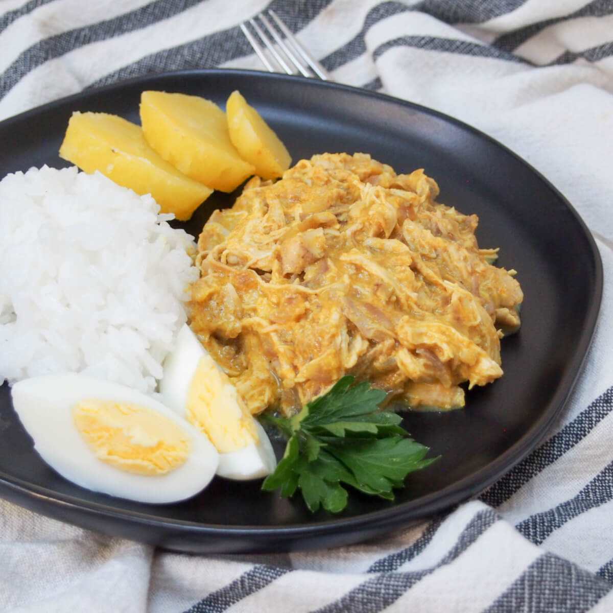

# Aji de Gallina

*Lima's Sunday-lunch comfort food: shredded poached chicken in a creamy yellow sauce of aji amarillo chilli, walnuts, bread and evaporated milk, served over white rice with a hard-boiled egg, a black olive and a slice of yellow potato.*

**Serves:** 4

**Prep Time:** 25 minutes

**Cook Time:** 45 minutes

## Overview
Aji de gallina ("hen with yellow chilli") is Lima's most beloved home dish. Aji amarillo paste (the Peruvian yellow chilli, sold in jars at Latin American shops) gives the sauce its electric yellow colour and floral-fruity mild heat. Bread soaked in chicken poaching liquid and evaporated milk thickens the sauce without flour or cornflour; toasted walnuts blitzed in finish the body. Shred the poached chicken by hand into thin threads, never machine-shredded; fold into the warm sauce. Serve over plain white rice with the traditional criolla garnish: a hard-boiled egg half, a Botija olive, a slice of boiled yellow potato and a parsley leaf.

## Ingredients

### The chicken
- 1200 g whole chicken OR 6 large bone-in skin-on chicken thighs
- 1 onion, halved
- 1 carrot
- 1 stick celery
- 2 bay leaves
- 6 black peppercorns
- 1 teaspoon salt
- Water to cover

### The sauce
- 4 slices stale white bread (60-80 g), crusts off, cut into chunks
- 200 ml evaporated milk
- 200 ml of the chicken poaching liquid (reserved)
- 1 large onion, finely chopped
- 4 cloves garlic, finely chopped
- 4 tablespoons sunflower oil
- 4-5 tablespoons aji amarillo paste (sold in jars at Latin American shops; or 4 dried aji amarillo chillies rehydrated and blitzed)
- 60 g walnuts, toasted and roughly chopped (plus a few extra for garnish)
- 50 g grated Parmesan cheese (optional but traditional in modern recipes)
- 1 teaspoon ground turmeric (boosts the yellow colour)
- 1 teaspoon ground cumin
- 1/2 teaspoon black pepper
- Salt to taste

### The garnish (traditional Peruvian criolla)
- 4 hard-boiled eggs, halved
- 8 Botija olives (the dried-purple Peruvian olives; substitute with Kalamata)
- 4 medium yellow potatoes (papa amarilla; substitute with Yukon Gold), boiled till tender and sliced 1 cm thick
- Fresh flat-leaf parsley, leaves picked
- An extra teaspoon of aji amarillo paste swirled on top

### To serve
- 600 g cooked plain white long-grain rice (jasmine or basmati)
- A wedge of lime per plate

## Method

### Stage 1 - Poach the chicken
1. Place the chicken in a large pot with the onion, carrot, celery, bay leaves, peppercorns and salt.
2. Add cold water to cover; bring to a gentle simmer.
3. Cook 35-40 minutes (whole chicken) or 25 minutes (thighs) till the chicken is just tender.
4. Lift out; let cool slightly.
5. Strain the broth; reserve 400 ml.
6. When the chicken is cool enough to handle, shred the meat by hand into thin threads. Discard skin and bones.

### Stage 2 - Soak the bread
1. In a bowl, combine the bread chunks with 200 ml of evaporated milk and 200 ml of the reserved chicken broth.
2. Let soak 10 minutes till the bread is fully softened and breaking apart.

### Stage 3 - Sweat the aromatics
1. Heat the sunflower oil in a heavy saucepan over medium heat.
2. Add the chopped onion and garlic.
3. Sweat 8-10 minutes till translucent and soft.

### Stage 4 - Build the sauce
1. Add the aji amarillo paste, turmeric, cumin and black pepper to the sweated onions.
2. Cook 2-3 minutes, stirring, till fragrant and the oil has turned vibrant yellow-orange.

### Stage 5 - Blend the sauce
1. Tip the bread-and-milk mixture into a blender.
2. Add the aji-amarillo-onion mixture.
3. Add the toasted walnuts.
4. Blend 2-3 minutes till perfectly smooth, a velvety, electric-yellow sauce.

### Stage 6 - Cook the sauce
1. Pour the blended sauce back into the saucepan.
2. Bring to a gentle simmer over medium-low heat.
3. Cook 8-10 minutes, stirring, till slightly thickened to a heavy-cream consistency.
4. Stir in the optional Parmesan till melted.
5. Taste and adjust salt and pepper.

### Stage 7 - Add the chicken
1. Fold the shredded chicken into the sauce.
2. Cook 4-5 minutes till the chicken is heated through and coated in the sauce.

### Stage 8 - Plate
1. Spoon a generous mound of white rice onto each warm plate (push to one side).
2. Spoon a generous portion of the aji de gallina alongside the rice (covering the other side of the plate).
3. Garnish with: 2 olives, a half hard-boiled egg, 1-2 slices of boiled yellow potato, a few parsley leaves, and a small swirl of extra aji amarillo paste.

### Stage 9 - Serve immediately
1. Add a lime wedge to each plate.
2. Eat hot. The diner mixes a bit of rice with each bite of sauce.

## Notes
- **Aji amarillo paste is non-negotiable:** sold in jars at Latin American shops (Inka Crops, Doña Isabel are common brands); or buy dried whole aji amarillos and rehydrate-blitz them yourself.
- **Bread-and-milk thickener:** white bread + evaporated milk + chicken broth is the Peruvian way. Don't substitute flour or cornflour, the texture is wrong.
- **Shred chicken by hand:** thin threads, not chunks. The mouth-feel matters.
- **The criolla garnish (egg, olive, potato, parsley) is traditional:** don't skip, the colour and the contrast are essential to the dish.
- **Walnuts toasted:** dry-toast in a frying pan 4-5 minutes till fragrant. Untoasted walnuts give a flat finish.
- **Parmesan is optional but standard in modern recipes:** the 18th-century version didn't include it; modern Lima restaurants almost all do.

## Variations
- **Aji de mariscos:** swap chicken for cooked prawns, scallops, or octopus, the seafood variant.
- **Aji de pollo with raisins:** add 50 g raisins to the sauce, the rural-Peruvian sweet variant.
- **Vegetarian aji de soya:** swap chicken for slow-cooked shredded soya pieces, the vegan Andean variant.
- **Modern Lima restaurant aji de gallina:** add a poached egg on top instead of hard-boiled, the brunch variant.
- **Aji de gallina sanguche:** the sandwich version, pile the cooked filling into a fresh roll with avocado and pickled red onion.
- **Aji de pollo with quinoa:** serve over Andean quinoa instead of rice, the modern healthy variant.

## Serving
- At a Lima criolla restaurant (the traditional setting) · at a Peruvian family Sunday lunch · at a Peruvian Independence Day (28 July) celebration · at a Peruvian household for a comfort-food dinner · at any chifa or criolla restaurant in Lima, Cusco, Arequipa or Trujillo · paired with chicha morada or a glass of cold Cusqueña lager.

## Storage
- Refrigerates 4 days; reheats well on the stovetop with a splash of milk to loosen.
- Freezes 2 months in airtight containers.
- The sauce thickens in the fridge; reheat with a splash of milk or broth to loosen.
- Day-2 aji de gallina is often better than fresh, the flavours marry overnight.
- The shredded chicken can be poached 3 days ahead and refrigerated; the sauce can be made 2 days ahead.
