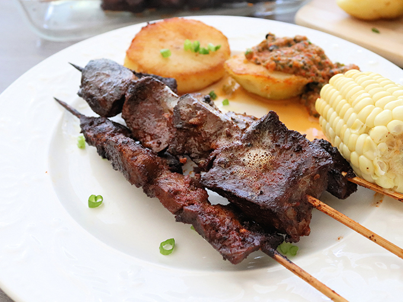

# Anticuchos de Corazón (Beef-Heart Skewers)

*Lima's street food classic, born from Incan altar-offering tradition: cubes of beef heart (corazón de res, the traditional cut; beef sirloin is the modern home substitute) marinated overnight in aji panca paste, garlic, cumin, oregano, red wine vinegar and a splash of oil, threaded onto wooden skewers and grilled hard over charcoal till the edges char and the centres stay pink. Served three skewers per plate with a slice of boiled yellow potato, a piece of choclo, a smear of aji huacatay (mint-and-aji creamy sauce) and a wedge of lime. The Lima street-corner classic that's also the Friday-night family barbecue dinner.*

**Serves:** 4 (3 skewers each)

**Prep Time:** 25 minutes (plus overnight marinating)

**Cook Time:** 12 minutes

## Overview
Anticuchos are Peru's most iconic street food, sold from charcoal carts in every city and town from Lima to Cusco. The traditional cut is beef heart (corazón de res), a working muscle that's deeply flavoured, lean, and cooks to a tender-firm texture when grilled fast. The tradition goes back to pre-Incan times, when heart was an altar-offering cut; modern street vendors still use it, while home cooks often substitute sirloin or chicken thighs. The marinade is aji panca paste (a sweeter, smokier Peruvian dried red chilli) with a generous quantity of garlic, cumin, dried oregano, red wine vinegar and oil; it tenderises the meat and lays down the Peruvian flavour base. Marinated at least four hours, ideally overnight, then grilled hard over charcoal for two or three minutes per side. Served three skewers per plate with a slice of boiled yellow potato, a chunk of choclo (boiled Peruvian corn), a smear of aji huacatay (creamy mint-chilli sauce) and a wedge of lime.

## Ingredients

### The meat (pick one)
- 700 g beef heart (corazón de res; ask the butcher to clean it, remove the white fat and the connective tissue), cut into 3 cm cubes
- OR 700 g beef sirloin (the home-cook substitute), cut into 3 cm cubes
- OR 700 g boneless skinless chicken thighs, cut into 3 cm cubes

### The marinade (the anticucho base)
- 6 tablespoons aji panca paste (sold in jars at Latin American shops; or substitute with 4 tablespoons sweet paprika + 1 teaspoon ancho chilli powder + 1 teaspoon chipotle powder)
- 8 cloves garlic, finely grated
- 4 tablespoons red wine vinegar OR cider vinegar
- 4 tablespoons sunflower oil
- 2 tablespoons dried oregano
- 2 tablespoons ground cumin
- 1 tablespoon dried thyme OR a small bunch fresh thyme
- 1 teaspoon ground black pepper
- 1 teaspoon salt
- 1 tablespoon soy sauce (optional, gives umami)

### The aji huacatay sauce (traditional accompaniment)
- 4 tablespoons aji amarillo paste (Peruvian yellow chilli, fruity and medium-hot)
- 2 tablespoons fresh huacatay (Peruvian black mint; substitute with 4 tablespoons fresh mint + 1 tablespoon fresh basil)
- 3 tablespoons mayonnaise
- 1 tablespoon fresh lime juice
- 1 small clove garlic, finely grated
- 1/4 teaspoon salt
- (Blend everything in a food processor till smooth)

### The traditional Peruvian sides
- 4 medium yellow potatoes (papa amarilla; Yukon Gold substitute), boiled and sliced 1 cm thick
- 2 ears choclo (Peruvian large-kernel corn) OR sweetcorn, boiled and cut into 4 cm rounds
- 100 g cancha (Andean toasted-and-salted corn snacks; optional)
- 4 lime wedges

### Equipment
- 12 long wooden skewers (about 25 cm), soaked in cold water for 30 minutes
- A charcoal grill OR a heavy cast-iron grill pan
- (Optional: a basting brush for extra marinade during grilling)

## Method

### Stage 1 - Marinate the meat
1. Combine all the marinade ingredients in a large bowl, whisk to a thick reddish-orange paste.
2. Add the cubed meat; toss to coat every cube generously.
3. Cover with cling film.
4. Refrigerate at least 4 hours, ideally overnight (8-12 hours).

### Stage 2 - Soak the skewers
1. Place the wooden skewers in a tray of cold water; soak 30 minutes.
2. This prevents them burning to ash during the high-heat grill.

### Stage 3 - Make the aji huacatay sauce
1. Combine all the sauce ingredients in a small food processor or blender.
2. Blend till smooth and bright green-yellow.
3. Refrigerate till serving.

### Stage 4 - Heat the grill
1. Light a charcoal grill 30 minutes ahead; let the coals burn down to white ash with red embers underneath, HIGH heat.
2. Or heat a heavy cast-iron grill pan over the highest heat for 5 minutes till smoking.
3. The grill must be VERY HOT for proper anticuchos.

### Stage 5 - Thread the skewers
1. Take the marinated meat from the fridge.
2. Thread 4-5 cubes onto each skewer, leaving 4 cm of bare skewer at each end for handling.
3. Discard the leftover marinade (it's been in raw meat).

### Stage 6 - Grill the anticuchos
1. Place the skewers on the hot grill / grill pan.
2. Grill 90 seconds on the first side; flip; 90 seconds on the second side; flip; 60 seconds on each of the remaining 2 sides.
3. Total grill time: 5-6 minutes for sirloin or chicken thighs (cooked through but still juicy); 4 minutes for beef heart (medium-rare; the heart goes tough if overcooked).
4. The meat should have deep char marks on the outside; pink-tender inside (for sirloin and heart) or just-cooked-through (for chicken).
5. Rest on a board 2 minutes.

### Stage 7 - Plate
1. Place 3 skewers on each warm plate.
2. Add 2 slices of boiled yellow potato.
3. Add a piece of boiled choclo.
4. Spoon a generous dollop of aji huacatay sauce on the side.
5. Scatter a small handful of cancha (toasted corn) alongside.
6. Add a lime wedge.

### Stage 8 - Serve immediately
1. Eat while hot, anticuchos are at their peak straight from the grill.
2. The diner alternates between meat (with a dip in the huacatay sauce), potato, corn, and a squeeze of lime.

## Notes
- **Beef heart is the traditional cut:** ask your butcher to clean it; modern Peruvian home cooks use beef sirloin or chicken thighs as more accessible substitutes.
- **Marinate overnight:** 4 hours minimum; overnight is dramatically better. The aji panca needs time to penetrate.
- **Soak the skewers:** 30 minutes in cold water; prevents burning.
- **HOT charcoal grill:** the searing is what makes anticuchos. A cool pan gives grey meat with no char.
- **Don't overcook beef heart:** 4 minutes total. Past 6 minutes the heart goes leathery.
- **The huacatay sauce is essential:** the herbal-aji-mayo dip is what makes them Peruvian rather than generic skewered meat.

## Variations
**Anticuchos de pollo:** chicken-thigh version; same marinade; the kid-friendly home variant.
**Anticuchos de pescado:** large chunks of firm white fish (mahi-mahi, swordfish) skewered with the same marinade.
**Vegetarian anticuchos:** swap meat for thick chunks of king oyster mushroom, halloumi, or seitan; same marinade.
**Anticuchos with quinoa sides:** swap the potato for Andean quinoa pilaf, the modern healthy variant.
**Cocktail-canapé anticuchos:** make smaller skewers (1.5 cm cubes; 3 per skewer); for a Peruvian reception.
**Anticuchos with a chimichurri-style green sauce:** add chopped parsley to the huacatay sauce.
**Modern Lima upscale anticuchos:** marinate Wagyu beef in the same aji panca base, the high-end Lima restaurant variant.
**Anticuchos sanguche:** anticuchos pulled off the skewer and piled in a fresh roll with the huacatay sauce, the Lima street-sandwich variant.

## Serving
At a Lima street-corner anticuchera (the traditional setting, charcoal carts grill them on the pavement at dusk) · at a Peruvian family backyard barbecue · at a Peruvian Independence Day (28 July) celebration · at the Lima Mistura food festival · at a Peruvian Friday-night dinner with friends · at a Peruvian gastropub abroad · at home as a Saturday-evening grill party.

## Storage
- Cooked anticuchos refrigerate 2 days; reheat in a hot grill pan 2 minutes to refresh.
- The marinade (sealed, not yet meat-touched) keeps 2 weeks refrigerated.
- The aji huacatay sauce refrigerates 3 days; freezes 2 months.
- The skewers can be pre-marinated and refrigerated up to 24 hours before grilling.
- Don't freeze cooked anticuchos, the texture suffers.
- Leftover anticucho meat is excellent in a sanguche (sandwich) with the huacatay sauce.
