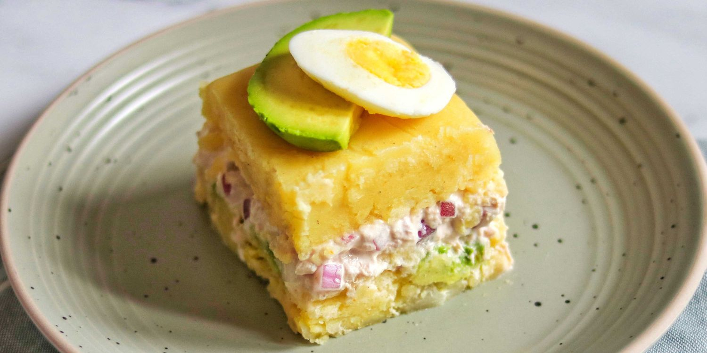

# Causa Rellena

*Lima's cold-plate elegance: a chilled cake of mashed yellow Peruvian potato (papa amarilla) bound with aji amarillo paste, lime juice and vegetable oil, layered with a generous filling of mayo-bound tuna, prawn, or chicken-and-avocado, topped with sliced hard-boiled egg, black Botija olives and a sprinkle of cilantro. The colour is the electric Peruvian yellow; the texture is dense, cold, almost like a mashed-potato terrine. Served in slices or individual rounds; the traditional first-course at every Lima dinner party and Peruvian family lunch.*

**Serves:** 6 (one 23 cm round) or 8 individual

**Prep Time:** 45 minutes

**Cook Time:** 25 minutes (boiling the potatoes) + 4 hours chilling

## Overview
Causa rellena ("stuffed cause") is one of Peru's most identity-defining cold starters. The name comes from causa, the Quechua word for "necessary" or "essential"; the dish was originally a fundraising potato cake during the 19th-century War of the Pacific, sold to support the Peruvian cause. The potato base is papa amarilla (Peruvian yellow potato, with Yukon Gold the workable substitute), mashed coarsely and bound with aji amarillo paste, lime juice and a generous slug of vegetable oil; the seasoned mash should be bright electric yellow and intensely flavoured. The filling is one of three classic options: tuna-and-mayo, prawn-and-mayo, or chicken-with-avocado-and-mayo, always rich and always cold-bound. Assembled as a layered terrine in a springform tin and refrigerated four hours minimum so the layers set. Unmoulded, sliced, garnished with hard-boiled egg, Botija olives, avocado and cilantro. Served cold with a wedge of lime.

## Ingredients

### The potato base
- 1.2 kg yellow Peruvian potatoes (papa amarilla) OR Yukon Gold OR another yellow waxy potato
- 4 tablespoons aji amarillo paste (yellow Peruvian chilli paste, sold in jars at Latin American shops; can be reduced by half if very mild palate)
- 4 tablespoons fresh lime juice (about 3 limes)
- 4 tablespoons sunflower oil OR vegetable oil
- 2 teaspoons salt
- 1/2 teaspoon white pepper

### Filling Option 1 - Tuna-mayo (traditional home version)
- 2 tins (about 320 g total) of good tuna in olive oil OR brine, drained
- 6 tablespoons mayonnaise (homemade or Hellmann's)
- 1 small red onion, very finely chopped (about 4 tablespoons)
- 2 tablespoons chopped flat-leaf parsley
- 1 tablespoon fresh lime juice
- 1/2 teaspoon black pepper

### Filling Option 2 - Prawn-mayo (festive variant)
- 400 g cooked prawns, peeled and finely chopped
- 6 tablespoons mayonnaise
- 1 tablespoon Dijon mustard
- 1 tablespoon fresh lime juice
- 1 small finely chopped red onion
- 1/2 teaspoon black pepper

### Filling Option 3 - Chicken-avocado (the most popular Lima version)
- 400 g cooked shredded chicken (from a poached breast or rotisserie)
- 6 tablespoons mayonnaise
- 1 small ripe avocado, mashed
- 1 tablespoon fresh lime juice
- 1 small red onion, finely chopped
- 1/4 teaspoon black pepper

### The garnish (traditional Peruvian)
- 2 hard-boiled eggs, sliced or quartered
- 8-10 Botija olives (the dried-purple Peruvian olives; Kalamata substitute)
- 1 ripe avocado, sliced thin (alongside the traditional "chicken" version)
- A few sprigs of fresh cilantro OR flat-leaf parsley
- 1 lime, cut into wedges
- 2 tablespoons extra mayonnaise (for piping or a small dollop)
- An extra teaspoon of aji amarillo paste, swirled on top

### Equipment
- A 23 cm springform tin (or 8 individual ring moulds, 8 cm)
- Cling film (essential for unmoulding)

## Method

### Stage 1 - Boil and mash the potatoes
1. Wash the potatoes but leave the skins on (helps prevent waterlogging).
2. Place in a large pot; cover with cold salted water.
3. Bring to the boil; simmer 20-25 minutes till a knife slides easily through the centre.
4. Drain; let stand 5 minutes till cool enough to handle.
5. Peel the skins off (they slip off easily when warm).
6. Mash the peeled potatoes thoroughly in a large bowl - aim for a smooth-to-coarse texture. Don't use a food processor (overworking makes potato glue).

### Stage 2 - Season the mash
1. Add the aji amarillo paste, lime juice, oil, salt and white pepper to the mashed potato.
2. Mix thoroughly with a wooden spoon till the mash is bright yellow-orange, uniformly seasoned, and slightly oily.
3. Taste; should be assertively flavoured - salty, tart from lime, gently spicy. Adjust salt and lime.
4. Let cool to room temperature (about 30 minutes).

### Stage 3 - Make the filling (choose one)
1. Combine all the ingredients for your chosen filling in a bowl; mix till coated.
2. Taste; adjust salt and lime juice.

### Stage 4 - Assemble (springform method)
1. Line a 23 cm springform tin with cling film (the cling film makes unmoulding easier).
2. Spread half the seasoned potato mash evenly across the base; press down firmly with the back of a spoon to compact.
3. Spread the filling evenly over the potato base; smooth the top.
4. Spread the remaining potato mash over the filling; press down firmly to seal.
5. Smooth the top with a spatula.
6. Cover with more cling film.

### Stage 5 - Chill
1. Refrigerate at least 4 hours, ideally overnight.
2. The longer chill firms the layers for cleaner slicing.

### Stage 6 - Unmould and garnish
1. Release the springform ring.
2. Lift away the cling film.
3. Transfer the chilled causa to a serving plate.
4. Decorate the top: pipe small dollops of mayonnaise around the rim; arrange sliced hard-boiled egg and Botija olives in a circle; lay slices of avocado in a fan pattern; scatter cilantro or parsley leaves; swirl an extra teaspoon of aji amarillo paste in a decorative pattern.

### Stage 7 - Serve
1. Slice into 6-8 wedges with a sharp knife dipped in hot water.
2. Place each wedge on a small plate.
3. Add a lime wedge and a small extra dollop of mayo.
4. Serve cold as a first course.

## Notes
- **Yellow waxy potato:** papa amarilla is traditional; Yukon Gold is the closest substitute. Floury potatoes (Maris Piper, Russet) give a wet, sloppy result.
- **Season aggressively:** the mash should be intensely flavoured. Under-seasoning ruins the dish.
- **Chill overnight:** 4 hours minimum; overnight is dramatically better. The slices cut cleaner; the flavours marry.
- **Cling film the tin:** essential for clean unmoulding.
- **Mash by hand or with a potato masher:** food-processor mashing makes potato glue.
- **The garnish is the show:** Peruvian causa is an Instagram dish - the garnish is what makes it spectacular.

## Variations
**Causa individual:** instead of one large round, use 8 individual ring moulds (8 cm diameter, 5 cm tall) for elegant individual portions.
**Causa de cangrejo (crab):** the upmarket Lima restaurant version - crab meat with mayo, lime and chives.
**Causa limeña classic (chicken-avocado):** Lima's most popular filling.
**Vegetarian causa:** swap the filling for chopped roasted vegetables + mayo + lime; or for grated cheddar + diced avocado + sour cream.
**Modern Lima fine-dining causa:** thin stripes of potato mash + delicate fish ceviche + microgreens - the deconstructed version.
**Causa with quinoa:** swap half the potato for cooked quinoa - the modern healthy variant.
**Mini causas for canapés:** make 30 small (3 cm) rounds with piped mash and a tiny dollop of filling.

## Serving
At a Lima Sunday family lunch (the traditional setting; cold first course before lomo saltado or aji de gallina) · at a Peruvian Independence Day celebration · at a Peruvian wedding canapé table · at a Lima criolla restaurant · at a Peruvian summer terrace lunch · at home as a make-ahead dinner-party starter.

## Storage
- Refrigerates 3 days, well covered. Slice fresh each time.
- Doesn't freeze - the texture suffers.
- The potato mash (seasoned, unassembled) refrigerates 24 hours.
- The fillings each keep refrigerated 24 hours.
- Best assembled the day before serving for the cleanest slicing.
- Leftover slices can be pan-fried in butter till crisp on both sides - the day-after Peruvian breakfast hack.
