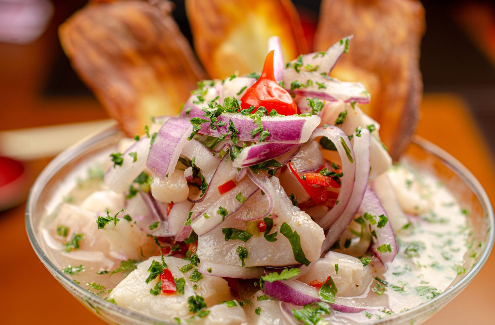

# Ceviche Peruano

*Peru's national dish, the country's most identity-defining plate: fresh white-fleshed sea fish (corvina, sea bass, sole, halibut) cut into 1.5 cm cubes, tossed with lime juice (the traditional Peruvian "leche de tigre", tiger's milk), thinly sliced red onion, finely chopped aji limo or aji amarillo chilli, salt and a generous bunch of fresh cilantro. The lime "cooks" the fish in 5-12 minutes by denaturing the proteins; the result is opaque, firm, vivid, bracingly sour-spicy. Served with cancha (Andean toasted-corn snacks), boiled sweet potato (camote) and a sliver of toasted corn-on-the-cob (choclo): the traditional Peruvian plate.*

**Serves:** 4

**Prep Time:** 25 minutes

**Cook Time:** 5-12 minutes (the lime cure)

## Overview
Ceviche is Peru's national dish and the most rigorously codified plate in the country; the Ministry of Production declared 28 June "National Ceviche Day", and Peruvian cooks have strict expectations about how it should be made. The fish is firm white-fleshed ocean fish (corvina or sea bass is the traditional Lima choice; halibut, sole, snapper or sea bream substitute well), cut against the grain into 1.5 cm cubes and sashimi-grade fresh; the lime cures but doesn't kill parasites. The leche de tigre ("tiger's milk") is freshly squeezed lime juice (lime only; lemon is wrong) with red onion, salt, finely chopped aji limo or aji amarillo, cilantro stems and garlic. Cure time is fast: five to twelve minutes only. Lima cebicherias serve it within five minutes of mixing; the fish should still be barely cured at the centre. Longer "marinated" ceviche is over-cured by Peruvian standards. Served immediately with boiled sweet potato, choclo (boiled giant-kernel corn), cancha (Andean toasted-and-salted corn snacks) and a wedge of lime.

## Ingredients

### The fish
- 600 g very fresh firm white-fleshed sea fish, sashimi-grade. Best options: corvina, sea bass, halibut, sole, red snapper, sea bream. Cut against the grain into 1.5 cm cubes.

### The leche de tigre (Peruvian marinade)
- 200 ml fresh lime juice (about 12-15 limes)
- 1 large red onion, halved and sliced into 2 mm half-moons
- 1 aji limo OR aji amarillo chilli (Peruvian yellow chilli, fruity and medium-hot), deseeded and very finely chopped (substitute: 1 small habanero deseeded + 1/2 tsp ground turmeric for colour)
- 4 cilantro stems (just the stems; reserve the leaves for finishing)
- 1 clove garlic, finely grated
- 1 teaspoon fine sea salt
- 1/2 teaspoon ground white pepper
- 4-5 small ice cubes (keep the marinade cold during the cure)

### To finish
- 1 small bunch fresh cilantro leaves, chopped
- 1 extra aji limo chilli, sliced into thin rings (optional, for heat-lovers)

### The traditional Peruvian sides
- 200 g sweet potato (camote), peeled, boiled in salted water 15 minutes till tender, sliced into 1 cm rounds
- 1-2 ears of choclo (Peruvian large-kernel corn) OR regular sweetcorn, boiled and cut into 3 cm rounds
- 100 g cancha (Andean toasted-and-salted corn snacks; sold at Peruvian / Latin American shops; substitute with corn nuts)
- 4 lime wedges
- A few lettuce leaves to line the plate (optional)

### To serve
- A small shot glass of leche de tigre alongside each plate (drink between bites; traditional Peruvian)

## Method

### Stage 1 - Prepare the fish (do this first)
1. Pat the fish very dry on kitchen paper.
2. With a sharp knife, cut the fish into 1.5 cm cubes against the grain.
3. Place the cubes in a wide shallow bowl; refrigerate while you prep the marinade.

### Stage 2 - Make the leche de tigre
1. Squeeze the limes fresh - 200 ml of juice is the target.
2. In a wide bowl, combine the lime juice with the sliced red onion, chopped chilli, chopped cilantro stems, grated garlic, salt and white pepper.
3. Add the ice cubes (they keep the marinade cold during the cure, critical).
4. Stir gently to combine.

### Stage 3 - Cure the fish
1. Add the chilled fish cubes to the marinade.
2. Stir gently with a wooden spoon to coat every cube.
3. Press the fish down so it's fully submerged in the lime juice.
4. Let cure 5-7 minutes (for raw-in-the-middle Peruvian style) OR 8-12 minutes (for more thoroughly opaque).
5. The fish surface will turn opaque white; the centre stays just slightly translucent (Peruvian style) or fully opaque (more cured).

### Stage 4 - Plate
1. Lift a few cubes of the cured fish out of the marinade with a slotted spoon; place on each plate.
2. Spoon some of the marinated onion and chilli over.
3. Drizzle 1-2 tablespoons of the leche de tigre marinade over the top.
4. Garnish with the chopped cilantro leaves and (optional) chilli rings.

### Stage 5 - Add the traditional sides
1. Place 2-3 slices of warm sweet potato on each plate (the sweet-soft starch balances the bracing ceviche).
2. Add 2-3 rounds of corn (choclo).
3. Scatter a small handful of cancha (toasted corn) alongside.
4. Add a lime wedge.

### Stage 6 - Pour the shot of leche de tigre
1. Pour a small shot glass of the strained leche de tigre marinade alongside each plate.
2. The diner drinks this between bites, it's the traditional Peruvian "ceviche cure" for hangovers (and even for inducing them; some Peruvians swear it tightens the brain like an espresso).

### Stage 7 - Serve immediately
1. Hand to the diner.
2. Eat within 10 minutes of plating, ceviche degrades fast.

## Notes
- **Fresh fish is non-negotiable:** sashimi-grade only. The lime cures the proteins but doesn't kill pathogens. Source from a trusted fishmonger; use the same day.
- **Limes, not lemons:** the Peruvian "limón" is what English speakers call a lime. Lemon gives a different (and wrong) flavour profile.
- **Don't over-cure:** Peruvian ceviche is 5-12 minutes max. Mexican-American "30 minute marination" gives over-cured rubber.
- **Ice in the marinade:** the cold keeps the cure controlled and stops the fish from going mushy.
- **The leche de tigre shot:** the small glass on the side is non-negotiable in a Peruvian cebicheria.
- **Sweet potato is the balance:** the sweet camote balances the sour-spicy ceviche. Some Peruvians eat it after; some during; the balance is the point.

## Variations
- **Ceviche mixto:** add 200 g cooked octopus or prawns alongside the raw fish, the mixed-seafood variant.
- **Tiradito Peruano:** the Nikkei (Japanese-Peruvian) variant, the fish is sliced THIN like sashimi instead of cubed; the leche de tigre is poured over at table.
- **Ceviche con leche de tigre amarilla:** the leche de tigre is blitzed with aji amarillo paste for a thicker, vivid yellow marinade.
- **Ceviche con leche de tigre verde:** add a handful of fresh herbs (mint, basil, cilantro) blitzed into the marinade for a green leche de tigre, the modern Lima restaurant variant.
- **Ceviche de pulpo (octopus):** swap the fish for finely sliced cooked octopus; same marinade.
- **Ceviche caliente / chilcano:** the cooked variant for fish that isn't sashimi-grade, briefly poached fish in the leche de tigre at very low heat.
- **Modern Lima ceviche:** add a few drops of a Peruvian fruit purée (passion fruit, mango) to the leche de tigre; the upscale Lima restaurant variant.
- **Vegan ceviche:** swap fish for diced firm tofu, or hearts of palm chopped into cubes; the same marinade.

## Serving
- At a Lima cebicheria for lunch (the traditional setting; cebicherias close at 3 pm because ceviche is a lunch dish, never dinner, lunch fish is fresher) · at a Peruvian Independence Day (28 July) celebration · at the National Ceviche Day (28 June) festival · at a Pacific-coast seafood restaurant · at home as a substantial first course or light main · paired with a chilled glass of pisco sour, chicha morada, or a cold Cusqueña lager.

## Storage
- Doesn't store. Eat within 15 minutes of plating.
- Leftover leche de tigre marinade refrigerates 24 hours and is excellent as a hangover cure (drunk as a shot) or as a marinade for grilled prawns.
- Don't refrigerate cured ceviche, the fish continues to "cook" in the lime and becomes over-firm within hours.
- The raw fish itself can be cubed and refrigerated 24 hours before curing; the marinade can be made up to 4 hours ahead.
- Cancha (toasted corn) keeps weeks in a sealed jar; sweet potato keeps 3 days boiled.
