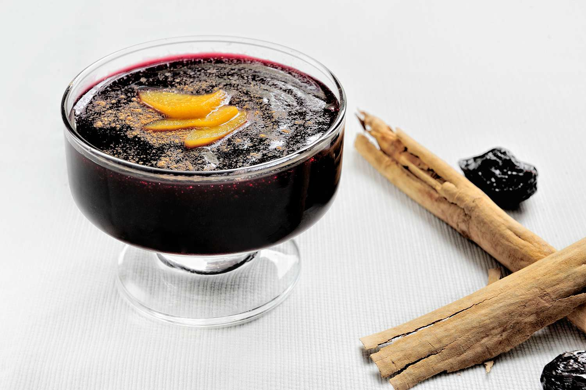

# Mazamorra Morada (Peruvian Purple-Corn Pudding)

*Lima's most distinctively-coloured dessert: a thick deep-purple pudding made by simmering Peruvian purple corn (maíz morado, the same corn used to make chicha morada) with pineapple skin, quince, cinnamon, cloves, dried apricots, raisins and a generous quantity of sugar, then thickened with sweet potato starch and finished with chunks of seasonal fruit (apple, peach, dried apricot, dried cherries). Served warm or cold in small bowls; the traditional accompaniment to arroz con leche (the Peruvian "marriage", half purple pudding, half rice pudding, eaten side-by-side in the same bowl). October's All Saints' Day dessert; year-round at every Peruvian dessert counter.*

**Serves:** 6

**Prep Time:** 20 minutes

**Cook Time:** 1 hour

## Overview
Mazamorra morada is one of Peru's most identity-defining sweet plates and one of the world's most distinctively-coloured desserts. The deep purple-violet colour comes from maíz morado (Andean purple corn), the same varietal used for chicha morada, the traditional Peruvian table drink. Dried purple corn cobs simmer with cinnamon, cloves, pineapple skin, quince peels and star anise; the resulting deep-purple infusion is strained and reduced, then thickened with sweet-potato starch and folded with chopped fruit (apple, pear, fresh pineapple, dried apricots, raisins, dried cranberries) into a pudding the consistency of thick custard. The traditional Peruvian way is to serve mazamorra morada beside arroz con leche (Peruvian rice pudding); both pour into the same bowl half-and-half, and the diner eats them together. This is called "el matrimonio", the marriage. Served warm or cold.

## Ingredients

### The purple-corn broth
- 1 large dried purple corn cob (maíz morado) OR 200 g dried purple-corn kernels (substitute: 300 g frozen blueberries + 100 g blackcurrants + 200 ml blackcurrant juice for colour)
- 2 litres water
- 2 cinnamon sticks
- 6 cloves
- 2 star anise (optional)
- The skin of 1/2 a pineapple (just the outer rind; reserve the flesh for the fruit chunks)
- 1 quince, halved (or 1 large apple, halved and unpeeled)
- 1 strip of orange peel (5 × 2 cm)

### The fruit (chopped into 1.5 cm dice)
- 1 large apple (Royal Gala or similar), cored and chopped
- 1 small ripe pineapple wedge (from the half above), chopped
- 100 g dried apricots, chopped
- 80 g raisins
- 80 g dried cranberries (optional)
- 1 small pear, chopped

### The thickener and sweetener
- 80-100 g caster sugar (taste before adding more)
- 4 tablespoons sweet-potato starch (chuño) OR cornflour, dissolved in 100 ml cold water
- 1 tablespoon fresh lime juice (brightens the flavour)
- 1 cinnamon stick (additional, for the final cook)

### To finish
- Ground cinnamon (for dusting)
- (Optional) A scoop of Peruvian arroz con leche (rice pudding) served alongside in the same bowl, the "marriage"

### Equipment
- A large heavy pot (4-5 litre capacity)
- A fine sieve for straining

## Method

### Stage 1 - Make the purple-corn broth
1. If using whole purple corn cob: break or saw it into 4-5 pieces (no need to remove kernels, the cob itself contains anthocyanin colour).
2. Place the corn (cob or kernels) in a large pot.
3. Add the water, cinnamon sticks, cloves, optional star anise, pineapple skin, halved quince (or apple) and orange peel.
4. Bring to a gentle boil; reduce to a simmer.
5. Cover loosely; cook 30-40 minutes till the liquid is deep purple-violet and richly aromatic.
6. Strain through a fine sieve into a clean pot (squeeze the corn and fruits to extract every drop of colour).
7. Discard the spent corn and fruit residues.
8. You should have about 1.5 litres of vivid purple broth.

### Stage 1 alternative - For substitute (blueberry-blackcurrant)
1. Simmer 300 g frozen blueberries + 100 g blackcurrants + 200 ml blackcurrant juice + 1.5 litres water with the same spices for 25 minutes.
2. Strain. Less pure-purple than real maíz morado but acceptable.

### Stage 2 - Cook the fruit
1. Return the strained purple broth to the pot.
2. Add the chopped apple, pineapple, dried apricots, raisins, dried cranberries (if using), and chopped pear.
3. Add 80 g sugar (taste; some Peruvian dishes are sweeter, add more if you prefer).
4. Bring to a gentle simmer.
5. Cook 12-15 minutes till the fresh fruit is tender and the dried fruit has plumped up.

### Stage 3 - Thicken
1. Whisk the sweet-potato starch (or cornflour) with the cold water in a small bowl till smooth.
2. Slowly drizzle this slurry into the simmering purple-fruit mixture while stirring constantly.
3. Continue cooking 4-6 minutes till the mixture thickens to the consistency of thick custard, it should coat the back of a spoon thickly.
4. Stir in the lime juice.

### Stage 4 - Taste and adjust
1. Taste; adjust sugar if not sweet enough; add lime if too sweet.
2. The flavour should be sweet, slightly tart, warmly spiced, with deep purple-corn earthy notes.

### Stage 5 - Serve
1. Pour into 6 small dessert bowls.
2. Dust each with a small pinch of ground cinnamon.
3. (For the traditional "matrimonio": serve a scoop of warm arroz con leche on one side of the bowl; pour the mazamorra morada on the other side, so the two desserts meet in the middle.)
4. Serve warm or cold.

## Notes
- **Real maíz morado is dramatically different from substitutes:** the deep-purple Andean corn has a unique earthy-fruity character that blueberries can't fully replicate. Source from a Latin American shop if you can.
- **Pineapple skin (not flesh):** the traditional Peruvian additive, the rind gives aroma without bitterness. The flesh goes into the fruit dice.
- **Don't over-thicken:** the consistency should be thick custard, not jelly. The mixture firms further as it cools.
- **The "matrimonio" with arroz con leche:** the traditional Peruvian way to serve, both desserts in the same bowl, side by side.
- **Sweetness is generous:** mazamorra morada is unapologetically sweet. Don't reduce the sugar too aggressively or the dish tastes flat.

## Variations
**Mazamorra morada Lima style:** add 1 tablespoon of cornflour-thickened cooked maíz morado kernels for texture, the chunky variant.
**Mazamorra morada with arroz con leche (the marriage):** the traditional pairing in a single bowl.
**Mazamorra morada with quinoa:** add 50 g of cooked Andean quinoa to the pudding, the modern variant.
**Lighter Mazamorra:** use less sugar (60 g): for those who find the standard version too sweet.
**Vegan mazamorra morada:** the recipe is already vegan (no dairy or eggs).
**Mazamorra with chia seed thickener:** swap the sweet potato starch for chia seeds (2 tablespoons): the modern healthy variant.
**Mazamorra morada cocktail (modern):** thin with 100 ml of pisco, the modern Lima cocktail-bar variant.

## Serving
At a Peruvian All Saints' Day (1 November) celebration (the traditional setting) · at a Peruvian Independence Day (28 July) dessert · at a Lima criolla restaurant · at a Peruvian street-cart in the late afternoon · at a Peruvian family Sunday lunch · at a Peruvian wedding · at home as the make-ahead Sunday dessert · paired with arroz con leche (the traditional "marriage") · with a strong black coffee.

## Storage
- Refrigerates 5 days in a sealed container.
- Freezes 3 months in portion-size containers.
- The pudding thickens further on cooling; loosen with a splash of water or fruit juice when reheating.
- Reheat gently on the stovetop (don't microwave, uneven heating creates hot spots).
- The strained purple-corn broth (before adding fruit) freezes 6 months, useful as a make-ahead base for fast subsequent batches.
- Dried purple corn cobs and kernels keep indefinitely in a sealed pantry jar.
