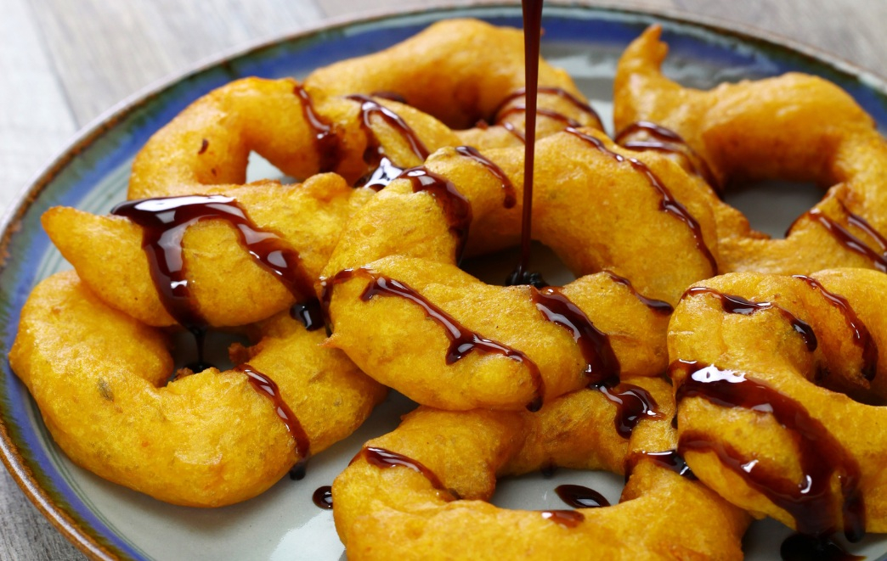

# Picarones (Peruvian Sweet Potato and Squash Doughnuts)

*Lima's street-food dessert from the colonial era: a yeasted batter made with mashed sweet potato (camote) and pumpkin (zapallo) puréed into the flour, deep-fried into ring-shaped doughnuts the size of a small bracelet, then drizzled generously with chancaca syrup - a dark sweet sticky syrup made from raw Peruvian cane-sugar blocks dissolved with cinnamon, cloves, orange peel and a fig leaf. The colour is the unmistakable deep golden-orange of sweet potato; the texture is crisp outside, fluffy-pumpkin inside. Sold from street stalls in Lima at festival times and on Sunday evenings; eaten hot, in the hand, walking.*

**Serves:** 24 picarones (6 per portion × 4)

**Prep Time:** 1 hour (active, mostly squash-and-sweet-potato prep)

**Cook Time:** 30 minutes (plus 60 minutes for the dough to rise)

## Overview
Picarones are Peru's colonial-era contribution to the global doughnut tradition - distinctive for the sweet-potato-and-squash purée folded into the dough and the dark molasses-rich chancaca syrup drizzled over. The construction has three Peruvian-specific moves. First, the dough: cooked-and-puréed sweet potato (camote) and pumpkin (zapallo or butternut squash) are folded into a basic yeasted dough; the squash and sweet potato give the dough its deep golden-orange colour and a faintly sweet, faintly vegetal character that's distinctly Peruvian. The dough is wet and slightly sticky - shaped in the fryer rather than rolled and cut. Second, the shape: small rings (about 5 cm across, with a hole in the middle) formed by sliding wet dough off the fingers into hot oil and quickly poking a hole through the centre with a wooden chopstick. Some Lima street vendors do this with both hands at once - a single drop, a single poke, the perfect ring. Third, the chancaca syrup: chancaca is a Peruvian raw cane-sugar block (similar to Mexican piloncillo, Indian jaggery), dissolved in water with cinnamon sticks, cloves, orange peel and (canonically) a fig leaf - producing a dark sticky syrup with deep molasses notes. The picarones are drizzled liberally with this hot syrup at serving.

## Ingredients

### The dough
- 250 g sweet potato (orange flesh - camote OR good orange-fleshed yam), peeled and chopped
- 250 g pumpkin OR butternut squash, peeled and chopped
- 500 ml water (for boiling the squash and sweet potato)
- 1 cinnamon stick
- 4 cloves
- 1 star anise (optional)
- 450 g plain flour
- 50 g caster sugar
- 1 teaspoon salt
- 7 g instant dry yeast (1 sachet)
- 60 ml whole milk, lukewarm (only if the dough is too dry)

### The chancaca syrup
- 350 g chancaca OR piloncillo OR jaggery (Peruvian raw cane sugar blocks; substitute with dark muscovado sugar)
- 300 ml water
- 2 cinnamon sticks
- 4 cloves
- 1 strip of orange peel (about 5 × 2 cm)
- 1 strip of lemon peel
- 1 fresh or dried fig leaf (optional but canonical)
- 1 tablespoon dark rum (optional)

### For frying
- 2 litres sunflower or groundnut oil

### To serve
- Hot, drizzled with hot chancaca syrup
- A glass of hot Peruvian coffee or a cold Peruvian Pilsen lager

## Method

### Stage 1 - Cook and purée the squash and sweet potato
1. Place the chopped sweet potato and pumpkin in a saucepan.
2. Add the water, cinnamon stick, cloves and optional star anise.
3. Bring to a simmer; cook 20-25 minutes till both are fully soft.
4. Drain (reserve 200 ml of the cooking water).
5. Discard the whole spices.
6. Mash the sweet potato and pumpkin together with a fork or potato masher till smooth.
7. Let cool to room temperature.

### Stage 2 - Make the dough
1. In a large bowl, combine the flour, caster sugar, salt and yeast.
2. Add the mashed sweet potato-and-pumpkin purée.
3. Add 100 ml of the reserved cooking water.
4. Mix with a wooden spoon till a soft, slightly sticky dough forms.
5. Add more cooking water (or the lukewarm milk) 1 tablespoon at a time only if needed - the dough should be sticky but workable.
6. Knead briefly in the bowl 3-4 minutes (don't try to knead this on the counter; it's too wet).

### Stage 3 - First rise
1. Cover the bowl with cling film.
2. Let rise at warm room temperature 60-75 minutes till the dough has roughly doubled and is full of bubbles.

### Stage 4 - Make the chancaca syrup
1. Place the chancaca block (or substitute) in a saucepan with the water, cinnamon sticks, cloves, orange peel, lemon peel and fig leaf.
2. Bring to a gentle simmer; cook 15-20 minutes till the sugar has fully dissolved and the syrup has reduced by 1/4 to a thick pourable consistency.
3. Strain (discard the spices and peels).
4. Stir in the optional rum.
5. Keep warm over a low heat for serving.

### Stage 5 - Heat the oil
1. Heat the oil to 180°C in a deep heavy pot.
2. Use a thermometer to check.

### Stage 6 - Shape and fry the picarones
1. With wet hands (keep a small bowl of cold water nearby for dipping fingers), scoop a heaped tablespoon of dough.
2. Plunge a finger through the centre of the dough as you slide it into the hot oil - this forms the ring shape.
3. (The traditional Peruvian street-vendor method: hold dough in one hand, plunge a wet finger through it as you drop it, and immediately use a wooden chopstick to perfect the hole shape.)
4. Cook 4-5 in the oil at a time (don't overcrowd).
5. Fry 90 seconds on each side till deep gold-orange.
6. Lift out with a wire spider; drain briefly on kitchen paper.

### Stage 7 - Serve immediately
1. Pile 5-6 hot picarones on each warm plate.
2. Drizzle generously with hot chancaca syrup.
3. Eat immediately - picarones are at their peak for 5-10 minutes.

## Notes
- **Sweet potato AND pumpkin:** the canonical Peruvian blend. Either one alone gives a flatter, less interesting dough.
- **Sticky dough is correct:** picarones are wet and shaped in the fryer; pre-rolled "rounds" lose the canonical irregular shape.
- **Wet finger to form the hole:** the canonical Peruvian street-vendor technique.
- **180°C oil:** too low and the picarones soak fat; too high and they burn outside before cooking through.
- **Chancaca syrup not substituted:** the dark molasses depth IS the dish's signature. Maple syrup or honey gives a different (and inferior) result.
- **Eat hot:** picarones lose 80% of their charm 15 minutes after frying.

## Variations
**Picarones with anise-flavoured syrup:** add 2 star anise to the chancaca syrup - the modern variant.
**Pumpkin-only picarones:** for those who can't find good sweet potato; use 500 g pumpkin / butternut squash.
**Sweet-potato-only picarones:** the lighter, smaller version popular in northern Peru.
**Chocolate-drizzled picarones (modern):** drizzle melted dark chocolate over after the chancaca syrup - the upscale Lima dessert variant.
**Picarones with cinnamon ice cream:** serve with a scoop of cinnamon ice cream on the side - the modern restaurant variant.
**Pisco-spiked syrup:** add 30 ml of pisco to the chancaca syrup just before serving.
**Mini picarones:** smaller rings (3 cm diameter); for canapés or kids' portions.

## Serving
At a Lima street stall (the canonical setting; especially around festival times) · at a Peruvian Independence Day evening · at the Mistura food festival · at a Lima criolla restaurant · at a Peruvian household for the dessert course · at home as a Sunday-night project · paired with hot coffee or a glass of warm spiced wine.

## Storage
- Best within 30 minutes of frying. After an hour the texture firms.
- The dough refrigerates 24 hours after the first rise; bring to room temperature for 30 minutes before frying.
- The chancaca syrup keeps refrigerated 4 weeks; reheats well in a saucepan.
- Don't store fried picarones - they go soggy fast.
- Sweet potato and pumpkin purée refrigerates 3 days; freezes 3 months - useful as a make-ahead base.
- Day-old picarones can be revived in a 200°C oven for 4 minutes - acceptable but not great.
