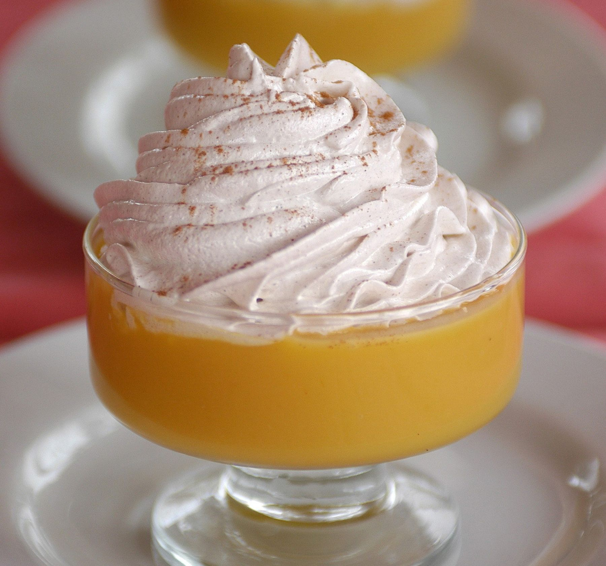

# Suspiro a la Limeña

*Lima's most iconic dessert: a creamy dulce de leche-based "manjar blanco" (Latin American milk caramel cooked with egg yolks till thick and pale gold) layered in small glasses, topped with a generous pillow of fluffy port-wine-flavoured Italian meringue, dusted with ground cinnamon. The name (translating loosely as "Lima lady's sigh") was given by the 19th-century poet José Gálvez who said the dessert was "soft and sweet as the sigh of a Lima lady". Eat in small portions at the end of every Peruvian celebratory meal.*

**Serves:** 6 small glasses

**Prep Time:** 15 minutes

**Cook Time:** 35 minutes

## Overview
Suspiro a la Limeña is Lima's signature dessert: intensely sweet, generous, unapologetically rich. The name (loosely "Lima lady's sigh") was given by the 19th-century poet José Gálvez, who said the dessert was "soft and sweet as the sigh of a Lima lady". Two distinct components. The manjar blanco is Peruvian dulce de leche made with evaporated milk, condensed milk, egg yolks and vanilla cooked low and slow till the mixture thickens to a deep gold caramel; the egg yolks distinguish it from a simpler dulce de leche, giving the cream more body and a custard-like character. The topping is a port-wine Italian meringue: egg whites whipped to soft peaks, then a hot port-and-sugar syrup poured in a thin stream while whisking; the port gives a deep amber colour and a faint wine-and-fruit aroma. The contrast is everything: dense rich caramel below, fluffy boozy cloud above, cinnamon dust on top. Served in small glasses at the very end of a Peruvian meal.

## Ingredients

### The manjar blanco (Peruvian dulce de leche)
- 1 × 397 g tin sweetened condensed milk
- 1 × 400 ml tin evaporated milk
- 3 large egg yolks
- 1 teaspoon vanilla extract
- A pinch of salt
- 1 small cinnamon stick (optional)

### The port-wine Italian meringue
- 2 large egg whites
- 4 tablespoons caster sugar (for the egg whites)
- 100 ml port wine (ruby or tawny)
- 80 g caster sugar (for the syrup)

### To finish
- 1 teaspoon ground cinnamon (for dusting)

### Equipment
- A heavy small saucepan
- A whisk OR an electric beater
- A sugar thermometer (for the port syrup)
- 6 small glasses (50-80 ml each; martini glasses, espresso glasses, or wine flutes work)
- A piping bag with a star tip (optional, for elegant presentation)

## Method

### Stage 1 - Make the manjar blanco
1. In a heavy saucepan, whisk together the condensed milk, evaporated milk, egg yolks, vanilla and salt.
2. (Add the cinnamon stick if using.)
3. Place over the lowest possible heat.
4. Stir CONSTANTLY with a wooden spoon for 25-30 minutes - the mixture thickens slowly and turns from pale ivory to deep gold caramel.
5. The manjar is done when it coats the back of the spoon thickly and a line drawn through it stays clear for 3-4 seconds.
6. Don't rush this step - higher heat will scramble the eggs and burn the bottom.

### Stage 2 - Spoon into glasses
1. Remove the cinnamon stick (if used).
2. Spoon the warm manjar blanco evenly into 6 small glasses, filling each to about 2/3 full.
3. Tap the glasses gently on the work surface to settle.
4. Cool at room temperature 30 minutes, then refrigerate at least 1 hour till fully cold and set.

### Stage 3 - Make the port-wine syrup
1. In a small saucepan, combine the port wine and the 80 g of caster sugar.
2. Heat over medium heat, stirring once or twice till the sugar dissolves.
3. Bring to a gentle boil; reduce to medium.
4. Cook 6-8 minutes till the syrup reaches 115°C on a sugar thermometer (soft-ball stage).
5. The syrup will reduce slightly and darken to a deep amber.

### Stage 4 - Make the meringue
1. While the port syrup cooks, whisk the egg whites in a clean bowl till foamy.
2. Add the 4 tablespoons of caster sugar gradually, whisking till soft peaks form.

### Stage 5 - Combine syrup with meringue (Italian meringue method)
1. With the mixer running on medium speed, pour the hot port-wine syrup in a thin, steady stream into the whipped egg whites.
2. Whisk for 5-6 minutes till the meringue is glossy, holds firm peaks, and has cooled to room temperature.
3. The meringue should be a soft amber-pink colour from the port.

### Stage 6 - Top the suspiros
1. Take the glasses of cold manjar blanco from the fridge.
2. Pipe (or spoon) a generous mound of port-wine meringue on top of each glass - it should rise above the rim like a fluffy cloud.
3. Use a piping bag with a star tip for elegant peaks, or just spoon for a more rustic look.

### Stage 7 - Finish and serve
1. Dust each suspiro with a small amount of ground cinnamon.
2. Serve immediately, or chill 30 minutes before serving.
3. Eat with a long spoon - the diner mixes the meringue and manjar with each bite.

## Notes
- **Constant stirring for the manjar:** the egg-yolk-cream mixture catches and burns within seconds of stopping. A wooden spoon, low heat, never look away.
- **Soft-ball stage for the port syrup:** 115°C. Use a sugar thermometer; estimating temperature is a recipe for failure.
- **Italian meringue is stable:** unlike French meringue (raw egg whites + sugar), Italian meringue is "cooked" by the hot syrup poured in. Stable for hours; safe for unbaked use.
- **Small glasses are non-negotiable:** the dessert is intensely sweet. 50-80 ml is the traditional Peruvian portion.
- **Don't substitute the port:** the deep wine flavour is the dish's character. A non-alcoholic version uses 100 ml of red grape juice + 1 tablespoon balsamic vinegar (works but is different).
- **Cinnamon dust at the end:** the traditional Peruvian finish.

## Variations
**Vanilla suspiro:** swap the port-wine meringue for plain Italian meringue + a vanilla bean - the milder variant.
**Coffee suspiro:** add 1 tablespoon strong espresso powder to the manjar blanco - the adult variant.
**Pisco suspiro:** swap the port for Peruvian pisco - the more local variant.
**Chocolate suspiro:** add 50 g good dark chocolate to the manjar blanco; melt in - the chocolate-lover's variant.
**Coconut suspiro:** swap half the evaporated milk for coconut milk in the manjar - the tropical variant.
**Salted-caramel suspiro:** add a pinch of fleur de sel on top before the cinnamon - the modern sweet-salt variant.
**Larger format (one large dish):** make in a single large bowl; serve scooped into small bowls - the family-style version.

## Serving
At a Lima family Sunday lunch as the dessert course (the traditional setting) · at a Peruvian wedding · at a Peruvian Independence Day (28 July) dinner · at a Lima criolla restaurant · at a Peruvian fine-dining dessert menu · at home as a make-ahead dinner-party finisher · paired with a small glass of Peruvian pisco or a strong espresso.

## Storage
- The manjar blanco refrigerates 1 week; freezes 3 months in airtight containers.
- The meringue is best within 6 hours of making - it slowly weeps and loses fluffiness.
- Assemble the suspiros within 4 hours of serving for the best texture.
- The manjar blanco can be made up to a week ahead; the meringue is made fresh.
- Leftover Italian meringue can be piped into kisses and dried in a low oven for 2 hours - dried meringues are excellent with coffee.
- Don't freeze the assembled suspiro - the meringue collapses.
