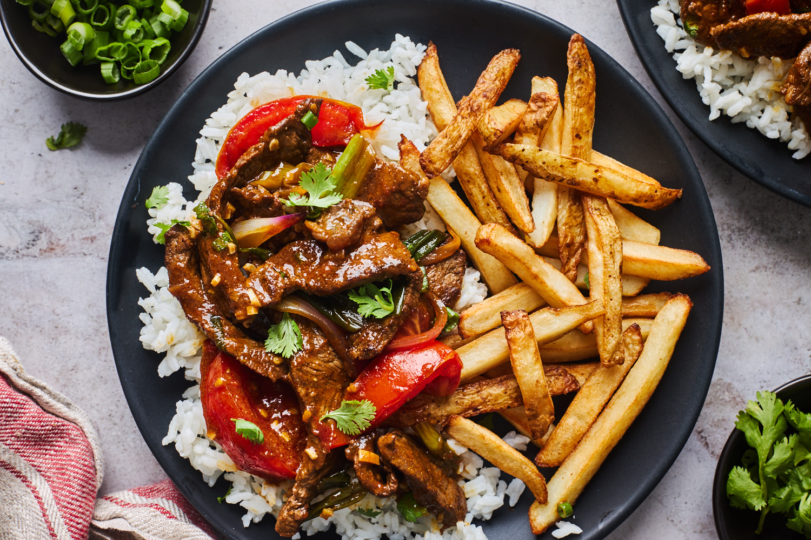

# Lomo Saltado

*Peru's most famous chifa (Chinese-Peruvian) dish: strips of beef sirloin stir-fried hard in a smoking-hot wok with red onion wedges, ripe tomato wedges, aji amarillo strips, soy sauce, red wine vinegar and a generous fistful of cilantro, served over white rice with a pile of Peruvian-style frites on top. Wok-charred edges, sour-spicy soy juices pooling at the bottom of the plate, the rice soaking up the gravy. Born in 19th-century Lima from the Cantonese-immigrant chifa restaurant tradition; now the canonical Peruvian household dinner. Eats best fast and hot from the pan.*

**Serves:** 4

**Prep Time:** 20 minutes

**Cook Time:** 12 minutes

## Overview
Lomo saltado ("jumped sirloin") is the foundational dish of Peruvian chifa cuisine, the Cantonese-Peruvian fusion that emerged from the 19th-century Chinese immigration to Lima. A wok-stir-fry: the pan must be smoking-hot, the beef sears hard (not braises), and the vegetables get a quick toss. Total cook time from beef hitting the pan is six to eight minutes. The chifa flavour base is soy sauce, red wine vinegar (the Peruvian addition; vinegar isn't traditional in Chinese stir-fries), aji amarillo paste and a grate of garlic. Soy gives the umami, vinegar gives the bracing tang, aji amarillo gives the floral-fruity heat that's distinctly Peruvian. The carb double is canonical: served on a bed of plain white rice and topped with a pile of Peruvian-style fries. The rice soaks the wok juices, the fries sit crisp on top.

## Ingredients

### The beef and marinade
- 600 g beef sirloin OR rib-eye, sliced thin across the grain (5 mm × 4 cm strips)
- 2 tablespoons soy sauce
- 1 tablespoon red wine vinegar
- 1 teaspoon aji amarillo paste
- 1 clove garlic, finely grated
- 1 teaspoon ground cumin
- 1/2 teaspoon black pepper

### The stir-fry
- 3 tablespoons sunflower oil OR rapeseed oil
- 1 large red onion, cut into 6-8 wedges through the root
- 2 large ripe tomatoes, cut into 6-8 wedges (deseed if very watery)
- 1 aji amarillo, deseeded and sliced into long thin strips (or 2 tablespoons aji amarillo paste added to the sauce)
- 4 cloves garlic, finely chopped

### The sauce (finishing)
- 3 tablespoons soy sauce
- 2 tablespoons red wine vinegar
- 1 tablespoon Worcestershire sauce
- 1 tablespoon aji amarillo paste
- 1/2 teaspoon caster sugar
- 1/2 teaspoon black pepper

### To finish
- 1 large bunch fresh cilantro, leaves picked

### To serve
- 600 g cooked plain white long-grain rice (jasmine or basmati)
- 600 g Peruvian-style frites (see [Belgian frites](../belgian/side-dishes/belgian-frites.md) - same technique) OR good thick-cut crisps
- A wedge of lime per plate

## Method

### Stage 1 - Marinate the beef
1. In a bowl, combine the sliced beef with the soy sauce, vinegar, aji amarillo paste, grated garlic, cumin and pepper.
2. Toss to coat; let sit 15-20 minutes (no longer - longer marinating breaks down the meat).

### Stage 2 - Cook the rice and fries (in parallel)
1. Cook the rice as usual (steam method - 600 g cooked rice from 200 g raw).
2. Cook the frites: double-fry the cut potatoes (see Belgian frites recipe) - this can be done ahead and the second fry done just before serving.

### Stage 3 - Whisk the sauce
1. In a small bowl, whisk together the 3 tbsp soy sauce, 2 tbsp red wine vinegar, Worcestershire, aji amarillo paste, sugar and pepper.

### Stage 4 - Heat the wok
1. Heat a large wok (or heavy frying pan) over the highest possible heat.
2. The pan should be smoking-hot - this is essential.
3. Add 1 tablespoon of oil; it should shimmer immediately.

### Stage 5 - Sear the beef in batches
1. Add half the beef to the smoking-hot wok in a single layer.
2. DO NOT MOVE for 60 seconds (let the underside char).
3. Flip / stir; cook another 60 seconds.
4. Tip onto a plate.
5. Repeat with another tablespoon of oil and the second half of the beef.
6. Don't crowd the wok; crowded beef steams instead of searing.

### Stage 6 - Stir-fry the vegetables
1. Return the wok to high heat with the last tablespoon of oil.
2. Add the red onion wedges; stir-fry 90 seconds till just starting to soften.
3. Add the tomato wedges and the chopped fresh aji amarillo strips.
4. Stir-fry 1 minute - the tomatoes should stay in wedges, just heated through and slightly softened.
5. Add the chopped garlic; stir 30 seconds.

### Stage 7 - Combine
1. Return the seared beef and any juices to the wok.
2. Pour the prepared sauce over.
3. Toss vigorously for 60 seconds - everything should be coated; the sauce thickens slightly from the heat.
4. The total time from when the beef first hit the pan should be no more than 8 minutes.

### Stage 8 - Plate
1. Spoon a generous portion of white rice onto each warm wide plate.
2. Spoon the lomo saltado (with all its juices) over and around the rice.
3. Pile a generous handful of Peruvian frites on top.
4. Scatter cilantro leaves generously over.
5. Place a lime wedge on the side.

### Stage 9 - Serve immediately
1. Eat hot - lomo saltado is at its peak for 3-5 minutes.
2. The diner mixes the rice, frites, and sauce together as they eat.

## Notes
- **Smoking-hot wok:** the heat is what makes this lomo saltado rather than a generic stir-fry. A cool pan gives grey braised meat.
- **Don't overcrowd:** 2-batch cooking of the beef. Crowded beef steams.
- **Aji amarillo is essential:** the Peruvian yellow chilli (fresh, paste or both) is what makes this Peruvian rather than Cantonese.
- **Both rice AND fries:** the double-carb is canonical. Some restaurants serve only rice (lighter); some only fries (less rice); the canonical home serving is both.
- **Wedge of lime is the finishing touch:** squeezed over at the table for the bracing acidity.

## Variations
**Tallarin saltado:** swap rice for fresh thin egg noodles - the Cantonese-Peruvian noodle version.
**Pollo saltado:** swap beef for chicken thighs sliced thin - the lighter / cheaper variant.
**Lomo saltado de mariscos:** swap beef for prawns and squid - the seafood variant.
**Lomo saltado de hongos (vegetarian):** swap beef for thick king oyster mushrooms sliced thin; same sauce.
**Modern Lima restaurant variant:** add a poached egg on top - the brunch variant.
**Lomo saltado on a sandwich (sanguche de lomo):** pile the cooked stir-fry into a fresh roll with mayo and pickled onions - the Lima street-sandwich variant.

## Serving
At a Peruvian chifa restaurant (the canonical setting; chifa restaurants run from Lima to the Amazon) · at a Lima working-day lunch · at a Peruvian Independence Day celebration · at a Peruvian household dinner (lomo saltado is the canonical Peruvian week-night meal) · paired with chicha morada or a cold Peruvian Pilsen Trujillo lager.

## Storage
- Refrigerates 2 days; reheat in a hot wok with a small splash of water.
- Doesn't freeze well - the vegetables go limp.
- The marinade and sauce can be made up to 2 days ahead.
- The frites are best fresh; reheated frites lose their crisp.
- Cooked rice keeps 3 days refrigerated; reheat with a splash of water in the microwave or stovetop.
