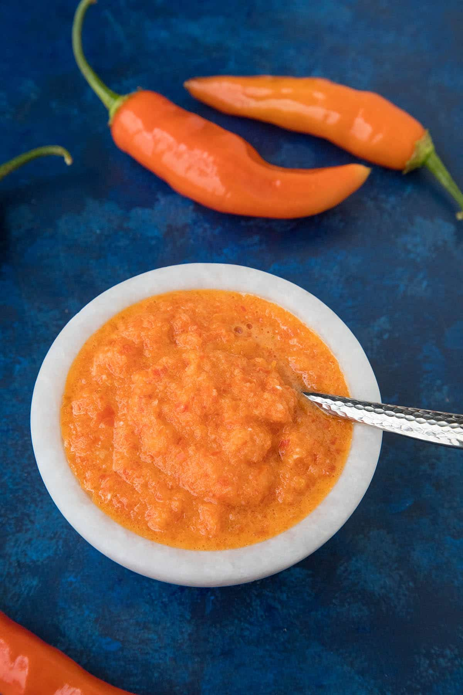

# Aji Amarillo Paste (Homemade Peruvian Yellow Chilli Paste)

*The single most-used Peruvian ingredient: a thick electric-yellow paste of blistered, deseeded aji amarillo chillies blended with oil and a pinch of salt, used as the flavour base for aji de gallina, papa a la huancaína, anticuchos marinade, lomo saltado sauce, and a dozen other Peruvian classics. The aji amarillo is Peru's signature chilli, fruity, floral, gently spicy (Scoville 30,000-50,000; about half-as-hot as a serrano), with a unique citrussy-tropical note that's hard to substitute. Made fresh in every Peruvian kitchen; sold by the jar at Latin American shops worldwide.*

**Serves:** Makes about 500 g paste (enough for 25-30 Peruvian dishes)

**Prep Time:** 20 minutes

**Cook Time:** 15 minutes

## Overview
Aji amarillo paste is Peru's most identity-defining ingredient: the yellow-orange paste that defines the flavour profile of dozens of traditional Peruvian dishes. Without it, Peruvian cooking is just generic Andean food. The aji amarillo (Capsicum baccatum) is the country's signature chilli, a tapered deep-orange pod about 8 to 10 cm long, with a Scoville heat of 30,000 to 50,000 (about half-as-hot as a serrano). Unlike most chillies, it has a uniquely fruity, almost tropical-citrus aroma that's the dominant note in the finished paste. The paste can be made fresh from whole pods (sold in Latin American shops and online), rehydrated from dried pods, or bought ready-made in jars (Inka Crops, Doña Isabel and Goya brands substitute well). This recipe is the homemade-from-fresh version: blister the chillies, peel them (the skin is bitter), deseed (most of the heat is in the seeds), then blend the flesh with neutral oil, garlic and salt. Keeps refrigerated two weeks or freezes six months.

## Ingredients

### The chillies (about 500 g of fresh pods makes 400 g of paste)
- 500 g fresh aji amarillo chillies (the long tapered yellow-orange Peruvian chilli; sold fresh in Latin American shops, or by mail order)
- OR 200 g dried aji amarillo pods (rehydrated, see Stage 1 alt below)

### The paste
- 4 cloves garlic
- 2 tablespoons sunflower oil OR a neutral vegetable oil
- 1 teaspoon fine sea salt
- 1 tablespoon fresh lime juice (optional, helps preservation)

### Equipment
- A small heavy saucepan or a frying pan
- A high-speed blender (Vitamix, Blendtec; or a regular blender with patience)
- Clean glass jars for storage

## Method

### Stage 1 - Blister the fresh chillies
1. Wash the fresh chillies; pat dry.
2. Heat a heavy frying pan (no oil) over medium-high heat.
3. Place the chillies in the dry pan in a single layer.
4. Cook 3-4 minutes per side (8-10 minutes total), turning occasionally, till the skins are charred and blistered all over.
5. Transfer to a heatproof bowl; cover with cling film or a plate (the steam loosens the skins).
6. Let steam 10 minutes.

### Stage 1 alternative - Rehydrate dried chillies
1. If using dried aji amarillo pods: place in a heatproof bowl; cover with just-boiled water.
2. Let stand 30 minutes till fully soft.
3. Drain (save the soaking water; can be used in stews for extra flavour).

### Stage 2 - Peel and deseed
1. Working with one chilli at a time (rubber gloves help if you're sensitive to chilli heat):
2. Rub the skin off, it should slip off easily after the steam.
3. Cut off the stem.
4. Cut the chilli open lengthways.
5. Scrape out the seeds and the white ribs with a small spoon or knife (these are most of the heat).
6. For a hot paste: leave some seeds in.
7. For a mild paste: remove every seed and rib.

### Stage 3 - Blend the paste
1. Place the peeled, deseeded chilli flesh in a blender.
2. Add the garlic cloves, salt, oil and (optional) lime juice.
3. Blend on the highest speed 2-3 minutes till perfectly smooth, glossy and uniformly bright yellow-orange.
4. If the paste is too thick to blend, add an extra tablespoon of oil.

### Stage 4 - Optional cook-down for shelf-stability
1. (Optional, some Peruvian cooks skip this; the paste keeps perfectly well raw.)
2. Pour the paste into a small heavy saucepan.
3. Cook over medium-low heat 5-8 minutes, stirring, till the paste darkens slightly and the raw garlic flavour mellows.
4. Cool to room temperature.

### Stage 5 - Store
1. Spoon the paste into clean glass jars.
2. Smooth the top with a spoon.
3. Pour 1 teaspoon of oil over the surface to seal (prevents oxidation).
4. Cover and refrigerate (keeps 2 weeks) or freeze (in small portions; keeps 6 months).

### Stage 6 - Use
1. Use 2-4 tablespoons per serving in Peruvian dishes:
   - Aji de gallina (4-5 tablespoons for 4 servings)
   - Papa a la huancaína (4 tablespoons in the sauce)
   - Anticuchos marinade (6 tablespoons for 700 g meat)
   - Lomo saltado (1 tablespoon in the sauce)
   - Causa rellena (4 tablespoons in the potato mash)
2. The paste is also excellent as a small condiment, a teaspoon swirled on top of any Peruvian dish for colour and extra heat.

## Notes
- **Fresh chillies are the gold standard:** the flavour is brighter and more aromatic than the dried/rehydrated version. But dried works.
- **Peel the skins:** non-negotiable. The skin is bitter and tough.
- **Deseed for heat control:** most of the heat is in the seeds and the white ribs. Adjust to taste.
- **Oil seals the surface:** prevents the paste oxidising and developing a dark brown skin.
- **Freezes excellently in small portions:** ice-cube trays of 2 tablespoons each, then bagged.
- **Substitute notes:** if you can't find aji amarillo at all, the closest commercial substitute is jarred yellow Hungarian or Caribbean Scotch bonnet paste + ground turmeric for colour, but it's not the same; aji amarillo is uniquely Peruvian.

## Variations
- **Rocoto paste:** the same technique with rocoto chillies (the deep-red Andean apple chilli): hotter, sharper, more vegetal.
- **Aji panca paste:** the traditional anticucho marinade base, sweeter, smokier dried red chilli; same technique with the dried pods.
- **Aji amarillo with citrus zest:** add the zest of 1 lemon and 1 lime before blending, the modern Lima restaurant variant.
- **Smoked aji amarillo paste:** smoke the chillies on a charcoal grill instead of dry-pan blistering, the modern smoky variant.
- **Vegan / vegetarian-friendly:** the recipe is already vegan; no animal products.
- **Aji amarillo huacatay paste:** add a small handful of fresh huacatay (Peruvian black mint) before blending, the herbal variant.
- **Aji amarillo-and-mango paste:** add a ripe mango cheek to the blend, the modern fruit-forward variant.

## Serving
- As the foundation ingredient for any Peruvian dish · pre-made in every Peruvian household pantry · sold in 250 g jars at every Peruvian shop and in Latin American specialty stores worldwide · in a small dish on the Peruvian table as a condiment for grilled meat, fish or boiled potatoes.

## Storage
- Refrigerates 2-3 weeks in a sealed jar with a thin layer of oil on top.
- Freezes 6 months in small portions (ice cube trays, then bagged).
- The cooked-down version (Stage 4) keeps slightly longer than the raw version.
- Don't store at room temperature for more than a few hours, the moisture content allows mould growth.
- The dried chilli pods themselves keep indefinitely in a sealed jar in a dry pantry; rehydrate as needed.
- A typical Peruvian household has at least 250 g of paste in the fridge at any time.
