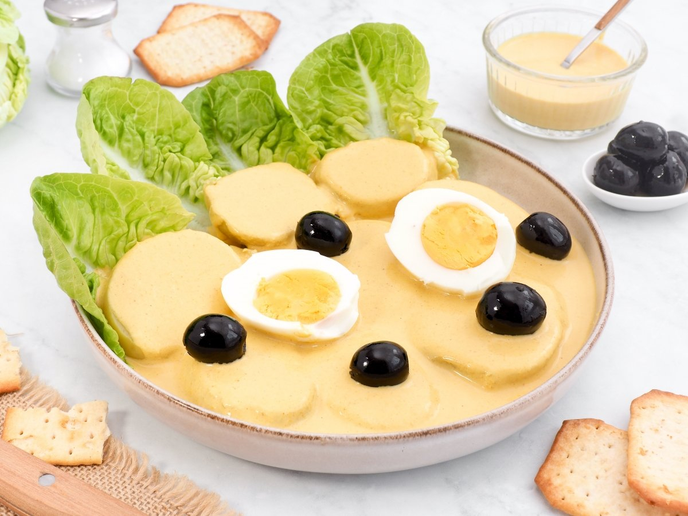

# Papa a la Huancaína

*The Huancayo highland classic: slices of cold boiled yellow potato fanned out over a bed of lettuce, drowned in a vivid yellow cream sauce (huancaína sauce - aji amarillo paste, evaporated milk, fresh cheese, soda crackers and a little oil blitzed into a velvety emulsion), garnished with a hard-boiled egg, a black Botija olive and a parsley sprig. The yellow sauce alone is one of Peru's most-loved condiments - poured over almost anything from boiled potatoes to grilled meat. Born in the Andean city of Huancayo; now eaten across Peru as both a side and a standalone starter.*

**Serves:** 6 (as a side; 4 as a starter)

**Prep Time:** 20 minutes

**Cook Time:** 20 minutes

## Overview
Papa a la huancaína is the dish that pulled the central-Andean city of Huancayo onto Peru's culinary map. The construction is built around the huancaína sauce - a deceptively simple emulsion of aji amarillo paste, evaporated milk, fresh white cheese (queso fresco, or a workable substitute like ricotta + feta), a few soda crackers (the canonical "salty cracker" thickener), a clove of garlic, salt, and a little oil - all blitzed in a blender into a velvety pourable cream the colour of egg yolk. The sauce is poured over thick slices of cold boiled yellow potato (papa amarilla; Yukon Gold substitutes); the dish is garnished with hard-boiled egg, a Botija olive, lettuce leaves and parsley. Some Peruvian cooks add a small swirl of extra aji amarillo paste on top for drama. The whole assembly is cold; the canonical Peruvian first course or table-side garnish. The sauce alone is what makes this dish Peruvian - the huancaína sauce in a small dish is also served alongside grilled meat, fried fish, or simply as a dip for cancha (toasted corn snacks). Three details: BLITZ THE SAUCE TILL VELVET (a coarse sauce ruins the dish; aim for the smoothness of mayonnaise), USE YELLOW WAXY POTATOES (papa amarilla canonical; Yukon Gold substitute; floury potatoes go grainy when sliced cold), and SERVE COLD (potatoes boiled and cooled fully; the sauce at room temp or cold; never warm).

## Ingredients

### The potatoes
- 800 g yellow waxy potatoes (papa amarilla OR Yukon Gold), peeled and halved
- 1 teaspoon salt (for the cooking water)

### The huancaína sauce
- 4 tablespoons aji amarillo paste (Peruvian yellow chilli paste, from Latin American shops or international supermarkets)
- 200 g queso fresco (Peruvian fresh cheese; substitute with 100 g ricotta + 100 g feta blended)
- 200 ml evaporated milk
- 6 saltine soda crackers (the canonical thickener; or 4 tablespoons fresh breadcrumbs)
- 1 clove garlic
- 4 tablespoons sunflower oil OR vegetable oil
- 1 tablespoon fresh lime juice
- 1/2 teaspoon salt (taste before adding more)
- 1/4 teaspoon white pepper

### The garnish (canonical Peruvian)
- 4 hard-boiled eggs, halved or sliced
- 8-12 Botija olives (Peruvian dried black olives; Kalamata substitute)
- 6-8 lettuce leaves (oak leaf, romaine, or iceberg) - the bed for the potatoes
- A few sprigs fresh flat-leaf parsley
- An extra teaspoon of aji amarillo paste, for the decorative swirl

### To serve
- A cold first-course plate
- An optional small bowl of extra huancaína sauce for dipping
- A glass of chicha morada OR a cold Peruvian Pilsen Trujillo lager

## Method

### Stage 1 - Boil the potatoes
1. Place the peeled potatoes in a pot of cold salted water.
2. Bring to the boil; simmer 18-22 minutes till tender (a knife slides in easily).
3. Drain; let cool at room temperature 20 minutes, then refrigerate at least 30 minutes till fully cold.
4. Slice into 1.5 cm thick rounds (or wedges).

### Stage 2 - Make the huancaína sauce
1. In a blender, combine the aji amarillo paste, queso fresco (or substitute), evaporated milk, saltine crackers, garlic, sunflower oil, lime juice, salt and white pepper.
2. Blend on high speed 1-2 minutes till perfectly smooth, velvety, and the colour of egg yolk.
3. Taste; adjust salt and lime juice. The sauce should be assertively flavoured, slightly cheesy, mildly spicy, bright yellow.
4. The consistency should be pourable but coat the back of a spoon - thinner than mayonnaise, thicker than cream.
5. If too thick, add a splash more evaporated milk; if too thin, add another cracker.
6. Refrigerate till serving (the sauce thickens slightly when cold).

### Stage 3 - Plate
1. Lay a bed of lettuce leaves on each plate (or one large platter).
2. Fan out 5-6 slices of cold boiled potato on top.
3. Pour or spoon the huancaína sauce generously over the potatoes - it should fully coat them.
4. Garnish each plate with: a half hard-boiled egg, 2-3 Botija olives, a sprig of parsley, and a small decorative swirl of extra aji amarillo paste.

### Stage 4 - Serve cold
1. Serve immediately while the potatoes are cold.
2. Eat with a fork - cut through the potato and sauce together.

## Notes
- **Blitz the sauce till perfectly smooth:** 1-2 minutes in a high-speed blender; coarse sauce ruins the dish.
- **Aji amarillo paste:** the jarred paste is non-negotiable; substitutes give a different, flatter result.
- **Yellow waxy potatoes:** papa amarilla canonical; Yukon Gold substitute; never floury (Maris Piper, Russet).
- **Soda crackers (saltines) thickener:** the canonical Peruvian secret. Substitute with fresh breadcrumbs in a pinch.
- **Cold potatoes, room-temp or cold sauce:** never warm. The dish is a cold first course.
- **The sauce is a Peruvian condiment in its own right:** make a double batch and refrigerate; pour over anything.

## Variations
**Huancaína sauce as a dip:** thicker version (less evaporated milk) - dip cancha (toasted corn), boiled cassava, or grilled chicken into it.
**Ocopa (the Arequipa cousin):** swap aji amarillo for huacatay (Peruvian black mint) + aji mirasol; same potato-and-cream structure but green-tinted.
**Modern Lima restaurant variant:** plate the sauce as a dot or quenelle; thin slices of potato cured briefly in the sauce; microgreens.
**Causa-style huancaína:** mash the boiled potato with the sauce; chill in a ring mould; garnish on top.
**Vegan huancaína sauce:** swap cheese for soaked cashews; evaporated milk for coconut milk; oil for olive oil - surprisingly good.
**Spicy huancaína:** double the aji amarillo paste + add 1 finely chopped fresh rocoto chilli - the more aggressive heat variant.
**Huancaína with quinoa:** instead of potato, use quinoa cooked till tender as the base - the modern healthy variant.

## Serving
At a Peruvian first-course Sunday lunch (the canonical setting) · at a Lima criolla restaurant · at a Peruvian Independence Day buffet · at a Peruvian wedding canapé table · at a Peruvian household alongside roast chicken or anticuchos · at home as a make-ahead first course · paired with chicha morada or a cold lager.

## Storage
- The sauce refrigerates 5 days; whisk briefly before serving if it thickens too much.
- The sauce freezes 2 months but the texture loosens slightly on defrost.
- Boiled potatoes refrigerate 3 days; bring to cool room temperature before plating.
- Plated papa a la huancaína refrigerates 1 day; the sauce darkens slightly but is still good.
- The hard-boiled eggs and olives keep 5 days refrigerated.
- A "huancaína kit" (sauce + boiled potatoes + boiled eggs + olives, all separately) can be prepped on Saturday morning and assembled Sunday lunch.
