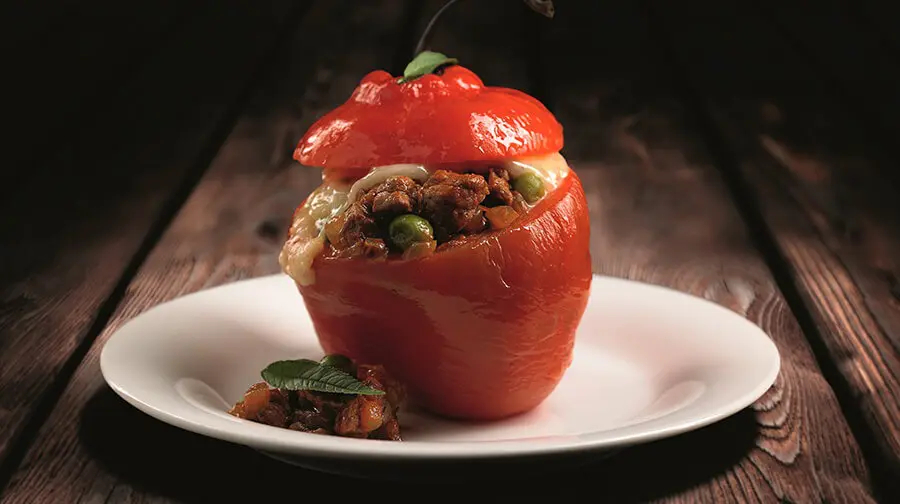

# Rocoto Relleno (Stuffed Andean Red Chillies)

*Arequipa's signature stuffed-pepper: large red rocoto chillies (the Andean apple-shaped pepper, hotter than an aji amarillo but with a sweet vegetal note) boiled briefly to mellow the heat, stuffed with a richly spiced filling of minced beef, sweated onion, garlic, aji panca paste, raisins and chopped peanuts, topped with a slice of queso fresco, baked till the cheese melts and the rocotos collapse slightly. Served with a slice of pastel de papa (Andean potato gratin) alongside. Arequipa's most identity-defining dish, hot, generous, distinctive.*

**Serves:** 4

**Prep Time:** 30 minutes

**Cook Time:** 50 minutes

## Overview
Rocoto relleno ("stuffed rocoto") is the Arequipa-region signature dish: large red rocoto chillies stuffed with a rich beef-and-onion filling and baked under a layer of melted Peruvian fresh cheese. Rocoto (Capsicum pubescens) is a distinctly Andean chilli, apple-shaped, deep red, with black seeds (unlike most chillies, which have cream-coloured seeds), thicker walls than a bell pepper, and a Scoville heat of 30,000 to 100,000 (similar to a habanero but with a sweeter, more vegetal flavour). Outside Peru, rocoto is sold fresh in Latin American shops (look for "rocoto" or "manzano"); cubanelle peppers substitute structurally. The mellowing boil tones down the brutal raw-rocoto heat to a manageable level; Arequipa purists boil three times, others once for the more aggressive version. The filling is minced beef with onion, garlic, aji panca paste, cumin, oregano, raisins, chopped peanuts (the Arequipa addition), hard-boiled egg and parsley. Topped with queso fresco, baked till the cheese is melted and golden. Served alongside pastel de papa (Andean potato gratin), the traditional Arequipa pairing.

## Ingredients

### The chillies
- 4 large fresh rocoto chillies (or 4 cubanelle peppers + 1 finely chopped habanero added to the filling, as a heat-substitute)
- 1 litre water (for boiling)
- 2 tablespoons white vinegar
- 2 tablespoons caster sugar
- 2 teaspoons salt

### The beef filling
- 400 g good minced beef (15% fat)
- 1 large onion, finely chopped
- 4 cloves garlic, finely chopped
- 2 tablespoons aji panca paste (from a jar)
- 1 teaspoon ground cumin
- 1 teaspoon dried oregano
- 1/2 teaspoon ground black pepper
- 1 teaspoon salt
- 2 tablespoons sunflower oil
- 50 g raisins
- 50 g raw peanuts, roughly chopped (the Arequipa addition)
- 2 hard-boiled eggs, finely chopped
- 2 tablespoons chopped flat-leaf parsley
- 2 tablespoons milk OR beef stock (loosens the filling)

### The cheese topping
- 200 g queso fresco (Peruvian fresh cheese; substitute with 100 g mozzarella + 100 g feta, mixed)
- 1 large egg yolk (for a glaze; optional but traditional)

### To serve alongside (the traditional Arequipa pairing)
- 1 batch pastel de papa OR 600 g boiled new potatoes, buttered
- 1 batch white rice
- A small wedge of lime

### Equipment
- An ovenproof dish large enough to hold 4 stuffed chillies snugly
- A small saucepan for the boiling

## Method

### Stage 1 - Prep the rocoto chillies
1. Wash the rocotos.
2. Cut a "lid" off the top of each (around the stem); set the lids aside.
3. Carefully scoop out the seeds and white ribs with a small spoon, WEAR RUBBER GLOVES if you're sensitive to chilli heat; rocoto residue on hands is unpleasant for hours.

### Stage 2 - Mellow the heat (boil)
1. In a saucepan, bring the water with the vinegar, sugar and salt to the boil.
2. Add the rocoto shells (and their lids) to the boiling water.
3. Boil 3-4 minutes (3 for spicy lovers; 4 for milder).
4. Drain.
5. (For the maximum-mellow Arequipa style: boil twice more, each time with fresh water-vinegar-sugar-salt, draining between, this gives the milder restaurant version.)
6. Set the boiled chilli shells aside.

### Stage 3 - Make the filling
1. Heat the sunflower oil in a heavy frying pan over medium heat.
2. Add the chopped onion; sweat 6-8 minutes till translucent.
3. Add the garlic; cook 1 more minute.
4. Add the aji panca paste; cook 2 minutes till fragrant.
5. Add the minced beef; break up with a wooden spoon.
6. Cook 5-6 minutes till the beef has lost its pink colour and the juices have mostly evaporated.
7. Add the cumin, oregano, salt, pepper, raisins, chopped peanuts.
8. Stir 2 minutes.
9. Off the heat, fold in the chopped hard-boiled egg, chopped parsley, and milk or stock.
10. Taste; adjust salt. The filling should be assertively flavoured.

### Stage 4 - Stuff the chillies
1. Heat the oven to 180°C (160°C fan).
2. Place the boiled rocoto shells in a buttered ovenproof dish.
3. Stuff each generously with the beef filling, really pack it in (a heaped 4 tablespoons per chilli).
4. Top each chilli with a thick slice of queso fresco (or the mozzarella-feta mix) covering the top of the filling.
5. (Optional: brush the cheese with the beaten egg yolk for a golden glaze.)
6. Replace the rocoto "lids" loosely on top (some cooks do; some don't).

### Stage 5 - Bake
1. Bake on the middle shelf of the oven 25-30 minutes till the cheese is melted, golden and bubbling at the edges; the rocotos slightly collapsed; the filling steaming.

### Stage 6 - Serve
1. Place one stuffed rocoto on each warm plate.
2. Add a generous spoonful of pastel de papa or a few buttered new potatoes alongside.
3. Add a spoonful of white rice if serving.
4. A lime wedge on the side.
5. Serve immediately while the cheese is still bubbling.

## Notes
- **Wear gloves:** rocoto residue on hands stings for hours; rubbing your eyes is excruciating.
- **Boil to mellow:** raw rocoto is too hot for most palates. The 3-4 minute boil with vinegar-sugar-salt is essential.
- **Raisins and peanuts:** the Arequipa-specific additions. Without them, the dish is just a generic Latin stuffed pepper.
- **Queso fresco is essential:** Peruvian fresh white cheese; mozzarella + feta mix is the workable substitute.
- **Don't substitute bell peppers for the traditional version:** the heat IS part of the dish. If you must, use cubanelle peppers + add a finely chopped habanero to the filling for some heat.
- **Pastel de papa is the traditional Arequipa side:** Andean baked layered-potato gratin (similar to scalloped potatoes); a layer of thin-sliced waxy potato, queso fresco, salt, milk, baked till golden.

## Variations
- **Vegetarian rocoto relleno:** swap beef for finely chopped mushrooms + lentils + the same raisins and peanuts.
- **Pork rocoto relleno:** swap beef for finely chopped pork shoulder; same spice base.
- **Chicken rocoto relleno:** swap beef for finely chopped chicken thigh.
- **Modern Arequipa upscale rocoto:** wrap the stuffed chilli in a thin sheet of phyllo before baking, the modern restaurant presentation.
- **Rocoto relleno with quinoa:** add 80 g cooked quinoa to the filling, the modern healthy variant.
- **Bell pepper version (heat-free):** use red bell peppers if you absolutely can't handle the heat, tastes different but works structurally.
- **Mini rocoto relleno canapés:** use small rocotos or cherry peppers; reduce filling proportions; serve as canapés.
- **Rocoto Relleno with aji huacatay sauce:** spoon a small dollop of huacatay sauce on top, the modern Lima fusion.

## Serving
- At an Arequipa picantería (the traditional setting; a picantería is a Peruvian regional restaurant focused on traditional Arequipa food) · at an Arequipa family Sunday lunch · at the annual Arequipa Day celebration (15 August) · at a Peruvian Independence Day buffet · at a southern-Peruvian Andean restaurant · at home as a Saturday-night dinner-party showpiece · paired with a glass of cold Cusqueña or Pilsen lager.

## Storage
- Cooked rocotos refrigerate 3 days; reheat in a 180°C oven for 15 minutes.
- Don't microwave, the cheese goes rubbery.
- Freezes 2 months in airtight containers; defrost overnight in the fridge before reheating.
- The raw filling refrigerates 24 hours; assemble fresh.
- The boiled rocoto shells (empty) refrigerate 3 days; stuff and bake as needed.
- The peanuts and raisins keep indefinitely in a sealed pantry jar.
