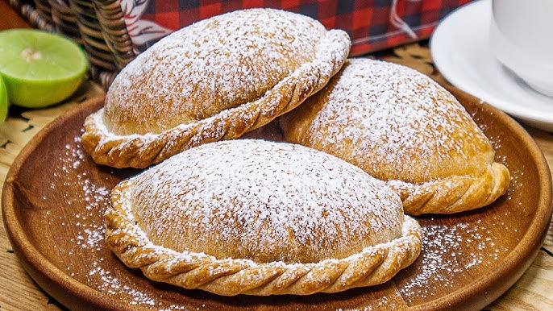

# Empanadas Peruanas (Peruvian Beef Empanadas)

*Lima's bakery and street-stall classic: a buttery short pastry half-moon, crimped at the edge with a decorative repulgue (twisted-rope crimp), filled with a juicy mince-beef-and-onion picadillo seasoned with aji panca paste, cumin, raisins, hard-boiled egg and a black Botija olive at the heart, brushed with egg wash and baked till deeply golden. The Peruvian version differs from Argentinian and Chilean empanadas in three small but defining ways. Eaten warm in the hand, with a small squeeze of lime over the top - the canonical Lima lunchroom and bakery quick lunch.*

**Serves:** 12 empanadas

**Prep Time:** 50 minutes (plus 30 minutes pastry chilling)

**Cook Time:** 30 minutes

## Overview
Empanadas are popular across Latin America (Argentinian, Chilean, Bolivian, Mexican and Colombian versions all exist), but each country has its own distinct profile. The Peruvian one is identity-defined by three specifics. The pastry: a Peruvian shortcrust enriched with lard or butter, sometimes with a touch of pisco in the dough, rolled thin and cut into 15 cm rounds. Less flaky than Argentinian, less laminated than Chilean. The filling: minced beef, finely chopped onion, aji panca paste (the Peruvian smoky-sweet red chilli paste, not aji amarillo), cumin, dried oregano, a splash of beef stock, chopped raisins, chopped hard-boiled egg and a single Botija olive at the centre of each empanada before sealing. The raisins and the olive are the Peruvian signatures; without them, you've made a Chilean or Argentinian empanada. The seal: a decorative repulgue (twisted-rope crimp at the edge, made by folding small pleats with thumb and forefinger). Baked at 200 °C till deep gold. Served warm with a wedge of lime and salsa criolla on the side.

## Ingredients

### The shortcrust pastry (for 12 empanadas)
- 400 g plain flour
- 1 teaspoon salt
- 1 tablespoon caster sugar
- 200 g cold unsalted butter, cubed (or 130 g butter + 70 g lard, the traditional mix)
- 1 large egg, lightly beaten
- 4 tablespoons ice-cold water
- 1 tablespoon Peruvian pisco OR vodka (optional but traditional; helps the pastry stay flaky)

### The filling
- 500 g good minced beef (15% fat)
- 1 large onion, very finely chopped
- 4 cloves garlic, finely chopped
- 3 tablespoons sunflower oil
- 2 tablespoons aji panca paste (the Peruvian smoky-sweet red chilli paste)
- 1 teaspoon ground cumin
- 1 teaspoon dried oregano
- 1/2 teaspoon ground black pepper
- 1 teaspoon salt
- 100 ml beef stock
- 100 g raisins (about 1/2 cup)
- 3 hard-boiled eggs, finely chopped
- 12 Botija olives (Peruvian dried-black olives; substitute with Kalamata), pitted; one per empanada
- 2 tablespoons chopped flat-leaf parsley

### The egg wash
- 1 egg yolk + 1 tablespoon milk

### To finish (optional)
- A small dusting of caster sugar OR icing sugar on the cooked empanada (the canonical Lima bakery touch; some skip)

### To serve
- A wedge of lime per empanada
- A small dish of [aji huacatay sauce](../anticuchos.md) (mint-aji creamy sauce) for dipping
- A small bowl of salsa criolla (finely sliced red onion + finely chopped chilli + lime juice + salt; the Peruvian fresh relish)
- A cold Peruvian Pilsen Trujillo lager OR a glass of chicha morada

## Method

### Stage 1 - Make the pastry
1. In a large bowl, combine the flour, salt and sugar.
2. Add the cold butter (and lard if using); rub with cold fingertips till the mixture resembles damp sand.
3. Whisk the egg with the ice-cold water and (optional) pisco.
4. Pour the wet into the dry; mix till the dough just comes together.
5. Shape into a flat disc; wrap in cling film.
6. Refrigerate at least 30 minutes (overnight is better).

### Stage 2 - Make the filling
1. Heat 2 tablespoons of oil in a heavy frying pan over medium heat.
2. Add the chopped onion and garlic; sweat 8 minutes till translucent.
3. Add the aji panca paste, cumin, oregano, salt and pepper; cook 2 minutes till fragrant.
4. Add the minced beef; break up with a wooden spoon.
5. Cook 6-8 minutes till the beef has lost its pink colour.
6. Pour in the beef stock; simmer 3-4 minutes till the liquid has mostly evaporated.
7. Fold in the raisins, chopped hard-boiled egg and parsley.
8. Taste; adjust salt. The filling should be assertively flavoured, moist but not soupy.
9. Cool to room temperature before assembling (essential - hot filling melts the pastry).

### Stage 3 - Roll and cut the pastry
1. Heat the oven to 200°C (180°C fan).
2. Line a baking tray with parchment.
3. Roll the chilled pastry on a lightly floured surface to 3 mm thick.
4. Cut into rounds using a 15 cm cutter (or a small bowl).
5. Re-roll scraps once to make extra rounds.
6. You should have 12 rounds.

### Stage 4 - Fill and shape each empanada
1. Take one pastry round; place 1.5 tablespoons of the cooled filling in the centre.
2. Place 1 Botija olive on top of the filling.
3. Brush the edge of the pastry with a small amount of egg wash (helps seal).
4. Fold the pastry over the filling to form a half-moon.
5. Press the edges together firmly.
6. Make the repulgue crimp: starting at one corner, fold small pleats over each other in a twisted-rope pattern around the curved edge. (Some Peruvian cooks just fork-crimp, but the repulgue is canonical and more elegant.)
7. Place the empanada on the lined tray.
8. Repeat with the remaining pastry and filling.

### Stage 5 - Brush and bake
1. Brush each empanada generously with the remaining egg wash.
2. Bake on the middle shelf of the oven 20-25 minutes till deep golden brown all over.

### Stage 6 - Serve
1. Let the empanadas cool 5 minutes (the filling is very hot just out of the oven).
2. (Optional Lima bakery touch: dust the cooked empanadas with a small amount of caster sugar or icing sugar - the sweet-savoury contrast is classical.)
3. Pile on a serving platter.
4. Serve with lime wedges, a small dish of huancaína or huacatay sauce, and salsa criolla alongside.

## Notes
- **Aji panca, not aji amarillo:** the Peruvian empanada filling is RED (panca) not yellow (amarillo). This is the key Peruvian-specific flavour difference from Argentinian/Chilean empanadas.
- **The olive in the centre:** canonical Peruvian. A single Botija olive at the heart of each empanada, placed before sealing.
- **The hard-boiled egg in the filling:** Peruvian / Argentinian shared tradition; gives texture and richness.
- **The raisins:** the sweet-savoury contrast. Don't skip - they're the Peruvian signature.
- **Repulgue crimp:** the twisted-rope edge is the elegant Peruvian / Argentinian way to seal. Practice on a few; you'll find your rhythm.
- **Cool the filling before assembly:** hot filling melts the pastry; assembly with cold filling is the Peruvian rule.

## Variations
**Empanadas de pollo:** swap beef for shredded chicken thigh; same aji panca base; sometimes with diced potato added.
**Empanadas de queso (cheese):** a filling of grated mature cheese + chopped onion + chilli - the popular meat-free variant.
**Empanadas de jamón y queso:** ham + cheese + a slice of olive - the simplest variant.
**Empanadas dulces (sweet):** filling of dulce de leche, with a brown sugar + cinnamon dust on top - the dessert variant.
**Fried empanadas:** instead of baking, deep-fry at 180°C for 4-5 minutes till deep golden - the street-stall version.
**Mini empanadas for cocktails:** make 8 cm rounds instead of 15 cm; smaller filling; bake 15 minutes. Good for receptions.
**Empanadas de mariscos (seafood):** chunky cooked seafood + chopped onion + aji amarillo + lime - the Lima coastal variant.
**Empanadas with a quinoa-mushroom filling (vegan):** cooked quinoa + sautéed mushrooms + aji panca paste - the modern healthy variant.

## Serving
At a Lima bakery in the morning (the canonical setting; sold from glass cases at every Peruvian panadería) · at a Peruvian working-day lunch break · at a Peruvian Independence Day buffet · at a Peruvian wedding · at a Peruvian birthday party · at home as a make-ahead weekend lunch · paired with chicha morada, cold lager, or a small glass of pisco.

## Storage
- Baked empanadas refrigerate 4 days; reheat in a 180°C oven for 8-10 minutes.
- Freezes 3 months baked; defrost in the fridge overnight and reheat in the oven.
- Raw assembled empanadas freeze 3 months on a tray then bagged; bake from frozen at 200°C for 30-35 minutes (no defrost needed).
- The filling refrigerates 3 days; freezes 3 months.
- Day-old empanadas pan-fried in a little butter till crisp on the outside is the canonical Peruvian breakfast hack.
- The pastry refrigerates 24 hours; freezes 3 months wrapped in cling film.
