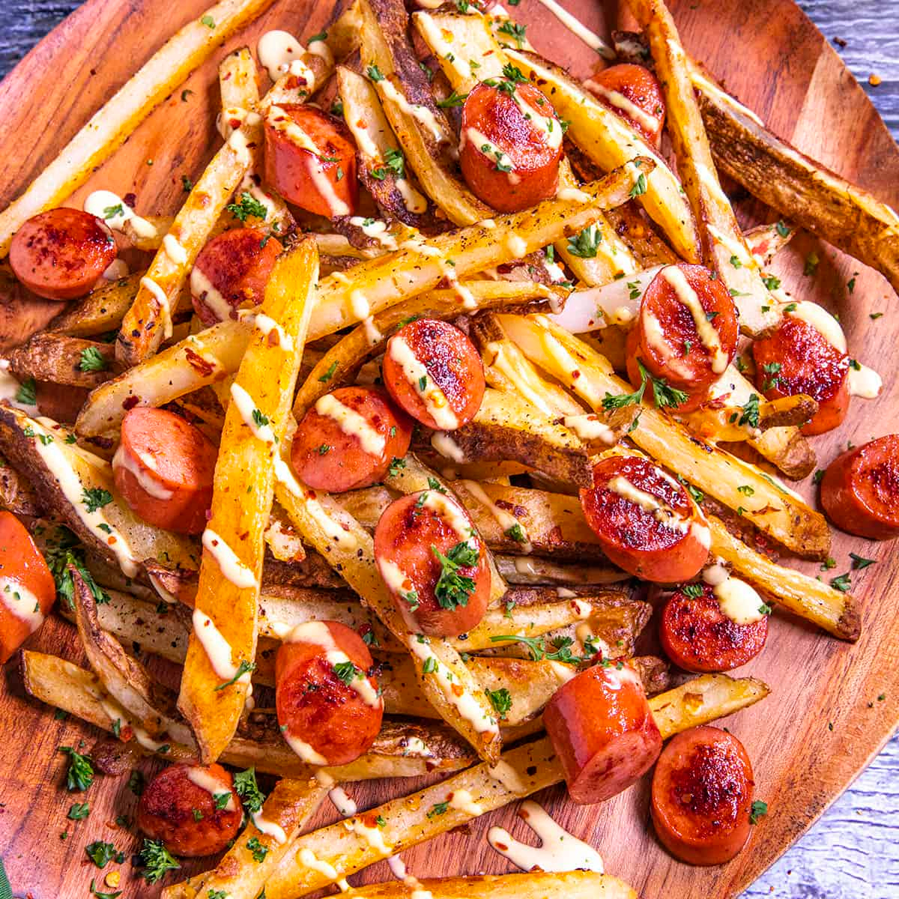

# Salchipapas (Peruvian Hot Dog and Fries)

*Peru's plated hot dog: sliced fried hot dog sausages mixed with hand-cut French fries on a plate, drizzled with ketchup, mustard, mayonnaise, and the traditional Peruvian green-chilli sauce (ají verde). The Lima street-cart and university-canteen classic; no bun, just dog and fries together as one dish.*

**Serves:** 4

**Prep Time:** 20 minutes

**Cook Time:** 25 minutes

## Overview
Salchipapas (literally "sausage potatoes", a portmanteau of salchicha + papas) is Peru's defining hot-dog dish and a fixture of Lima street carts, working-class lunch counters and university canteens across the country. The construction has no bun at all: it's a plated dish where sliced hot dog sausages are pan-fried till crispy at the edges, then mixed directly with a heap of hand-cut Peruvian-style French fries (papas fritas, twice-fried for the traditional crisp), and the whole plate is drizzled with three sauces: ketchup, mustard, mayonnaise, and the traditional Peruvian green sauce ají verde (a creamy aji amarillo and aji escabeche chilli sauce blended with mayonnaise, cilantro, lime and queso fresco). Eat with a fork. Salchipapas is a complete handheld-by-fork meal, sausage + carb + sauce on one plate.

## Ingredients

### Hot dogs
- 6 long hot dogs (Peruvian salchichas; or any quality pork-and-beef hot dogs)
- 2 tablespoons vegetable oil

### Hand-cut fries (papas fritas)
- 1 kg starchy potatoes (Russet or Maris Piper; peeled, cut into 8mm-thick fries)
- Vegetable oil for deep-frying (about 1.5 litres)
- 1 teaspoon fine sea salt

### Ají verde (Peruvian green sauce) - makes about 250 ml
- 4 ají amarillo chillies (frozen or jarred Peruvian yellow chillies; remove seeds and veins for milder; or substitute with 2 jalapeños + 1 teaspoon turmeric for colour)
- 1 large bunch fresh cilantro (leaves and tender stems; about 60 g)
- 4 garlic cloves
- 80 g queso fresco (or feta as substitute)
- 4 tablespoons mayonnaise
- Juice of 2 limes
- 4 tablespoons olive oil
- 1 teaspoon fine sea salt
- ½ teaspoon ground cumin

### Standard sauces
- Ketchup
- Yellow mustard
- Mayonnaise (extra; for plating)

### To serve
- A cold Cusqueña or Pilsen Callao (Peruvian beers)
- Or an Inca Kola (the yellow Peruvian soda)
- Limes for squeezing
- Sliced ají rocoto chillies for those who want extra heat

## Method

### Stage 1 - Cut the potatoes
1. Cut the peeled potatoes into 8mm-thick fries.
2. Soak in cold water 15 minutes (removes surface starch; gives crispier fries).
3. Drain very thoroughly; pat dry with paper towels.

### Stage 2 - Make ají verde
1. In a blender, combine the ají amarillo chillies, cilantro, garlic, queso fresco, mayonnaise, lime juice, olive oil, salt, cumin.
2. Blitz till smooth.
3. The sauce should be a vibrant pale green and the texture of thick mayonnaise.
4. Refrigerate 30 minutes for the flavours to meld.

### Stage 3 - First fry (blanch fries)
1. Heat oil to 150°C (300°F).
2. Fry potatoes in batches 5 minutes till just cooked through but still pale (no colour).
3. Drain on a rack.

### Stage 4 - Slice and fry the hot dogs
1. Slice each hot dog diagonally into 2cm rounds (about 6-7 slices per dog).
2. Heat 2 tablespoons of vegetable oil in a wide pan over medium-high heat.
3. Add sliced hot dogs; cook 4-6 minutes, turning, till deeply caramelised at the cut edges.
4. Remove to paper towels.

### Stage 5 - Second fry (the crisp)
1. Bring oil temperature up to 180°C (360°F).
2. Fry the par-cooked potatoes in batches 3-4 minutes till deep golden and crispy.
3. Drain; salt immediately.

### Stage 6 - Combine and plate
1. On each plate, pile a generous heap of crispy fries.
2. Scatter the fried hot dog slices over and through the fries.
3. Drizzle with zigzags of ketchup, mustard, and mayonnaise.
4. Spoon a generous dollop of ají verde alongside.

### Stage 7 - Serve immediately
1. With limes for squeezing.
2. Ají rocoto for those who want more heat.
3. A cold beer or Inca Kola.
4. Eat with a fork; salchipapas is a plated dish, not handheld.

## Notes
- **No bun:** plated dish, eaten with fork.
- **Twice-fried fries:** the traditional Peruvian fry technique; blanching at 150°C then crisping at 180°C.
- **Sliced (not whole) hot dogs:** the eating geometry.
- **Ají verde:** essential, the Peruvian signature sauce. Without it, the dish is generic.

## Variations
**Salchipollo:** swap hot dogs for crispy fried chicken pieces (popular in Lima university canteens).
**Salchipulpo:** swap hot dogs for grilled octopus pieces (a posh Peruvian fusion).
**Salchipapas con huevo:** add a fried egg on top.
**Spicier:** add chopped fresh ají rocoto or a drizzle of ají panca paste.
**With queso fresco crumbled on top:** for extra cheese.

## Serving
At a Lima street cart in the afternoon; at a Peruvian working-class restaurant for lunch; at a university canteen between classes; at home as a casual dinner.

## Storage
- Ají verde refrigerates 1 week.
- Cooked fries: best fresh; reheat in a hot oven 5 minutes to re-crisp.
- Fried hot dogs refrigerate 3 days.
- Don't store assembled.
