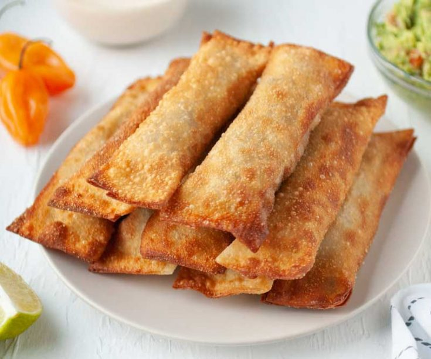

# Tequeños (Cheese-Filled Wonton Sticks)

*Lima's most-loved finger food: small fingers of soft mild Peruvian white cheese (queso paria or queso fresco) wrapped in tortilla-style wheat-flour dough rolled into cigar shapes, deep-fried till golden and crisp, and served with a small dish of guacamole or huancaína sauce for dipping. Originally Venezuelan (the dish is more famously Venezuelan; the Peruvian version takes the same form but uses local cheese and is served with Peruvian accompaniments), now adopted thoroughly into the Peruvian appetizer repertoire. The standard Lima reception or birthday-party canapé.*

**Serves:** 30 small tequeños (about 8 per person × 4)

**Prep Time:** 45 minutes (plus 30 minutes resting the dough)

**Cook Time:** 20 minutes

## Overview
Tequeños are originally from Venezuela; the name comes from "Los Teques", a Venezuelan town. They migrated to Peru and Colombia in the 20th century and were enthusiastically adopted into both cuisines. The Peruvian version uses a slightly different cheese (queso paria or queso fresco, Peruvian semi-firm white cheese) and is served with distinctly Peruvian dipping sauces. Huancaína sauce or guacamole are the traditional pairings; some Lima homes serve both. Queso paria is similar to mild Mexican queso panela or Greek halloumi; outside Peru, halloumi is the closest substitute (mozzarella melts too much). Cut the cheese into batons about 6 × 1 × 1 cm, wrap in spirals of thin wheat-flour dough, deep-fry at 180 °C for ninety seconds till deep golden. The cheese should soften but not melt out, which is the secret of a proper tequeño. The standard Lima reception or birthday-party canapé.

## Ingredients

### The dough
- 300 g plain flour
- 60 g unsalted butter, soft (room temperature)
- 1 large egg
- 1 teaspoon salt
- 100-120 ml whole milk OR water, lukewarm

### The cheese filling
- 400 g halloumi OR Peruvian queso paria OR queso fresco (a firm semi-soft white cheese)
- Cut into batons about 6 cm × 1 cm × 1 cm (you should get 30 batons from 400 g)

### For frying
- 1.5 litres sunflower or groundnut oil

### The dipping sauces (traditional Peruvian; pick one or both)

**Sauce 1, Huancaína dip:**
- 4 tablespoons aji amarillo paste (Peruvian yellow chilli, fruity and medium-hot)
- 100 g queso fresco (or cream cheese)
- 100 ml evaporated milk
- 2 saltines
- 1 garlic clove
- 1 tbsp oil
- (Blend till smooth, see [Papa a la Huancaína](../side-dishes/papa-a-la-huancaina.md))

**Sauce 2, Guacamole:**
- 2 ripe avocados, mashed
- 1 small finely chopped red onion
- 1 small finely chopped tomato
- 1 tablespoon fresh lime juice
- 1 tablespoon chopped cilantro
- 1/2 teaspoon salt
- A small finely chopped chilli (optional)

### To serve
- A small platter
- Wooden toothpicks (optional)
- Cold beer or chicha morada to drink

## Method

### Stage 1 - Make the dough
1. In a bowl, combine the flour, salt, soft butter and egg.
2. Rub together with cold fingertips till the butter is fully incorporated.
3. Add 100 ml of lukewarm milk; mix with a wooden spoon.
4. Add more milk 1 tablespoon at a time only if needed, the dough should be soft but not sticky.
5. Knead briefly on a floured surface 4-5 minutes till smooth.
6. Shape into a flat disc; wrap in cling film; rest 30 minutes at room temperature.

### Stage 2 - Cut the cheese
1. Cut the firm cheese into batons 6 cm × 1 cm × 1 cm.
2. You should have 30 batons.
3. Pat them dry on kitchen paper (excess moisture leaks out during frying).

### Stage 3 - Roll and cut the dough
1. Divide the dough in half.
2. Working with one half at a time (keep the other wrapped), roll out on a lightly floured surface to 2 mm thick, really thin.
3. Cut into strips about 14 cm long × 2.5 cm wide.

### Stage 4 - Wrap the cheese batons
1. Place a cheese baton at one end of a dough strip at a 45-degree angle.
2. Press the dough firmly against the baton.
3. Roll the cheese baton diagonally, wrapping the dough strip around it in a spiral.
4. The dough should fully cover the cheese except a tiny bit of cheese visible at one or both ends.
5. Tuck the ends under (or twist to seal them) so the cheese can't escape.
6. Place on a tray lined with parchment.
7. Repeat with the rest of the dough and cheese.

### Stage 5 - Make the dipping sauces
1. For the huancaína sauce: blend all ingredients in a small blender till smooth; refrigerate.
2. For the guacamole: combine the mashed avocado with onion, tomato, lime juice, cilantro, salt and optional chilli; refrigerate.

### Stage 6 - Fry the tequeños
1. Heat the oil to 180°C in a deep heavy pot.
2. Fry the tequeños in batches of 6-8 (don't overcrowd).
3. Cook 90 seconds, turning gently, till deep golden brown all over.
4. The cheese inside should soften but not melt out, if it's leaking, the cheese was too low-melt or the oil was too hot.
5. Lift out with a slotted spoon; drain briefly on kitchen paper.

### Stage 7 - Serve immediately
1. Pile the hot tequeños on a platter.
2. Place the dipping sauces in small ramekins alongside.
3. Eat hot, with a slight tear so the soft cheese centre is exposed; dip into the huancaína or guacamole.

## Notes
- **Firm cheese is essential:** halloumi, queso paria, queso fresco, or a firm mild feta. Mozzarella melts too aggressively and leaks out.
- **Roll the dough thin:** 2 mm. Thicker dough stays raw inside.
- **Seal the ends:** twist or press firmly so the cheese can't escape during frying.
- **180°C oil:** lower and the dough soaks fat; higher and the outside burns before the inside is hot.
- **The dipping sauce is non-negotiable:** plain tequeños are bland; the sauce gives the dish its Peruvian identity.
- **Eat hot:** tequeños are at their peak for 5 minutes; the cheese firms as they cool.

## Variations
**Modern Lima tequeños with chicken filling:** swap cheese for finely shredded cooked chicken seasoned with aji amarillo, the savoury-meat variant.
**Sweet tequeños:** swap the cheese for chunks of fresh fig or guava paste, the dessert variant.
**Tequeños with crab filling:** chunk crab + cream cheese + a touch of mustard, the upscale Lima restaurant variant.
**Vegan tequeños:** swap cheese for slices of firm tofu seasoned with smoked paprika and salt, surprisingly good.
**Larger format tequeños:** make 10 cm batons (instead of 6 cm) for substantial canapés.
**Smaller tequeños for canapés:** 3 cm batons; for cocktail receptions.
**Air-fryer tequeños:** brush with oil; air-fry at 200°C for 8 minutes, less crisp but functional.
**Baked tequeños:** brush with oil; bake at 220°C for 10-12 minutes, lighter, less crisp.

## Serving
At a Lima reception or wedding (the traditional setting) · at a Peruvian birthday party · at a Peruvian Sunday family lunch as a starter · at a Peruvian Independence Day buffet · at a Lima café for a 4 pm tea · at home as a Saturday-night drinks-and-snacks plate · paired with cold beer or chicha morada.

## Storage
- The raw wrapped tequeños can be made and refrigerated for 24 hours before frying; or frozen 2 months and fried from frozen (add 30 seconds frying time).
- Cooked tequeños are best within 10 minutes of frying.
- Don't refrigerate cooked tequeños, the cheese hardens and the dough goes leathery.
- The huancaína and guacamole sauces refrigerate 2 days each.
- The cheese batons can be cut and refrigerated 24 hours; the dough can be made up to 12 hours ahead.
