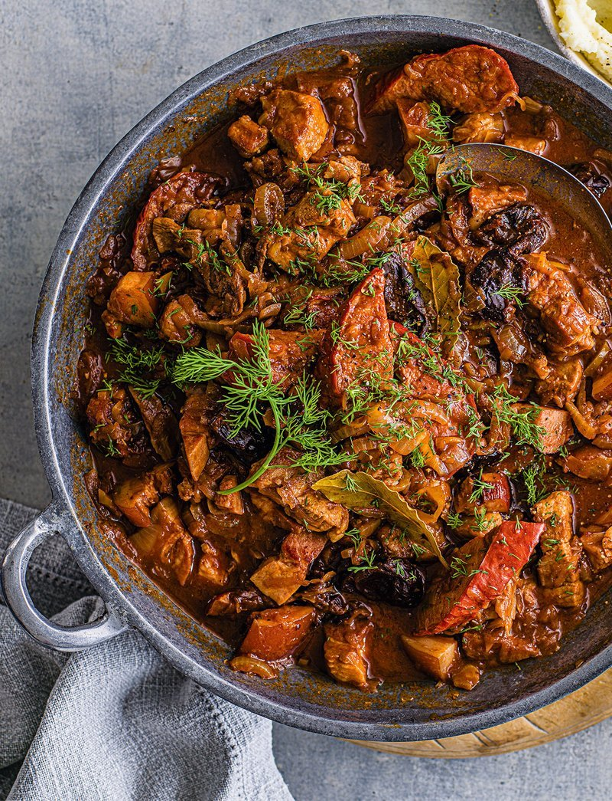

# Bigos

*Polish hunter's stew: sauerkraut and fresh cabbage simmered slow with mixed meats (pork, beef, sausage, sometimes game), dried mushrooms, prunes and red wine. Three days of cooking, properly bigos is reheated and reheated, deepening each day.*

**Serves:** 8

**Prep Time:** 30 minutes

**Cook Time:** 3 hours (active); 2-3 days of reheating

## Overview
Bigos is Poland's great hunter's stew, the pot you start on Saturday and eat from for the rest of the week. Sauerkraut and fresh cabbage simmer slow with four different meats (smoked bacon, pork shoulder, beef and kielbasa), dried porcini, prunes and red wine until everything melts into one deep-mahogany whole. The truth about bigos is that it isn't actually done at three hours of simmering. Cool overnight, reheat the next day for thirty minutes, do it again the day after, and the flavour deepens at every round until by day three it has become the stew Poles dream about. Juniper, caraway, allspice and a teaspoon of sweet paprika carry the warmth. Eat with dark rye bread, sharp mustard and sometimes mashed potato, with a small glass of something cold poured to the side.

## Ingredients

- 500 g pork shoulder (cubed)
- 300 g beef chuck (cubed)
- 200 g smoked Polish sausage (kielbasa; sliced)
- 200 g smoked bacon lardons
- 2 onions (chopped)
- 4 garlic cloves (crushed)
- 800 g sauerkraut (rinsed and drained)
- 500 g white cabbage (shredded)
- 30 g dried porcini mushrooms (soaked in 200 ml hot water for 30 minutes)
- 200 g prunes (pitted)
- 2 tablespoons tomato purée
- 250 ml red wine
- 500 ml beef stock
- 2 bay leaves
- 1 tablespoon caraway seeds
- 1 teaspoon allspice berries
- 6 juniper berries (lightly crushed)
- 1 teaspoon sweet paprika
- 1 tablespoon brown sugar
- salt
- pepper
- 2 tablespoons olive oil

## Method

### Stage 1 - Brown the meats
1. Heat the oil in a very large heavy pot.
1. Brown the bacon until the fat renders; lift out.
1. Brown the pork in batches; lift out.
1. Brown the beef; lift out.
1. Lightly brown the kielbasa; lift out.

### Stage 2 - Build the base
1. Cook the onions in the rendered fat for 10 minutes.
1. Add the garlic; cook 1 minute.
1. Stir in the tomato purée; cook 1 minute.
1. Pour in the red wine; reduce by half.

### Stage 3 - Combine
1. Return all the meats.
1. Add the sauerkraut, fresh cabbage, soaked mushrooms (with their soaking liquid; strained), prunes, stock, bay, caraway, allspice, juniper, paprika and brown sugar.
1. Stir to combine.

### Stage 4 - Simmer
1. Bring to a simmer; cover loosely.
1. Cook on low heat for 3 hours, stirring occasionally, adding more stock if it dries out too much.
1. Taste; season with salt and pepper. The sauerkraut already brings salt, so check before adding.

### Stage 5 - Rest and reheat
1. Cool overnight in the fridge.
1. Reheat the next day for 30 minutes; the flavour deepens.
1. On day three (and four), reheat again for another 20 minutes each time.
1. Bigos really does improve over multiple reheats; patience is the recipe.

### Stage 6 - Serve
1. Ladle into deep bowls.
1. Serve with rye bread and sharp mustard; mashed potato is also traditional.

## Notes
- **Multiple meats matter:** Single-meat bigos is bland. The complexity comes from pork, beef, smoked sausage and bacon all contributing different notes.
- **Reheat for days:** Once cooked, bigos isn't done, it improves over 2-3 days of reheats. Plan accordingly.
- **Don't drain the sauerkraut too well:** Some of its briny liquid is part of the dish. Squeeze, don't rinse, unless yours is very salty.

## Storage
- Improves over 3-4 days. Keeps a full week refrigerated.
- Freezes 3 months.
