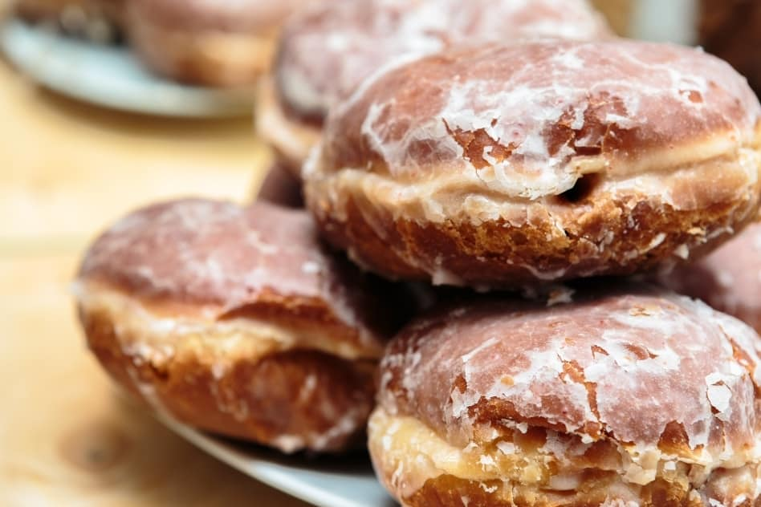

# Pączki

*Polish jam-or-rose-filled doughnuts: enriched yeast dough deep-fried until pale gold with a tell-tale pale ring around the middle, filled with rose-petal jam, plum butter or thick blackcurrant, and dusted with icing sugar or coated in a candied-orange glaze. Eaten by the millions on Tłusty Czwartek (Fat Thursday), the Polish Mardi Gras kickoff, where bakery queues stretch around the block.*

**Makes:** 12 pączki

**Prep Time:** 30 minutes (plus 2 hours proving)

**Cook Time:** 25 minutes

## Overview
An enriched yeast dough (lots of egg yolks, butter, sugar, a splash of rum) proves twice. Divides into 12 balls, proves again until pillowy. Deep-fries in clean oil at exactly 170°C: hot enough to set the outside before the dough soaks, cool enough that the inside cooks before the outside burns. Each pączek gets a teaspoon of jam piped into the centre while still warm; the tops dust with icing sugar, dip in a thin lemon-orange glaze, or get a strip of candied orange peel.

## Ingredients

### Dough
- 500 g strong white flour
- 10 g instant dried yeast (1 ½ sachets)
- 80 g caster sugar
- 1 teaspoon salt
- 220 ml warm whole milk
- 5 large egg yolks
- 100 g unsalted butter (very soft)
- 2 tablespoons spirit (rum, vodka, or grain alcohol; reduces oil absorption)
- 1 teaspoon vanilla extract
- Zest of 1 lemon

### To fry
- 2 litres neutral oil (sunflower or rapeseed) or lard for the traditional version

### Filling
- 350 g good-quality jam (rose petal, plum butter (powidła), or thick blackcurrant)

### To finish (choose one)
- 100 g icing sugar (for dusting)
- OR 150 g icing sugar + 3 tablespoons fresh orange juice + finely chopped candied orange peel (for glazing)

## Method

### Stage 1 - Make the dough
1. Whisk the flour, yeast, sugar, salt and lemon zest in a large bowl.
2. Beat the warm milk and egg yolks; pour in.
3. Add the spirit and vanilla.
4. Mix to a shaggy dough; turn out and knead 8-10 minutes until smooth and elastic.
5. Add the soft butter piece by piece, kneading in (this takes patience; the dough goes slack, then comes back tighter).
6. Continue kneading 5 minutes more until silky, soft and slightly tacky.
7. Cover; prove 1 hour in a warm place until doubled.

### Stage 2 - Shape
1. Knock the dough back gently.
2. Divide into 12 equal pieces (about 75 g each; use scales).
3. Roll each into a ball by cupping under your palm on the unfloured work surface (the slight stickiness helps tension).
4. Place each ball on a square of parchment paper (this makes lowering them into oil easier).
5. Cover loosely; prove 45 minutes in a warm place until pillowy and almost doubled.

### Stage 3 - Heat the oil
1. Pour the oil into a deep heavy pan; it should be at least 8 cm deep.
2. Heat to exactly 170°C (use a thermometer; pączki temperature is critical).
3. Once at temperature, monitor and adjust the heat to keep it steady.

### Stage 4 - Fry
1. Lift a pączek by its parchment square and lower gently into the oil (the parchment will release in seconds; lift it out with tongs).
2. Fry 3-4 at a time; don't crowd the pan or the oil temperature drops.
3. Cook 2-3 minutes on the first side until pale gold underneath; flip with a slotted spoon or chopsticks.
4. Cook 2-3 minutes on the other side.
5. The signature pączek look: pale gold with a clear white ring around the middle (where the dough sat on the oil surface). This is what you want.
6. Lift onto kitchen paper to drain.
7. Repeat with all 12; let the oil come back to 170°C between batches.

### Stage 5 - Fill
1. While the pączki are still warm (not hot), use a piping bag fitted with a long thin nozzle.
2. Push the nozzle into the side of each pączek, halfway in.
3. Squeeze in about 1 tablespoon of jam; you'll feel the doughnut swell slightly. Stop just before it would burst.
4. Set on a rack.

### Stage 6 - Finish (choose one)
- **Dusted:** Sift icing sugar generously over the top of each pączek.
- **Glazed:** Whisk the icing sugar and orange juice to a pourable glaze. Dip the top of each pączek in; let drip; set on a rack. Scatter chopped candied orange peel on the wet glaze.

### Stage 7 - Serve
1. Best eaten on the day, still slightly warm.
2. Make a strong coffee.

## Notes
- **The spirit isn't for flavour:** A tablespoon or two of rum or vodka in the dough actually reduces how much oil the pączki absorb during frying (alcohol evaporates faster than water, leaving less moisture-soaking-up-oil). Don't skip; it works.
- **170°C is the only temperature:** Hotter and the outside browns before the inside cooks. Cooler and they soak oil and go heavy. A thermometer matters.
- **The pale ring is the badge:** A proper pączek is pale gold with a white band around the equator. Fully-bronzed all over means too hot; doughy means too cool.

## Variations
**Rose-petal jam (the classic):** Konfitura z róży, sold in Polish shops, is the traditional filling for Tłusty Czwartek.
**Plum butter (powidła):** Thick spiced plum, an old peasant filling.
**Custard:** Pastry cream is a modern bakery filling; some purists object, but bakeries everywhere do them.

## Serving
Serve with: Strong coffee or a glass of milk. On Fat Thursday (the last Thursday before Lent), tradition says eat at least one to ensure a year of luck.

## Storage
- Best on the day. Keeps 2 days at room temperature in an airtight box but they soften.
- Don't refrigerate (dries them out). Don't freeze filled (the jam weeps).
- Unfilled fried pączki freeze 1 month; defrost and fill the same day.
