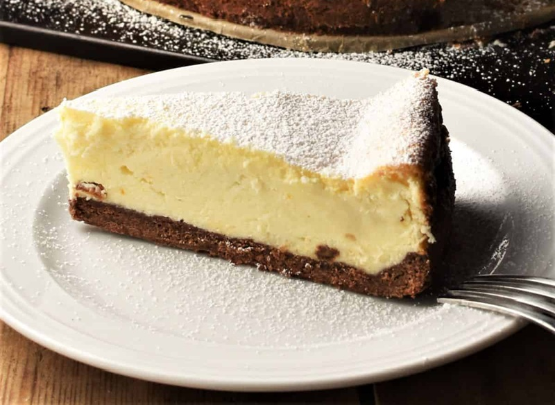

# Sernik

*Poland's twaróg cheesecake: dense, dry, slightly tangy, lifted with eggs and brightened with lemon zest. Built on a shortcrust base. The Easter centrepiece.*

**Serves:** 12

**Prep Time:** 30 minutes

**Cook Time:** 1 hour 15 minutes (plus 4 hours cooling)

## Overview
Sernik is the Polish Easter cheesecake (and Christmas Eve, and every birthday in between), denser and drier than its New York cousin, slightly tangy from twaróg cheese, brightened with lemon zest and built on a buttery shortcrust base often topped with a pastry lattice. Make the shortcrust first: pulse cold butter into flour and icing sugar to breadcrumbs, bring together with a yolk, milk and vanilla, divide into one larger piece for the base and a smaller one for the lattice, then chill 30 minutes. The cheese is the heart of the dish: 1 kg of twaróg (the dry tangy Polish curd cheese; drained full-fat cottage cheese pressed through a sieve is the substitute), beaten into creamed butter and sugar over four minutes till pale and fluffy, then egg yolks one at a time, semolina or cornflour for structure, lemon zest, vanilla and rum-soaked raisins. Whisk six egg whites to firm peaks and fold through in three additions to lighten the batter without losing the air. Roll the larger pastry to line a 24 cm springform with 3 cm walls, pour in the filling, lattice the smaller pastry across the top, and bake at 170°C for 70 to 80 minutes till the surface is golden and the centre still has the faintest wobble. Then comes the most important step: turn off the oven and prop the door open with a wooden spoon so the cake cools inside for an hour (rapid cooling cracks the top, so don't shortcut). Out of the oven, fully cooled on a rack, then refrigerated at least four hours and ideally overnight, sernik genuinely tastes better the next day. Dust with icing sugar through a sieve, slice with a hot dry knife, and serve cold with strong coffee or a thin pour of cherry compote.

## Ingredients

### Shortcrust base
- 250 g plain flour
- 80 g icing sugar
- 150 g cold unsalted butter (cubed)
- 1 egg yolk (large)
- 2 tablespoons cold milk
- ½ teaspoon vanilla extract
- A pinch of salt

### Filling
- 1 kg twaróg cheese (or 1 kg drained full-fat cottage cheese; see Notes)
- 200 g unsalted butter (room temperature)
- 200 g caster sugar
- 6 eggs (large, separated)
- 50 g fine semolina (or 40 g cornflour)
- 2 lemons (zest)
- 1 tablespoon vanilla extract (or 1 vanilla pod, seeds scraped)
- 50 g raisins (optional; soaked in 2 tablespoons rum or warm water 15 minutes)
- A pinch of salt

### To finish
- 1 tablespoon icing sugar (for dusting)

## Method

### Stage 1 - Pastry
1. Pulse the flour, icing sugar, salt and cold butter in a food processor (or rub by hand) until breadcrumb texture.
2. Add the yolk, milk and vanilla; pulse just until the dough comes together.
3. Tip out, shape into two pieces (one twice the size of the other), wrap; chill 30 minutes.

### Stage 2 - Twaróg base
1. If using cottage cheese: drain in a sieve lined with muslin or a clean tea towel; press to remove excess liquid; you want it dry and crumbly. Push through a fine sieve or food mill for the right smooth-but-textured base.
2. If using twaróg: push through a fine sieve once for smoothness.

### Stage 3 - Filling
1. Beat the soft butter and sugar in a large bowl on high speed for 4-5 minutes until pale and fluffy.
2. Beat in the egg yolks one at a time.
3. Beat in the sieved twaróg in three additions; mix until smooth.
4. Stir in the semolina, lemon zest, vanilla and salt.
5. Drain the raisins; fold in.

### Stage 4 - Egg whites
1. In a clean bowl, whisk the 6 egg whites to firm peaks.
2. Fold a third into the cheese mixture vigorously to loosen.
3. Fold the rest in gently in two more additions, keeping the air.

### Stage 5 - Assemble
1. Heat the oven to 170°C (150°C fan).
2. Line a 24 cm springform tin with baking paper.
3. Roll the larger piece of pastry to fit the base and 3 cm up the sides; press in.
4. Pour the filling in; smooth the top.
5. Roll the smaller piece of pastry to a rectangle; cut into 1 cm strips.
6. Lay strips in a lattice across the top (or skip; many Polish serniki are unadorned).

### Stage 6 - Bake and cool slowly
1. Bake 70-80 minutes until the top is golden and the centre still has the faintest wobble.
2. Turn off the oven; prop the door slightly open with a wooden spoon.
3. Cool in the cooling oven 1 hour. This slow cool prevents cracks.
4. Lift out; cool completely on a rack (another 2 hours).
5. Refrigerate at least 4 hours, ideally overnight. Sernik tastes much better the next day.

### Stage 7 - Serve
1. Run a knife around the tin; release the springform.
2. Dust with icing sugar through a sieve.
3. Slice with a hot, dry knife (dip in hot water, wipe, slice; repeat).

## Notes
- **Twaróg is the critical ingredient:** Polish farmer's curd cheese - dry, tangy, slightly grainy. The closest substitute is full-fat cottage cheese, drained for an hour through muslin then pressed through a sieve. Ricotta is too wet without overnight draining. Quark is acceptable but thinner.
- **Slow cool prevents cracks:** Don't shortcut by pulling the cake out at the end. The temperature drop is what cracks the top.
- **Next day is better:** Sernik genuinely improves on day two. Make ahead.

## Variations
**Sernik krakowski:** With a lattice top (the Krakow style; this recipe).
**Sernik wiedenski:** With a thin chocolate ganache glaze; Vienna-influenced.
**Plain (warszawski):** No pastry top, no lattice; just dusted with icing sugar.

## Serving
Serve cold or just-cool from the fridge with a strong coffee. Some Polish households serve it with a thin pour of fruit compote (cherry, plum) on the side.

## Storage
- Keeps 4 days refrigerated, covered.
- Freezes 1 month (wrap individual slices; defrost overnight in the fridge).
