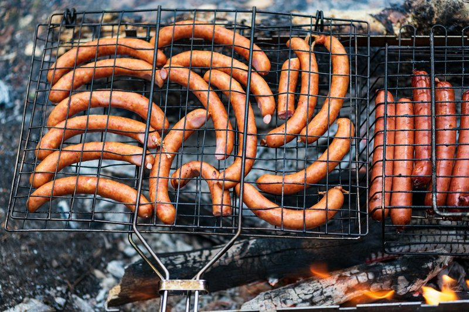

# Grilled Kielbasa

*Plump horseshoe coils of garlic-and-marjoram smoked sausage finished over hot coals until the casing pops and snaps, served with sharply pickled cabbage, dark rye bread and a smear of mustard or horseradish. The smell is beechwood smoke and garlic on the breeze, with the herbal lift of dried marjoram. Eaten across Poland from a Tatra mountain bakery to a Warsaw backyard grill, and an absolute staple of Polish-American summer cookouts in Chicago and Detroit.*

**Serves:** 6

**Prep Time:** 15 minutes

**Cook Time:** 20 minutes

## Overview
Kielbasa simply means "sausage" in Polish, and there are dozens of named varieties: kielbasa biała (white, fresh, the Easter sausage), kielbasa myśliwska (smoked hunter's sausage), kielbasa krakowska (a large dry sausage similar to bologna). The kielbasa most people picture, and the one for the grill, is kielbasa wiejska or kielbasa zwyczajna: a fully cooked pork sausage smoked over fruit or beech wood, seasoned with generous garlic, marjoram, salt and pepper, and sold in long curved horseshoes. Because it's pre-cooked and pre-smoked, grilling kielbasa is really about reheating and putting the finishing char on the casing. That makes it one of the easiest things on the summer table and a hard one to ruin. The proper technique is medium heat (not screaming high), turning often so all sides crisp evenly, and a light score or angled cuts in the thicker pieces to help the heat penetrate. The flavour profile is rich and garlicky, with the warm herbal note of marjoram that distinguishes Polish from Czech, Hungarian or German sausages, and a clear smoky undertone from the wood used in production. Traditional accompaniments are kapusta kiszona (sharp lacto-fermented cabbage), often warmed with onion and bacon, dark rye bread, sharp mustard (musztarda sarepska) or grated horseradish (chrzan), and pickled cucumbers. A bottle of cold Polish beer or a small glass of żubrówka is the drink.

## Ingredients

### Kielbasa
- 1.2 kg smoked Polish kielbasa (1-2 horseshoes)
- 15 ml vegetable oil

### Warm pickled cabbage
- 600 g sauerkraut (drained, lightly squeezed)
- 1 onion (finely chopped)
- 60 g smoked bacon lardons
- 1 apple (peeled, grated)
- 5 g caraway seeds
- 1 bay leaf
- 5 black peppercorns
- 100 ml chicken stock or water
- 30 g butter

### To serve
- Polish mustard (musztarda sarepska) or sharp brown mustard
- Grated horseradish (chrzan)
- Sliced dark rye bread
- Pickled cucumbers (ogórki kiszone)

## Method

### Stage 1 - Warm pickled cabbage
1. Render the bacon lardons in a wide pan over medium heat until crisp.
1. Add the chopped onion; cook 5 minutes until soft.
1. Stir in the sauerkraut, grated apple, caraway, bay and peppercorns.
1. Pour in the stock; bring to a simmer; cover loosely.
1. Cook 25-30 minutes over low heat, stirring occasionally, until the kraut is soft and tangy.
1. Stir in the butter at the end; taste for seasoning.

### Stage 2 - Prepare the grill
1. Build a medium charcoal fire or set a gas grill to medium. The grill should not be screaming hot.
1. Oil the grates.
1. Score the kielbasa lightly at 4 cm intervals on a diagonal, just through the casing, or leave whole.
1. Brush with a thin film of oil.

### Stage 3 - Grill
1. Lay the kielbasa on the grates over direct heat.
1. Grill 4-5 minutes per side, turning to colour all surfaces evenly.
1. Total cooking time is 12-16 minutes; the kielbasa is heated through, the casing crisp and beginning to blister, and the score marks open and brown.
1. If the outside is browning too fast, move to a cooler edge to finish through.

### Stage 4 - Rest and serve
1. Lift onto a board; rest 3-4 minutes.
1. Slice into 5-6 cm pieces on the diagonal.
1. Plate with the warm pickled cabbage, rye bread, mustard, horseradish and pickled cucumbers.

## Notes
- **Look for real Polish kielbasa:** a Polish or Eastern European deli will have proper smoked kielbasa with natural casings and garlic-and-marjoram seasoning. Supermarket "kielbasa" labelled as such is often a different sausage entirely.
- **Medium heat, not high:** kielbasa is already cooked. You're warming through and crisping the casing, not searing raw meat. High heat splits and dries it out.
- **Score, don't cut through:** shallow cuts help the heat in without releasing all the juice.
- **Pair the kraut:** if you can't get good sauerkraut, a quick sauté of finely shredded white cabbage with vinegar, caraway and a little sugar gives a respectable substitute.

## Storage
- Cooked kielbasa keeps 4 days refrigerated; slice and reheat in a covered pan or use cold in sandwiches.
- The warm cabbage improves on day two; reheat gently with a splash of stock.
- Both freeze well separately for up to 2 months.
