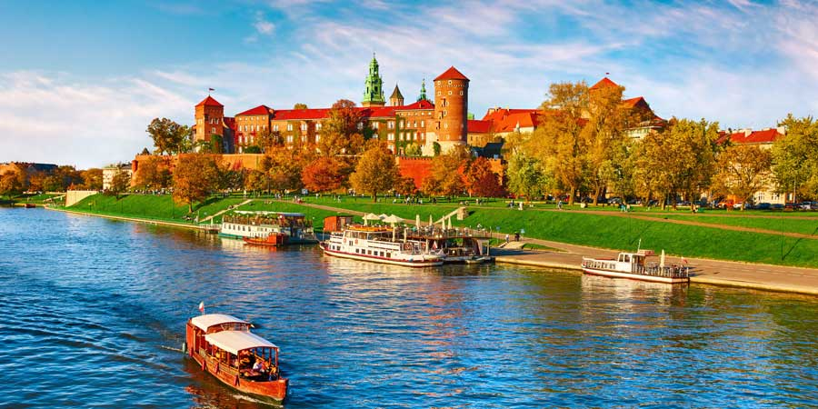

# Polish Cuisine

Hearty Eastern European cooking built on pork, cabbage, beetroot, mushrooms and grains. Caraway, dill, marjoram and bay handle the herb side; fermented and pickled vegetables (sauerkraut, ogórki) supply the brightness. Defining dishes include pierogi (filled dumplings), bigos (the long-simmered hunter's stew), żurek (fermented rye soup) and the daily presence of dark, dense rye bread.
