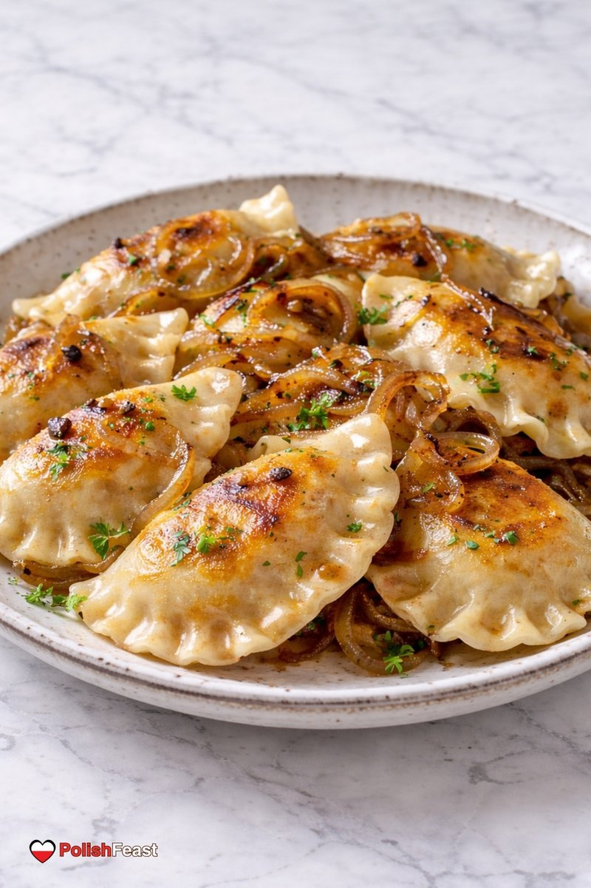

# Pierogi Ruskie

*Polish dumplings filled with potato, twaróg cheese and fried onion. Boiled, then traditionally pan-fried in butter until the edges crisp. Served with sour cream and more crisp onions on top. The most popular pierogi filling in Poland.*

**Makes:** 30 pierogi

**Prep Time:** 1 hour

**Cook Time:** 30 minutes

## Overview
Pierogi ruskie are the most-eaten pierogi in Poland, half-moon dumplings stuffed with mashed potato, tangy twaróg cheese and fried onion, boiled till they float and then pan-fried in butter so the edges crisp into ribbons of gold. Make a simple dough first: flour, salt, egg, warm water and a splash of oil, mixed and kneaded eight minutes till smooth and elastic, then rested under a cloth for half an hour while you build the filling. Boil floury potatoes till tender, drain and steam dry, mash hot, then fold in soft-cooked onion, twaróg (or quark, or ricotta, or cottage cheese with a little crumbled feta), salt and pepper. Meanwhile slice two more onions thin and caramelise them slowly in butter for nearly half an hour till deep gold and crisp at the edges, this is the topping that makes the dish. Roll the rested dough thin (2 mm), cut 8 cm circles, drop a heaped teaspoon of filling on each, fold over into a half-moon and pinch the edges firmly with floured fingers or crimp with a fork (loose seals split in the boiling water and lose all the filling). Boil in batches in gently salted water for four or five minutes till they float, lift out with a slotted spoon, then pan-fry in butter for a minute or two a side till the edges crisp into gold (skip this step and they're just boiled dumplings; with the fry they're pierogi ruskie). Pile onto a warm plate, shower with the caramelised onions, a generous spoon of sour cream and a scatter of chopped chives.

## Ingredients

### Dough
- 500 g plain flour
- 1 egg (large)
- 1 teaspoon salt
- 250 ml warm water
- 2 tablespoons vegetable oil

### Filling
- 600 g floury potatoes (peeled, cubed)
- 250 g twaróg cheese (or quark, ricotta, or a mix of cottage cheese and feta)
- 1 onion (medium, very finely chopped)
- 30 g unsalted butter
- 1 teaspoon salt
- ½ teaspoon black pepper

### To finish
- 50 g unsalted butter (for pan-frying)
- 2 onions (very thinly sliced; for the crisp topping)
- 30 g unsalted butter (for the topping onions)
- 200 g soured cream
- A small bunch of chives (chopped)

## Method

### Stage 1 - Dough
1. In a bowl, whisk the flour and salt.
1. Make a well; crack in the egg.
1. Pour in the warm water and oil.
1. Mix to combine; turn out and knead 8-10 minutes until smooth and elastic.
1. Cover; rest 30 minutes.

### Stage 2 - Filling
1. Boil the potatoes in salted water 15 minutes until tender; drain and steam dry.
1. Mash thoroughly while still hot.
1. Cook the chopped onion in 30 g butter for 8 minutes until soft.
1. Mix the mashed potato, fried onion, twaróg cheese, salt and pepper. Cool.

### Stage 3 - Caramelised onions
1. While the dough rests, melt 30 g butter in a pan over medium heat.
1. Cook the sliced onions for 25-30 minutes until deep golden and crisp at the edges.

### Stage 4 - Shape
1. Roll the dough on a floured surface to 2 mm thick.
1. Cut out 8 cm circles with a glass or cookie cutter.
1. Place a heaped teaspoon of filling on each circle.
1. Fold over into a half-moon; pinch the edges firmly to seal (a fork crimp helps).
1. Set on a floured tray.

### Stage 5 - Boil
1. Bring a large pot of salted water to a gentle boil.
1. Cook the pierogi in batches (don't crowd) for 4-5 minutes until they float.
1. Lift out with a slotted spoon.

### Stage 6 - Pan-fry (optional but traditional)
1. Melt the 50 g butter in a wide pan.
1. Fry the boiled pierogi in batches for 1-2 minutes a side until golden and crisp at the edges.

### Stage 7 - Serve
1. Pile onto a warm plate.
1. Scatter caramelised onions over.
1. Serve with sour cream and chives.

## Notes
- **Twaróg is the classic cheese:** Polish farmer's cheese, slightly tangy, dry. Ricotta works; a mix of cottage cheese with a little crumbled feta is closer.
- **Seal firmly:** Pierogi that leak filling in the boiling water lose their shape. Pinch hard, double-pinch with a fork if you need to.
- **Pan-fry the boiled ones:** Optional but the buttery crisp edge is what makes pierogi ruskie ruskie. Skip and they're just boiled dumplings.

## Storage
- Cooked keep 2 days refrigerated; pan-fry to reheat (the texture's better than boiled-and-warmed).
- Raw shaped pierogi freeze 3 months on a tray, then bagged. Boil from frozen, adding 2 minutes.
