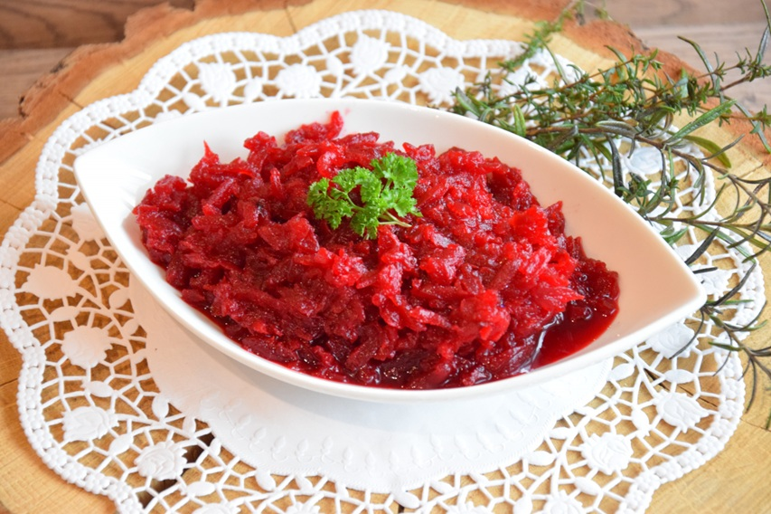

# Buraczki

*Polish grated braised beetroot: roasted or boiled beetroot, grated and warmed in butter with sautéed onion, vinegar, sugar and a kick of fresh horseradish. The dark-magenta side served alongside Sunday roast pork, schnitzel and Christmas Eve carp. Sweet, sour and earthy in equal measure.*

**Serves:** 4

**Prep Time:** 10 minutes

**Cook Time:** 1 hour (mostly roasting)

## Overview
Buraczki is the deep-magenta beetroot side that turns up next to roast pork, kotlet schabowy and the Christmas Eve carp across Polish tables. Sweet, sour and earthy in equal measure with a kick of fresh horseradish that announces the dish as unmistakably Polish. The beetroots roast whole wrapped in foil to keep their sweet earthiness (boiling waters them down), then grate coarse and warm through with softened onion, white wine vinegar, sugar, grated horseradish and an optional pinch of caraway. The balance is the cook's job: more sugar if too sharp, more vinegar if flat, more horseradish if the heat needs lifting. A scatter of dill if you like. Served warm in winter alongside roast pork and mashed potato, or at room temperature in summer next to grilled kielbasa and dark rye bread.

## Ingredients

### Beetroot
- 750 g fresh beetroots (about 4 medium; tops trimmed but not peeled)
- 1 tablespoon olive oil

### Dressing
- 1 onion (medium, very finely chopped)
- 40 g unsalted butter
- 2 tablespoons white wine vinegar (or fresh lemon juice)
- 1 tablespoon caster sugar
- 2 tablespoons grated fresh horseradish (or 1 tablespoon prepared horseradish from a jar)
- ½ teaspoon ground caraway (optional)
- 1 teaspoon salt
- Freshly ground black pepper

### To finish
- A small bunch of fresh dill (finely chopped; optional)

## Method

### Stage 1 - Roast the beetroots
1. Heat the oven to 200°C (180°C fan).
2. Wash the beetroots, leave the skins on, rub lightly with olive oil.
3. Wrap each beetroot loosely in foil; place on a baking tray.
4. Roast 50-70 minutes (depending on size) until a knife slides through with no resistance.
5. Let them rest 10 minutes; the skins should slip off when rubbed with kitchen paper (wear gloves; beetroot stains).

### Stage 2 - Grate
1. Coarsely grate the peeled warm beetroot on a box grater. Some prefer fine grating; both work.
2. Set aside.

### Stage 3 - Sauté the onion
1. Melt the butter in a wide pan on medium heat.
2. Add the onion; cook 8 minutes until translucent and soft, not coloured.

### Stage 4 - Combine
1. Add the grated beetroot to the pan.
2. Stir in the vinegar, sugar, horseradish, caraway if using, salt and pepper.
3. Warm through for 4-5 minutes, stirring, so the flavours combine. It should glisten and smell sweet-sharp.

### Stage 5 - Taste and serve
1. Taste. Balance: more sugar if too sharp, more vinegar if flat, more horseradish if it lacks heat.
2. Scatter dill if using.
3. Serve warm.

## Notes
- **Roasting beats boiling:** Roasted beetroot keeps its sweet earthiness; boiled is watery. If pressed for time, vacuum-packed cooked beetroots (unflavoured, not vinegared) are a fair shortcut.
- **Horseradish makes it Polish:** Without it, this is just braised beetroot. Fresh grated has the cleanest heat; jarred prepared horseradish (with white vinegar) is a fine substitute.
- **Wear gloves or apron:** Raw beetroot stains hands, chopping boards and clothes. Lemon juice gets it off skin.

## Variations
**Cold version:** Skip the butter sauté. Toss raw-grated cooked beetroot with the dressing; eat cold.
**With apple:** Grate one tart apple in at the end; brightens the sweetness.

## Serving
Serve with: Roast pork, kotlet schabowy, baked carp (Christmas Eve), or kielbasa. Sweet-sour foil to rich meat.

## Storage
- Keeps 4 days refrigerated.
- Freezes 2 months.
