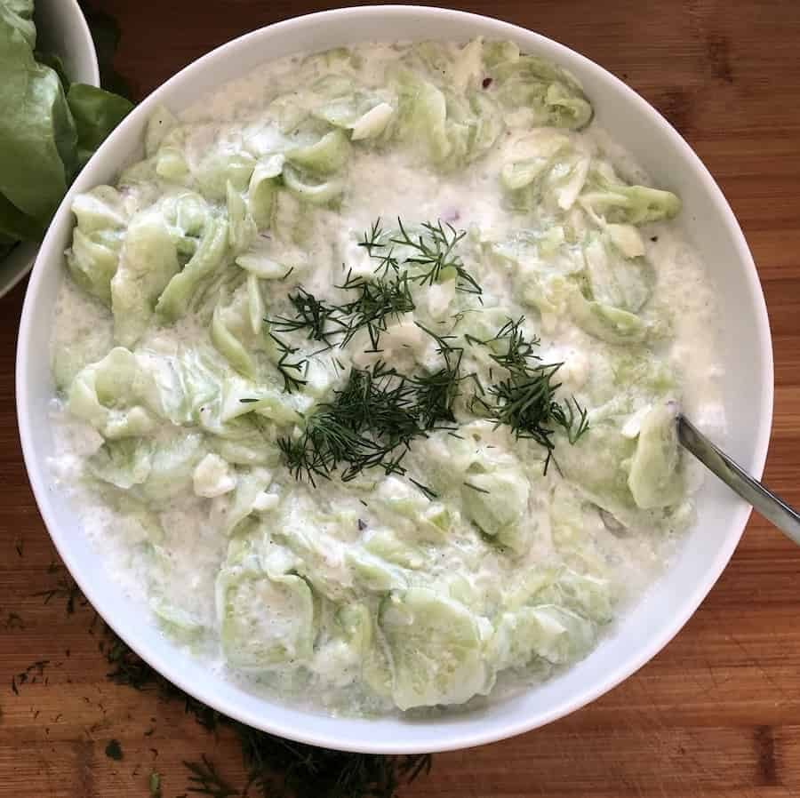

# Mizeria

*Polish cucumber-and-sour-cream salad: thin-sliced cucumber salted to weep out water, dressed with sour cream, dill and vinegar. Named after the Italian queen Bona Sforza's homesickness ("miseria"), it's the cooling counterpart to roast pork, schnitzel and dumplings. The Polish summer side.*

**Serves:** 4

**Prep Time:** 15 minutes (plus 20 minutes salting)

**Cook Time:** none

## Overview
Mizeria is the cooling Polish summer side, paper-thin cucumber tossed with tangy sour cream and plenty of fresh dill, served next to whatever heavy thing is on the table (roast pork, kotlet schabowy, pierogi, dumplings) to give the plate some lightness. The name supposedly comes from the homesick Italian queen Bona Sforza ("miseria"), though no one's quite sure. The whole dish hangs on one technical move: slice the cucumbers paper-thin on a mandoline, salt them in a colander for twenty minutes to weep out their water, then squeeze hard in a tea towel till barely a drop more comes out. Skip this and the sour cream turns into a watery puddle within five minutes. The dressing is full-fat sour cream with white wine vinegar, a teaspoon of sugar for balance, salt, pepper and a generous handful of dill (without plenty of dill it's just cucumber in cream). Made fresh, eaten cold the same day.

## Ingredients

### Salad
- 2 cucumbers (large, about 600 g; English cucumbers or 4 Lebanese)
- 1 teaspoon fine salt

### Dressing
- 200 g full-fat sour cream
- 1 tablespoon white wine vinegar (or lemon juice)
- 1 garlic clove (small, finely grated; optional)
- 1 teaspoon caster sugar
- ½ teaspoon fine salt
- Freshly ground black pepper
- 3 tablespoons fresh dill (finely chopped)
- 1 tablespoon fresh chives (finely snipped; optional)

## Method

### Stage 1 - Salt and drain
1. Wash the cucumbers; trim the ends.
2. Slice as thinly as possible on a mandoline or with a sharp knife (2 mm or less).
3. Place in a colander over a bowl; toss with the 1 teaspoon salt.
4. Leave 20 minutes (the slices weep a surprising amount of water).

### Stage 2 - Squeeze
1. Gather the cucumber slices into a clean tea towel.
2. Twist the cloth and squeeze hard over the sink. Keep squeezing until barely any more water comes out.
3. Tip the dried slices into a serving bowl.

### Stage 3 - Dressing
1. In a small bowl, whisk the sour cream, vinegar, garlic if using, sugar, salt and pepper.
2. Stir in the dill (keep back 1 tablespoon for the top).

### Stage 4 - Combine
1. Pour the dressing over the cucumbers.
2. Toss gently to coat.
3. Taste; adjust salt, vinegar, or sugar.
4. Scatter the remaining dill and the chives over the top.
5. Chill 10 minutes before serving.

## Notes
- **Salting and squeezing is the whole technique:** Without it, you'll have a watery puddle in 5 minutes. Skip and you skip the dish.
- **Sour cream, not yoghurt:** Polish śmietana is thick and tangy. Full-fat sour cream is the right substitute. Greek yoghurt is acceptable but thinner; drain it through cheesecloth for 30 minutes first.
- **Dill is non-negotiable:** Mizeria without dill is just cucumber in cream. Use plenty.

## Variations
- **With garlic:** A grated clove is a traditional southern Polish variation; skip for the cleaner northern style.
- **With apple:** Some grandmothers grate a tart apple in. Adds sweetness and crunch.

## Serving
- **Serve with:** Roast pork, kotlet schabowy (Polish schnitzel), pierogi, golabki (cabbage rolls), or grilled kielbasa. Cooling counterpart to rich main courses.

## Storage
- Eat within 4 hours of dressing. The cucumbers weep again over time.
- Salted-and-squeezed cucumber (undressed) keeps a day refrigerated.
