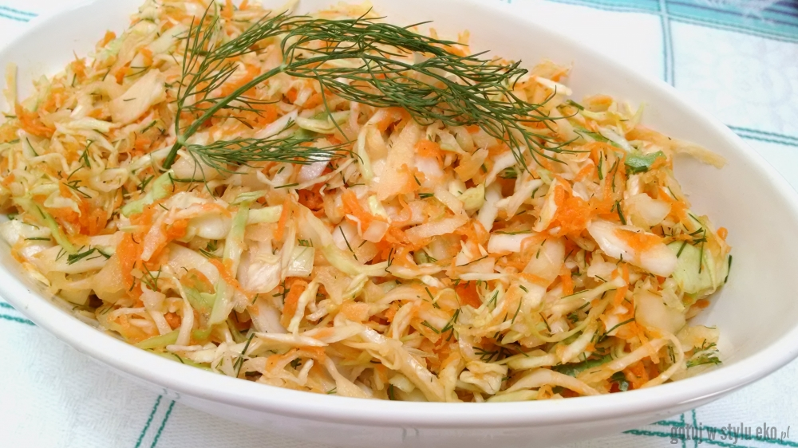

# Surówka

*Polish raw vegetable slaw: grated carrot, apple and white cabbage tossed with sour cream, lemon juice and a pinch of sugar. Crisp, bright, faintly sweet. Eat alongside the heaviest Polish lunches (kotlet schabowy, mashed potatoes and gravy) for fresh contrast. Every Polish home cook has their version.*

**Serves:** 4

**Prep Time:** 15 minutes

**Cook Time:** none

## Overview
Surówka is the bright crunchy slaw that turns up next to almost every Polish lunch: grated carrot and tart apple tossed with finely shredded white cabbage and dressed with sour cream, lemon and a pinch of sugar. The fresh foil to a plate piled with kotlet schabowy, mashed potato and gravy. Every Polish home cook has their own version. The carrots and apple grate coarse (fine grating turns them to mush), the cabbage shreds thin, everything gets a brief salt rest in a colander to soften slightly, then a quick toss in the sour cream dressing. Optional additions are raisins plumped in hot water and a tablespoon of sunflower seeds. A scatter of chopped parsley or dill across the top finishes it. Made just before serving, since surówka softens noticeably within an hour, alongside roast chicken, fried fish or pork chops.

## Ingredients

### Salad
- 3 carrots (medium, about 300 g; peeled, coarsely grated)
- 1 tart apple (large, Granny Smith or Cox; peeled, coarsely grated)
- 200 g white cabbage (very finely shredded; about a quarter of a small head)
- ½ teaspoon salt

### Dressing
- 150 g full-fat sour cream
- 2 tablespoons fresh lemon juice
- 1 teaspoon caster sugar
- ¼ teaspoon fine salt
- Freshly ground black pepper

### Optional add-ins
- 2 tablespoons raisins (soaked in hot water 5 minutes, drained)
- 1 tablespoon sunflower seeds
- 1 tablespoon fresh parsley (or dill, chopped)

## Method

### Stage 1 - Prepare the vegetables
1. Peel and coarsely grate the carrots on a box grater.
2. Peel, core and coarsely grate the apple. Toss immediately with 1 tablespoon of the lemon juice (from the dressing) to stop browning.
3. Finely shred the cabbage with a sharp knife or mandoline (2 mm strips).
4. Place all three in a large bowl with the ½ teaspoon salt; toss; leave 5 minutes.

### Stage 2 - Squeeze the cabbage
1. Tip into a colander; press with your hands to release some water from the cabbage. Don't squeeze it dry; just a light press.
2. Return to the bowl.

### Stage 3 - Dress
1. Whisk the sour cream, remaining lemon juice, sugar, salt and pepper in a small bowl.
2. Pour over the vegetables.
3. Toss to coat.

### Stage 4 - Finish
1. Stir in the raisins and seeds if using.
2. Taste; adjust salt or lemon.
3. Scatter parsley or dill over the top.
4. Serve straight away, or chill 15 minutes max.

## Notes
- **Coarse grate, not fine:** Fine-grated carrot turns to mush. Use the large holes on a box grater.
- **Eat within an hour:** Surówka loses its crunch as the vegetables continue to release water. Make right before serving.
- **Sour cream or yoghurt:** Full-fat sour cream is traditional. Greek yoghurt thinned with a teaspoon of cream is acceptable.

## Variations
**Surówka z kapusty kiszonej:** Made with sauerkraut, grated carrot, apple and a little oil instead of cream. The winter version.
**With horseradish:** Stir 1 teaspoon prepared horseradish into the dressing for extra bite.

## Serving
Serve with: Kotlet schabowy, roast chicken, fried fish, pork chops, or alongside potato dumplings. The crunchy fresh foil to heavy Polish mains.

## Storage
- Best on the day. Keeps 1 day refrigerated but softens noticeably.
- Doesn't freeze.
