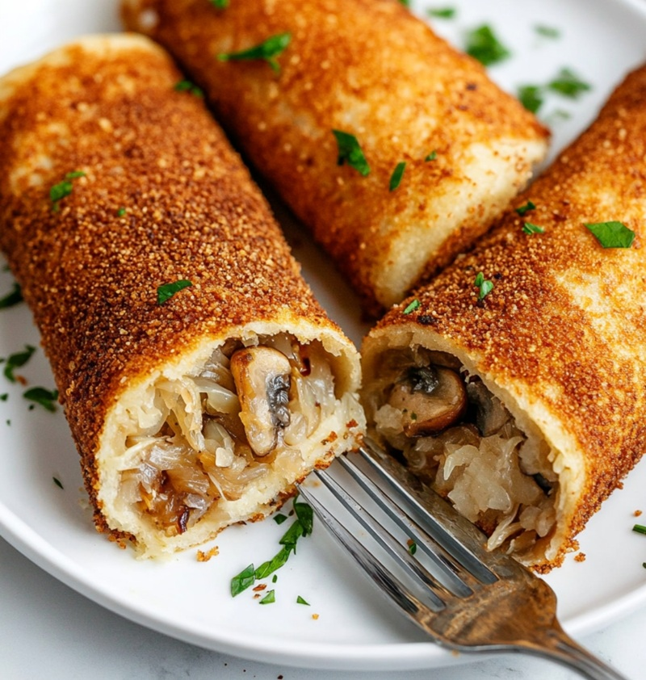

# Krokiety

*Polish breaded fried savoury crepes: thin pancakes rolled around a filling of mushroom-and-cabbage or seasoned meat, then breadcrumbed and pan-fried until crisp. Served with a bowl of clear barszcz (beetroot broth) or as a snack on their own with mustard. The Christmas Eve and milk-bar standard.*

**Serves:** 4 (makes 8 krokiety)

**Prep Time:** 45 minutes

**Cook Time:** 30 minutes

## Overview
Krokiety are the breaded fried savoury rolls of Polish milk bars and Christmas Eve tables, thin crepes wrapped around a sauerkraut-and-mushroom filling (or seasoned mince the rest of the year), then dipped in egg and breadcrumbs and pan-fried golden, sliced on the diagonal to show the filling spiral. Make the crepe batter first: flour, eggs, milk, a splash of sparkling water for tender crepes (the bubbles help keep them light, an old Polish trick), salt and melted butter. Rest the batter 15 minutes for the flour to hydrate, then cook eight thin crepes in a buttered 22 cm non-stick pan, a minute and a half a side, stacked on a plate. The Christmas Eve filling is what makes krokiety distinctly Polish: rehydrate dried porcini in hot water, squeeze the sauerkraut dry, soften onion in butter and add the chopped mushrooms, then the sauerkraut with bay, caraway and a splash of strained mushroom liquor, cook fifteen minutes till the mixture is dark and dry, finish off the heat with sour cream and seasoning. Cool the filling completely (warm filling steams the inside of the rolled crepe and makes the breading slide off in the pan). Lay a crepe on a board, spoon a sausage of filling along the lower third, fold the bottom over the filling, fold the sides in like a burrito, and roll up tightly into a log seam-side down. Dust each roll lightly in flour, dip in beaten egg, coat completely in fine breadcrumbs and chill ten minutes so the coating sets. Fry seam-side-down first in oil with a knob of butter for two or three minutes a side till deep golden and crisp all over, then slice on the diagonal and serve with a cup of clear barszcz alongside or simply sharp Polish mustard and a pickled cucumber.

## Ingredients

### Crepes
- 200 g plain flour
- 3 eggs (large)
- 400 ml whole milk
- 100 ml sparkling water
- ½ teaspoon salt
- 2 tablespoons melted butter (plus more for the pan)

### Mushroom-and-cabbage filling (Christmas Eve version)
- 25 g dried porcini mushrooms (soaked in 200 ml hot water 30 minutes)
- 250 g sauerkraut (rinsed, drained, squeezed dry, chopped)
- 1 onion (medium, finely chopped)
- 30 g unsalted butter
- 2 tablespoons soured cream
- 1 bay leaf
- ½ teaspoon caraway seeds
- salt
- pepper

### Breading
- 2 eggs (large, beaten)
- 200 g fine dried breadcrumbs (panko works too)
- 50 g plain flour (for an initial light dredge)

### For frying
- 4 tablespoons sunflower oil (plus a knob of butter)

### To serve
- Polish mustard (or barszcz czerwony, clear beetroot broth)

## Method

### Stage 1 - Crepe batter
1. Whisk the flour and salt in a bowl.
2. Make a well; crack in the eggs; whisk in, gradually drawing in flour from the sides.
3. Whisk in the milk in a slow stream until smooth.
4. Whisk in the sparkling water and melted butter.
5. Rest the batter 15 minutes (lets the flour hydrate; crepes are more tender).

### Stage 2 - Make the crepes
1. Heat a 22 cm non-stick pan on medium; rub with a buttered piece of kitchen paper.
2. Pour in a small ladle of batter (about 60 ml); swirl quickly to coat the base in a thin layer.
3. Cook 60-90 seconds until set on top and golden underneath; flip; cook 20 seconds more.
4. Stack on a plate. Repeat for 8 crepes total.

### Stage 3 - Filling
1. Strain the mushroom soaking liquid (through a fine sieve to catch grit); reserve.
2. Finely chop the soaked mushrooms.
3. Melt the 30 g butter in a wide pan; cook the onion 8 minutes until soft.
4. Add the chopped mushrooms; cook 2 minutes.
5. Add the sauerkraut, bay leaf, caraway and 100 ml of the mushroom soaking liquid.
6. Cook on low heat for 15 minutes, stirring occasionally, until the liquid has reduced and the mixture is moist but not wet.
7. Off heat, fish out the bay leaf; stir in the soured cream; season with salt and pepper.
8. Cool completely.

### Stage 4 - Roll
1. Lay a crepe on a board, paler side up.
2. Spoon a sausage of filling (about 3 tablespoons) along the lower third.
3. Fold the bottom edge over the filling; fold both sides in (like a burrito); roll up tightly into a log.
4. Set seam-side down. Repeat with the remaining crepes and filling.

### Stage 5 - Bread
1. Set up three plates: flour, beaten egg, breadcrumbs.
2. Lightly dust each roll in flour (shake off excess).
3. Roll in egg; let drip; coat completely in breadcrumbs, pressing gently.
4. Set aside on a tray. Chill 10 minutes (helps the coating stay on).

### Stage 6 - Fry
1. Heat the oil and butter in a wide frying pan on medium heat.
2. Lay in the krokiety, seam-side down first.
3. Fry 2-3 minutes a side until deep golden and crisp on all sides.
4. Drain briefly on kitchen paper.
5. Slice each krokiet on the diagonal to show the filling spiral.

## Notes
- **Sparkling water in the batter:** A Polish trick for tender crepes. The bubbles help keep them light; you can replace with milk if you don't have it.
- **Cool the filling completely:** Warm filling steams the inside of the rolled crepe and makes the breading slide off during frying.
- **Chill before frying:** 10 minutes in the fridge firms the egg-breadcrumb coat so it holds together in the pan.

## Variations
**Meat filling (everyday):** Brown 400 g minced pork-and-beef with an onion; add 1 teaspoon marjoram, salt and pepper. Use in place of the mushroom-cabbage filling.
**Baked version (lighter):** Brush the breaded krokiety with melted butter and bake at 200°C for 20-25 minutes, turning halfway. Less crisp than fried, but no oil splatter.

## Serving
Serve with: A cup of clear barszcz czerwony (beetroot broth) for Christmas Eve, or Polish mustard for everyday. A pickled cucumber on the side.

## Storage
- Cooked keep 2 days refrigerated; reheat in a 180°C oven for 10 minutes to re-crisp (microwave makes them soggy).
- Breaded uncooked freeze 2 months on a tray, then bagged; fry from frozen on slightly lower heat.
