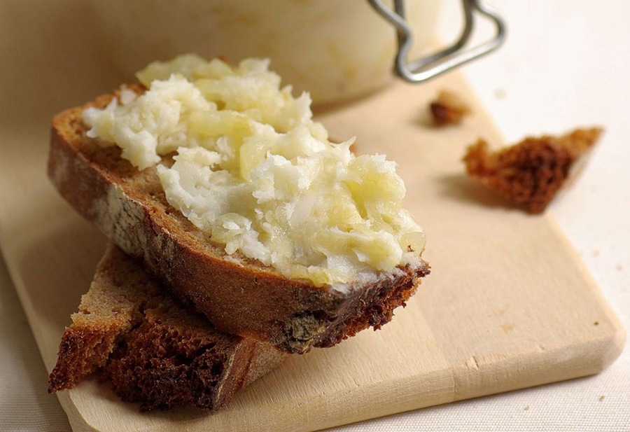

# Smalec

*Polish lard spread: pork fat slow-rendered with diced bacon, onion, garlic, marjoram and apple, the crackling left in for texture. Cools to a soft, savoury spread, eaten on dark rye bread with a salted pickle on the side. The bar snack that comes free with vodka in every Krakow milk bar.*

**Serves:** 8 (as a snack)

**Prep Time:** 10 minutes

**Cook Time:** 1 hour 15 minutes (plus 4 hours setting)

## Overview
Smalec is the Polish lard spread that turns up at every Krakow milk bar and bar table, often served free with a glass of vodka. A soft golden spread flecked with bacon, onion and apple crackling that you smear thickly on dark rye with sea salt and a pickled cucumber. The whole technique is in the slow render. Diced pork back-fat starts gently with a splash of water (the water stops sticking and gently steams the fat at the start), then smoked bacon renders alongside, then finely chopped onion, tart apple, garlic, marjoram, bay, peppercorns and a few crushed juniper berries cook down into the warm fat. Low and slow throughout; a high heat scorches the solids and ruins everything, with no rescue. Set in ramekins in the fridge till firm, taken out half an hour before serving so it spreads easily. Eat with dark rye, flaky sea salt, Polish gherkins, slices of raw white onion and a glass of cold żubrówka.

## Ingredients

### Smalec
- 500 g pork back-fat (or skinless fatty pork belly, cut into 1 cm dice)
- 200 g smoked streaky bacon (rind off, cut into 1 cm pieces)
- 1 onion (large, very finely chopped)
- 1 tart apple (small, Bramley or Granny Smith; peeled, cored, finely diced)
- 4 garlic cloves (finely chopped)
- 2 teaspoons dried marjoram
- 2 bay leaves
- 6 black peppercorns
- 4 juniper berries (lightly crushed; optional)
- ½ teaspoon fine salt (taste before adding; bacon brings salt)
- Freshly ground black pepper

### To serve
- Dark rye bread (sourdough or pumpernickel)
- Flaky sea salt
- Polish gherkins (ogórki kiszone) or salted dill pickles
- A small bunch of fresh chives (snipped; optional)
- Raw white onion (sliced; optional)

## Method

### Stage 1 - Start the render
1. Place the diced pork fat in a heavy-bottomed pan with 2 tablespoons of water (the water stops it sticking at the start and steams gently).
2. Cover; set on very low heat.
3. After 15 minutes the water has evaporated and clear fat is starting to pool.
4. Uncover; stir.

### Stage 2 - Add the bacon
1. Add the smoked bacon.
2. Continue on low heat for 30 minutes, stirring every 5 minutes. The bacon and pork fat should slowly brown to gold; the fat should look clear and yellow, not dark or smoking. If it threatens to scorch, drop the heat lower.

### Stage 3 - Aromatics
1. Stir in the chopped onion, apple, garlic, marjoram, bay, peppercorns and juniper.
2. Cook on low for another 20-25 minutes, stirring often. The onion goes translucent then golden; the apple breaks down; the bacon and pork bits become crisp crackling.
3. Taste a piece. The fat should taste clean, sweet, savoury, and lightly herbal. If it tastes burnt or acrid, the heat has been too high; you'll have to start again.

### Stage 4 - Season and set
1. Off heat, fish out the bay leaves.
2. Season with salt (taste first; bacon already adds salt) and a few generous grinds of pepper.
3. Cool 10 minutes; stir to distribute the solids evenly through the liquid fat.
4. Spoon into clean ramekins, small jars or a 500 ml ceramic dish.
5. Cool to room temperature, then refrigerate at least 4 hours until set firm.

### Stage 5 - Serve
1. Take the smalec out of the fridge 30 minutes before eating; it spreads better at cool room temperature.
2. Scatter chives over the top if using.
3. Serve in the dish with dark rye bread, flaky sea salt, gherkins and slices of raw white onion alongside.
4. Spread thickly. Eat. Drink vodka.

## Notes
- **Low and slow keeps the flavour clean:** A high heat scorches the solids; smalec then tastes acrid. Keep the heat as low as your hob goes. An hour-plus of slow rendering is the whole technique.
- **The bits are the point:** Don't strain. The crackling bits of bacon, onion and apple are what make smalec smalec; pure rendered fat would just be lard.
- **Apple is the secret:** A small amount of tart apple gives a faint sweetness that balances the salt and smoke. Don't skip.

## Variations
**Smalec ze skwarkami:** A larger proportion of pork belly to back-fat gives more crackling.
**Vegetarian (not traditional):** Mash white beans with caramelised onion, garlic, marjoram and a little smoked paprika. Different dish, similar role.

## Serving
Serve with: Dark rye, sea salt, pickled cucumbers (ogórki kiszone), pickled mushrooms, sliced raw onion. Cold vodka or rye beer.

## Storage
- Keeps 3 weeks refrigerated, sealed.
- Freezes 6 months. The fat preserves itself well.
