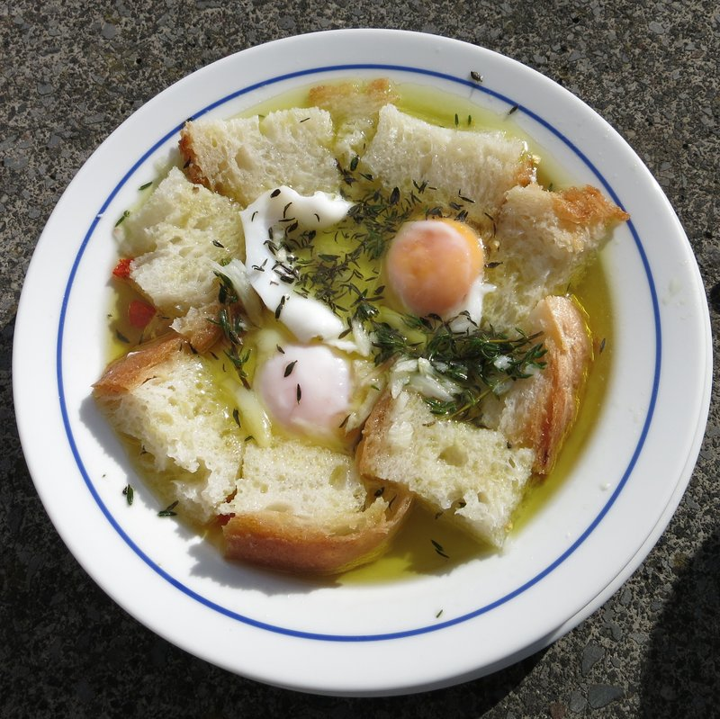

# Açorda Alentejana

*Portugal's shepherd soup: stale country bread softened in a fragrant broth of garlic, coriander and olive oil, finished with poached eggs.*

**Serves:** 4

**Prep Time:** 15 minutes

**Cook Time:** 15 minutes

## Overview
This is the Alentejo's classic morning-after breakfast and lunchtime  supper: a thin garlic-and-coriander broth ladled over chunks of stale country bread with a poached egg slipped in at the end. You start by pounding fresh coriander, garlic, salt and olive oil into a paste in a wide bowl, then pour boiling water (or light stock) over it to make a fragrant broth. Stale bread goes in to soak up the liquid, eggs poach in the same broth for the last minute, and the whole bowl comes to the table warm enough to steam but cool enough to eat with a spoon. Stir the yolk through your portion as you eat. It is the cleanest, most aromatic 15-minute bowl of bread soup you will ever make.

## Ingredients

- 6 garlic cloves (peeled)
- 1 large bunch fresh coriander (about 60 g - the volume is by design)
- 2 teaspoons salt
- 80 ml extra-virgin olive oil (good Portuguese or Spanish)
- 1.2 litres boiling water (the broth is essentially this)
- 1 teaspoon white wine vinegar (optional, brightens)
- 4 eggs (large)
- 350 g stale rustic country bread (sourdough or pão alentejano, cut into 3 cm chunks)
- salt
- pepper

## Method

### Stage 1 - Make the paste
1. In a wide deep serving bowl, combine garlic cloves, half the coriander, and 1 teaspoon salt.
1. Crush with a pestle (or back of a wooden spoon) until you have a coarse green paste.
1. Stir in the remaining chopped coriander and the olive oil.

### Stage 2 - Boil and pour
1. Bring 1.2 litres of water to a boil.
1. Pour boiling water slowly over the paste, whisking, to make a fragrant green broth.
1. Stir in the vinegar if using.
1. Add the remaining 1 teaspoon salt and a generous grind of pepper.

### Stage 3 - Poach the eggs
1. Reduce the heat under the broth-bowl (or transfer the broth back to a pot if the bowl isn't heat-safe).
1. Bring to a gentle simmer.
1. Crack the eggs carefully into the broth; cook 3-4 minutes until the whites are just set but the yolks still runny.
1. Lift the eggs out carefully with a slotted spoon.

### Stage 4 - Soften the bread
1. Tip the stale bread chunks into the hot broth.
1. Press down gently with a spoon; let stand 2 minutes - the bread softens and absorbs the broth.

### Stage 5 - Assemble
1. Ladle the bread-and-broth into deep bowls.
1. Float a poached egg on top of each bowl.

### Stage 6 - Eat
1. Break the yolk into the bowl with a spoon; stir to coat the bread with the rich yolk.
1. Eat warm, with another piece of bread on the side to mop.

## Notes
- **Stale bread is the dish:** Fresh bread dissolves into mush. Two-day-old crusty country bread softens beautifully without disintegrating. If you only have fresh bread, dry it in a 150°C oven 15 minutes first.
- **Coriander, generously:** A whole large bunch is what the dish needs. The bright green herbal broth is the soul of açorda. Don't substitute parsley.
- **Eat warm, not hot:** Açorda alentejana is served lukewarm to warm, not piping hot. The hot bowl is unpleasant.

## Storage
- Best fresh.
- The broth (without bread and eggs) refrigerates 2 days; assemble fresh.
- Doesn't freeze.
