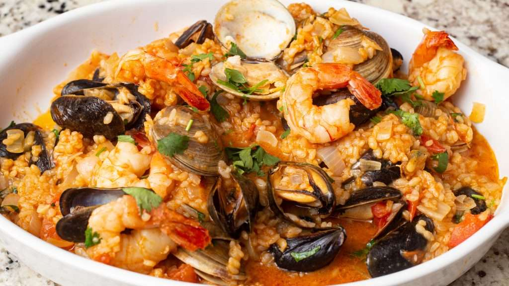

# Arroz de Marisco

*Portugal's brothy seafood rice: medium-grain rice cooked into a deliberately wet creamy stew with shrimp, mussels, clams, white fish, octopus and the traditional sofrito base of onion, garlic, tomato, white wine and fresh coriander. The Portuguese coastal classic, Atlantic abundance in a single pot, eaten with a spoon from deep plates.*

**Serves:** 6

**Prep Time:** 30 minutes

**Cook Time:** 45 minutes

## Overview
Arroz de marisco (literally "seafood rice") is one of Portugal's most iconic coastal dishes and a signature of every Algarve and Atlantic-coast restaurant: medium-grain rice (carolino traditional) cooked into a deliberately wet creamy stew with a generous mix of Atlantic seafood (shrimp, mussels, clams, white fish, octopus or squid, sometimes lobster or crab) in a base of sautéed onion, garlic, tomato, white wine, fish stock, fresh coriander and a touch of piri-piri. The dish distinguishes itself from Spanish paella (drier, bomba rice) and Italian risotto (arborio, stirred constantly): Portuguese arroz de marisco is brothy, almost soupy, with the rice having released its starch into the broth to create a creamy stew. Served in deep plates with crusty bread, lemon wedges and cold white wine. Three parts liquid to one part rice by volume is the proper ratio. Multiple types of seafood give the layered flavour. Coriander is generous, not garnish: the fresh-herb finish is the Portuguese signature.

## Ingredients

### Seafood
- 400 g large raw shrimp (peeled, deveined, shells reserved for stock)
- 400 g mussels (cleaned, debearded)
- 400 g clams (cleaned)
- 300 g firm white fish (cod, monkfish, sea bass; cubed)
- 200 g octopus (pre-cooked, sliced) or squid (sliced into rings)

### Stock
- Shrimp shells (from above)
- 1 small onion (halved)
- 2 garlic cloves (whole)
- 2 bay leaves
- 1 teaspoon paprika
- 1.2 litres water

### Cooking
- 6 tablespoons olive oil
- 2 large onions (finely chopped)
- 8 garlic cloves (crushed)
- 6 ripe tomatoes (chopped); or 1 tin (400 g) chopped tomatoes
- 3 tablespoons tomato paste
- 200 ml dry white wine (Portuguese vinho verde)
- 1 tablespoon piri-piri sauce (or 1 chopped fresh chilli)
- 1 tablespoon sweet paprika
- 1 tablespoon dried oregano
- 1 large bunch fresh coriander (about 50 g; chopped, half for cooking, half for finishing)
- 4 bay leaves
- 1 ½ teaspoons fine sea salt (taste)
- 1 teaspoon ground black pepper

### Rice
- 400 g medium-grain rice (carolino, or Calrose; rinsed)

### To finish
- 1 small bunch fresh parsley (chopped)
- Juice of 1 lemon
- Lemon wedges
- Crusty bread

## Method

### Stage 1 - Make the shrimp stock
1. Place the reserved shrimp shells in a pot.
2. Add halved onion, garlic cloves, bay leaves, paprika and 1.2 litres of water.
3. Bring to a simmer; cook 20 minutes.
4. Strain into a clean pot; keep warm.

### Stage 2 - Build the base
1. Heat olive oil in a wide heavy pot over medium heat.
2. Add chopped onions; cook 8 minutes till soft.
3. Add crushed garlic; cook 30 seconds.
4. Add tomato paste; cook 2 minutes.
5. Add chopped tomatoes; cook 5 minutes till they break down.

### Stage 3 - Add wine and seasonings
1. Pour in the white wine; let bubble 2 minutes.
2. Stir in piri-piri, paprika, oregano, half the chopped coriander, bay leaves, salt and pepper.

### Stage 4 - Add rice and stock
1. Add the rinsed rice; stir to coat.
2. Pour in the hot shrimp stock.
3. Bring to a low simmer.

### Stage 5 - Cook the rice (and add seafood in stages)
1. Cook the rice uncovered for 8 minutes, stirring occasionally.
2. Add the octopus and white fish; cook 5 minutes.
3. Add the mussels and clams; cover the pot; cook 5 minutes till they open.
4. Add the shrimp; cook 3 more minutes till pink.
5. Total rice cooking time: about 21 minutes.
6. The dish should be brothy, not dry; add more hot stock if needed.

### Stage 6 - Finish
1. Take off the heat; discard unopened mussels/clams.
2. Stir in the remaining coriander and the parsley.
3. Squeeze lemon juice over.
4. Taste; adjust salt.

### Stage 7 - Serve
1. Ladle into deep plates.
2. Lemon wedges and crusty bread alongside.

## Notes
- **Brothy, not dry:** soupy is the point.
- **Add seafood in stages:** different cooking times.
- **Don't overcook shrimp:** 3 minutes max.
- **Discard unopened shells:** unsafe.
- **Coriander generously:** Portuguese signature.

## Variations
**With lobster (luxurious):** add 1 lobster tail split lengthwise; cook 5 minutes with the fish.
**Spicier:** double the piri-piri.
**Without octopus:** add more shrimp and fish.
**Vegetarian (arroz de tomate vegetariano):** skip seafood; use vegetable stock; double the tomato + add chickpeas; closer to the related Portuguese arroz de tomate but heartier.

## Serving
In deep plates with the brothy rice ladled generously. Crusty bread for sopping. Cold Portuguese vinho verde or Sagres beer.

## Storage
- Best eaten fresh; seafood doesn't reheat well.
- The base broth-and-rice keeps 2 days; reheat with extra stock and add fresh seafood.
- Don't freeze with seafood.
