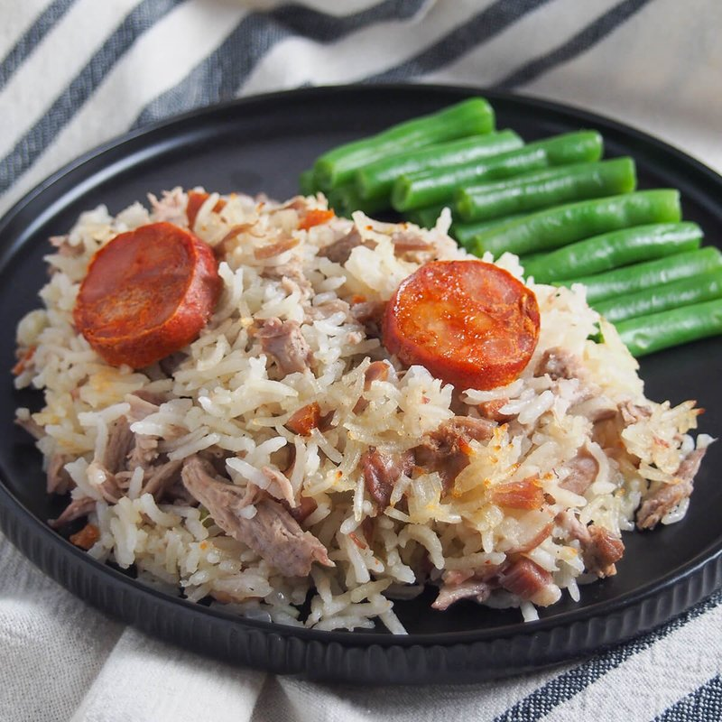

# Arroz de Pato

*Portugal's duck rice: long-grain cooked in rich duck stock with shredded confit meat, topped with sliced chouriço and baked golden.*

**Serves:** 6

**Prep Time:** 25 minutes

**Cook Time:** 2 hours 30 minutes (duck) + 30 minutes (rice)

## Overview
A whole duck (or 4 large legs) is poached with onion, garlic, bay, cloves and lemon peel for 2 hours until the meat falls off the bone. The duck cools; meat is pulled into shreds; bones are returned to simmer 30 more minutes for a deeper stock. Rice cooks in this strained duck stock with bay leaves and a clove or two until just tender. Folded together with the duck shreds and a touch of duck fat. Spread in an oven dish; topped with thin slices of chouriço; baked at 200°C 15-20 minutes until the top is gold and the chouriço is crisped.

## Ingredients

### Duck stock
- 1 whole duck (small, about 2 kg) - OR 4 large duck legs (about 1.4 kg)
- 1 onion (large, halved)
- 6 garlic cloves (crushed)
- 3 bay leaves
- 4 whole cloves
- 1 cinnamon stick
- lemon peel (5cm strip)
- 1 carrot (large, chopped)
- 1 leek (chopped)
- 2 teaspoons salt
- 2 ½ litres cold water

### Rice
- 400 g long-grain rice (or Carolino, Portuguese-style)
- 1 onion (large, finely diced)
- 4 tablespoons duck fat (skimmed from the stock - or use olive oil)
- 2 bay leaves
- 1 teaspoon salt (to taste)

### Topping
- 200 g chouriço sausage (Portuguese - or substitute Spanish chorizo)
- 2 tablespoons fresh flat-leaf parsley (chopped)

## Method

### Stage 1 - Duck stock
1. Place duck (or legs) in a large stockpot with onion, garlic, bay, cloves, cinnamon, lemon peel, carrot, leek, salt and water.
1. Bring to a boil; skim thoroughly.
1. Reduce to a low simmer; cover loosely.
1. Cook 2 hours until the duck is very tender.
1. Lift duck onto a plate; cool slightly.
1. Pull all meat off the bones in shreds (discard skin and bones, or return bones for an extra 30 minute simmer for deeper stock - recommended).
1. Strain the stock through a fine sieve. Skim off the fat from the surface (reserve 4 tablespoons of duck fat).
1. You should have about 1 ½ litres of stock.

### Stage 2 - Cook the rice
1. Heat 2 tablespoons of duck fat in a wide heavy pot over medium heat.
1. Add the diced onion; cook 8 minutes until soft.
1. Add the rice; toast 2 minutes, stirring.
1. Pour in 800 ml of the strained duck stock (about double the volume of rice).
1. Add bay leaves and salt.
1. Bring to a simmer; reduce heat to lowest; cover.
1. Cook 18-20 minutes until tender. The rice should be just-tender, not mushy; some liquid remaining.

### Stage 3 - Combine
1. Off heat; fluff with a fork.
1. Fold in the shredded duck meat and the remaining 2 tablespoons duck fat.
1. Taste; adjust salt.

### Stage 4 - Top and bake
1. Heat oven to 200°C (180°C fan).
1. Spread the rice mixture into a wide oven dish (about 26 cm round, or a 20 x 30 cm rectangle).
1. Slice the chouriço into thin (3 mm) coins; arrange over the rice in a single overlapping layer.
1. Bake 18-22 minutes - the chouriço crisps and releases its red-orange fat into the rice; the top of the rice deepens to gold.

### Stage 5 - Serve
1. Sprinkle with chopped parsley.
1. Serve straight from the dish.
1. A glass of vinho verde or a young red on the side.

## Notes
- **Strain the stock:** Cloudy stock makes muddy-tasting rice. Strain through a fine sieve (or a sieve lined with muslin) before cooking the rice.
- **Don't over-cook the rice:** Mushy rice is the failure mode. Pull it off heat slightly underdone; the oven finishes it.
- **Reserve some duck fat:** The fat folded in at the end is essential richness. If you can't be bothered with the long stock simmer, supplement with bought duck fat (Tesco sells it).

## Storage
- Refrigerate 3 days; reheat covered in a 160°C oven 20 minutes.
- Freezes 2 months.
