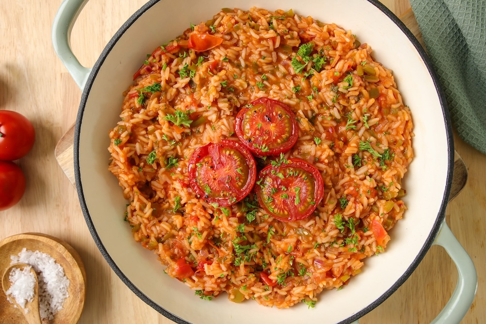

# Arroz de Tomate

*Portugal's tomato rice: medium-grain rice cooked into a brothy creamy stew with sautéed onion, garlic, ripe tomato, olive oil and a generous handful of fresh coriander. The Portuguese vegetarian one-pot, served with grilled sardines on the coast, with fried fish, or as a meal on its own with a fried egg on top.*

**Serves:** 4

**Prep Time:** 15 minutes

**Cook Time:** 35 minutes

## Overview
Arroz de tomate is Portugal's beloved tomato rice and one of the most vegetarian-friendly dishes in Portuguese cooking: medium-grain rice (Portuguese carolino; or any medium-grain) cooked in a base of sautéed onion, crushed garlic, ripe tomatoes, white wine and olive oil, finished with fresh chopped coriander. The dish is intentionally brothy-creamy (like arroz de marisco but vegetarian) - the rice releases its starch into the tomato broth giving the proper Portuguese soupy-rice character. Served alongside grilled sardines (the traditional Portuguese coastal pairing), with fried fish, with grilled chicken, or as a meal on its own with a fried egg on top. The dish depends on tomato quality; use peak-summer ripe tomatoes (canned work but underwhelm). Medium-grain rice is essential; it releases the starch needed for the creamy soupy texture. The finish wants to stay brothy, not dry; aim for a thick soup-like texture.

## Ingredients

- 400 g medium-grain rice (carolino; or Calrose; or arborio as substitute)
- 6 tablespoons olive oil
- 2 large onions (finely chopped)
- 8 garlic cloves (crushed)
- 1 kg ripe tomatoes (chopped); or 2 tins (each 400 g) chopped tomatoes
- 3 tablespoons tomato paste
- 200 ml dry white wine
- 1.4 litres hot vegetable stock (or water)
- 1 tablespoon sweet paprika
- 1 teaspoon piri-piri sauce (optional)
- 1 tablespoon dried oregano
- 2 bay leaves
- 1 large bunch fresh coriander (about 40 g; chopped, half for cooking, half for finishing)
- 1 ½ teaspoons fine sea salt
- 1 teaspoon ground black pepper
- 1 teaspoon caster sugar (balances tomato acidity)

### Optional
- 4 fried eggs (1 per serving; for the heartier version)
- 100 g grated Parmesan or aged cheese for finishing

### To serve
- Grilled sardines (the traditional Portuguese coastal pairing)
- Fried eggs (for the meal-on-own version)
- Crusty bread

## Method

### Stage 1 - Build the base
1. Heat the olive oil in a wide heavy pot over medium heat.
2. Add chopped onions; cook 8 minutes till soft.
3. Add crushed garlic; cook 30 seconds.
4. Add tomato paste; cook 2 minutes.
5. Add chopped tomatoes; cook 8-10 minutes till they break down into a thick sauce.

### Stage 2 - Add wine and seasonings
1. Pour in white wine; let bubble 2 minutes.
2. Stir in paprika, piri-piri (if using), oregano, sugar, salt and pepper.
3. Add half the chopped coriander.
4. Add bay leaves.

### Stage 3 - Add rice and stock
1. Add the rice; stir to coat.
2. Pour in the hot vegetable stock.
3. Bring to a simmer.

### Stage 4 - Cook
1. Reduce heat to low.
2. Cook 18-20 minutes, stirring occasionally, till the rice is just tender and the dish is brothy-creamy.
3. The rice should release its starch into the broth; texture should be like a thick soup, not dry.
4. If too thick, add hot stock; if too thin, simmer uncovered 3-5 minutes more.

### Stage 5 - Finish
1. Take off the heat.
2. Stir in the remaining chopped coriander.
3. Taste; adjust salt.

### Stage 6 - Serve
1. Ladle into deep plates.
2. Top with a fried egg (if making the meal-on-own version).
3. Scatter extra coriander.
4. Serve with grilled sardines or fried fish, crusty bread, lemon.

## Notes
- **Ripe tomatoes:** essential.
- **Medium-grain rice:** for the creamy texture.
- **Brothy, not dry:** the traditional texture.
- **Coriander generously:** Portuguese signature.

## Variations
**With chouriço:** add 100 g of sliced chouriço at the beginning.
**With chickpeas:** add 1 tin of drained chickpeas in the last 5 minutes.
**Spicier:** double the piri-piri.
**With seafood (becomes arroz de marisco):** add shrimp and mussels in the last 5 minutes.

## Serving
In deep plates with a fried egg on top (for the vegetarian main version), or alongside grilled sardines (the traditional Portuguese coastal pairing). Cold vinho verde or Sagres beer.

## Storage
- Keeps refrigerated 3 days; thickens overnight (add stock when reheating).
- Don't freeze; rice goes off-texture.
- Day-old arroz de tomate makes excellent breakfast with a fried egg.
